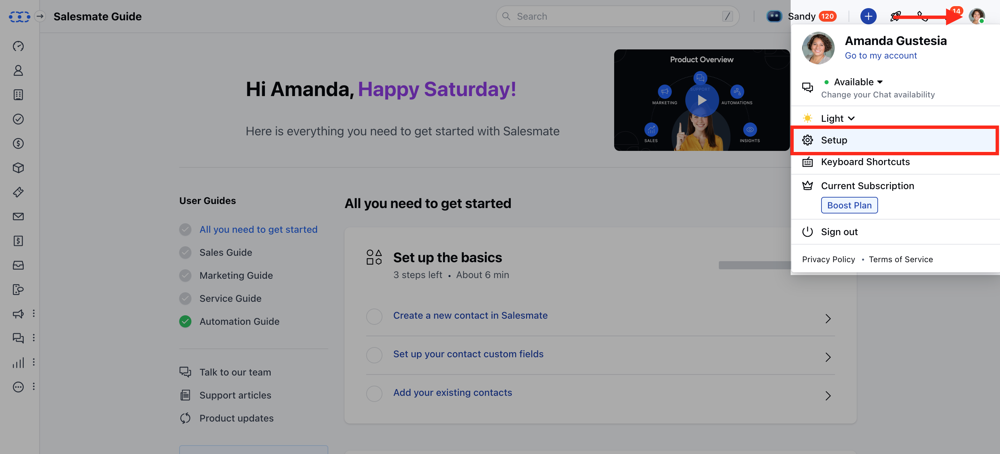

If you want to change the order in which categories and articles appear on your knowledge base portal, Salesmate makes it simple.

<Note>

- **Note:** You need permission to organize categories for reordering the categories or articles.

</Note>

### **Topics covered:**

- [How to Reorder the Categories](#how-to-reorder-the-categories)

- [How to Reorder the Articles](#how-to-reorder-the-articles)

### How to Reorder the Categories

To Reorder the Categories,

- **Navigate to the** Profile Icon from the top right corner.

- **Click on the** Setup **

- ** Head over to the ** Library** category

- **Select the** Knowledge Base option

- **Click on the** Categories tab

- **Simply drag and drop to reorder the** Categories , which will be saved automatically.

### How to Reorder the Articles

To Reorder the Articles,

- **Navigate to the** Profile Icon from the top right corner.

- **Click on the** Setup **

- ** Head over to the ** Library** category

- **Select the** Knowledge Base option

- **You will see the subcategories and** Articles in the

- **Category** you selected.

- **Navigate to the** Category whose

- **Articles** you want to reorder.

- **Simply drag and drop to reorder the** Articles , which will be saved automatically.

