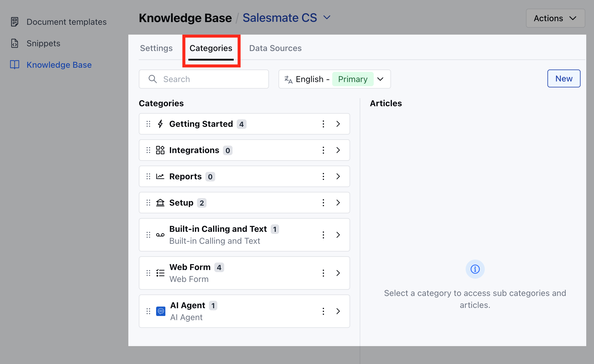

Updating categories keeps your knowledge base organized and relevant, making it easier for users to navigate while ensuring content stays aligned with changing business needs and customer queries.

<Note>

- **Note:** You need **Organize Categories** permission to perform any action on categories.

</Note>

To Update the Category,

- **Navigate to the** Profile Icon from the top right corner.

- **Click on the** Set Up

- Headover to the **Library** category

- **Select the** Knowledge Base option

- **Click on the** Categories tab

- If multiple languages are supported, select your preferred language, then search for the category you wish to update.

- Once you've found the category you want to update, hover over it and click the "Edit" option from the available actions.

- You can modify any of the following details: **Name:**The title of the category as it will appear to users.

- **Description:**A brief summary explaining the purpose or contents of the category.

- **Icon **: A visual symbol representing the category for easy recognition.

- **Click** Change to select a new icon, or

- **Remove** to delete the existing one.

- Hit the Save button to update the category

- **Upon successful update, a confirmation message appears as** Updated successfully

<Note>

**Note:** This icon is the same for all translations.

- You can modify the Name & Description in other languages, if they exist

- The category name field can’t be empty for any of the translations if they’re available to prevent removing translations once they are added.

</Note>
