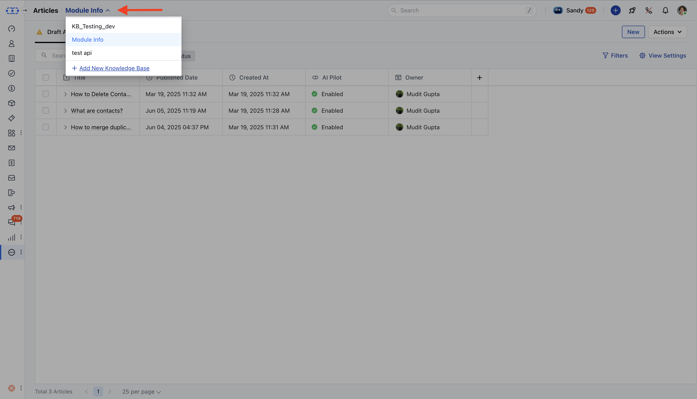
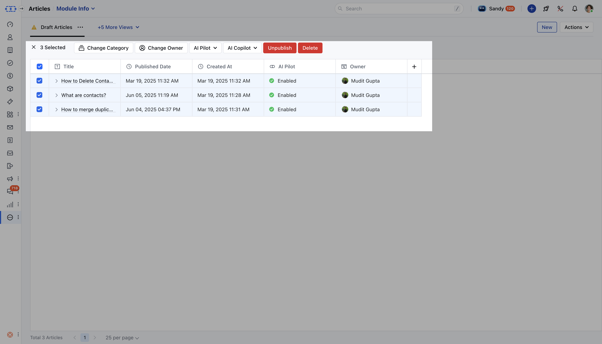
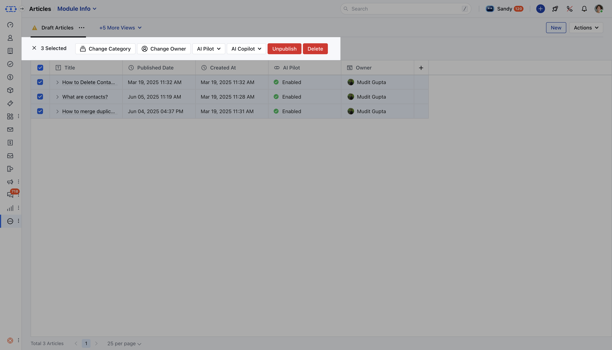

You can perform bulk operations on the articles in a knowledge base to save time and get things done in one go, like publishing a couple of articles that are in draft at the moment or enabling the articles for [AI Pilot](https://support.salesmate.io/hc/en-us/articles/45803043910937) and [AI Co-Pilot](https://support.salesmate.io/hc/en-us/articles/45879889482265).

<Note>
**Note:**You need an admin profile or the required permission to act on articles. [Learn more](https://support.salesmate.io/hc/en-us/articles/44391129991449)

</Note>

#### Please follow the steps below to perform bulk operations on articles.

* **Navigate to** Articles from the left sidebar.

* You will be directed to the Articles List View.

* **Select the correct** Knowledge Base from the drop-down in the top left corner.

* You can select individual articles or select all Articles to perform Bulk Operations.

* A bar will appear at the top with the following options: ***Change Category**: Move the selected articles to a different category. ***Change Owner**: Transfer the ownership of the selected articles. ***AI Pilot**: Enable or disable AI Pilot for the selected articles. ***AI Co-pilot**: Enable or disable AI Co-pilot for the selected articles. ***Publish****:/Unpublish:**Publish/Unpublish the selected articles. ***Delete**: Delete the selected articles.

* Choose the action you need to perform for the selected articles.
