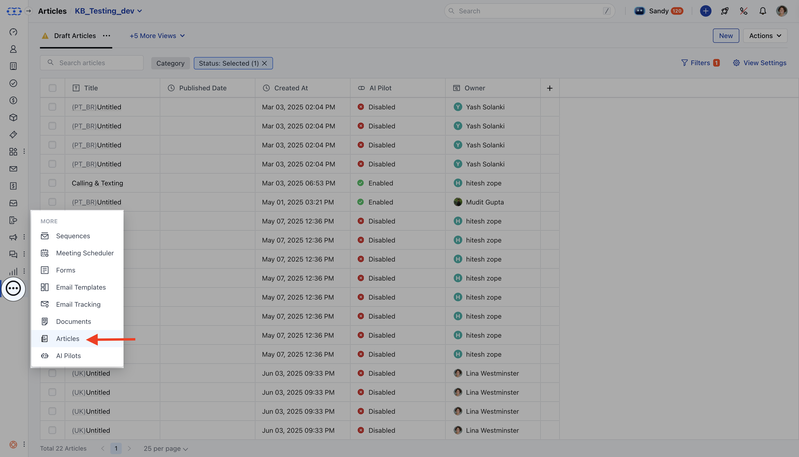

In Salesmate, you can archive a knowledge base article instead of deleting it. Archiving removes the article from public or internal access while keeping it stored for future reference or reactivation.

<Note>
**Note:**You need**"Edit Articles"**permission to unarchive an article.

</Note>

### How to Archive an Article

* **Navigate to** Articles from left side outreach

* If multiple knowledge bases exist, select the appropriate one.

* **Locate the article you want to** archive .

* **Click on the** Actions button and choose

* **Archive**.

* A confirmation dialog will appear: ***"Are you sure you want to archive this article? You can restore it anytime from the archived list."*** Click**Yes**to confirm.

* **A success message will appear:** “Archived successfully.” **

**
