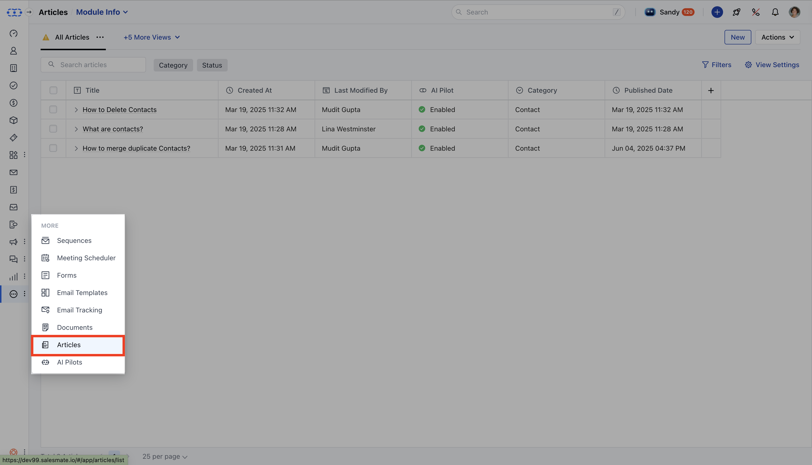

If you need to create a similar Knowledge Base article without rewriting everything, you can use the Clone article feature in Knowledge Base. Cloning helps you quickly duplicate existing content. This article will show you how to clone a KB article in just a few clicks.

<Note>
**Note:**You’ll need “**Create Articles**” permission to clone articles. [Learn more](https://support.salesmate.io/hc/en-us/articles/44391129991449)

</Note>

### Steps to Clone a Knowledge Base Article

* **In the left sidebar, click** Articles to view your knowledge base article list.

* **Find the article you want to clone. Hover over it and select** Clone from the action menu, or you can also open the article’s detail page and click

* **Clone**.

* You’ll be taken to the article editor with all settings copied from the original article.

### Clone the Article Details

The cloned article is set up with these details:

***Title**: The original title is copied with “-clone” added (e.g., “Introduction to Messenger” becomes “Introduction to Messenger-clone”).

***Slug**:: The original slug is copied with “-clone” added and must be unique. A slash (/) is included at the start.

***Language**: The cloned article is created in the primary language of your knowledge base, no matter which language the original article was in.

***Draft Status**: The cloned article starts as a draft, which you can edit or publish if you have “Publish Articles” permission.

***Success Message**: After cloning, you’ll see “Cloned successfully" message pop-up.
