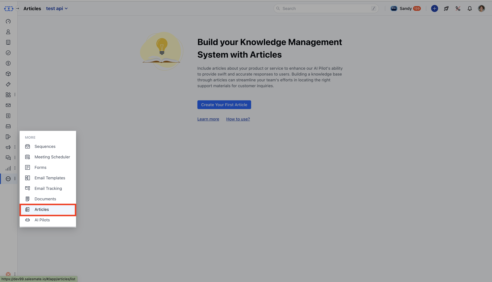
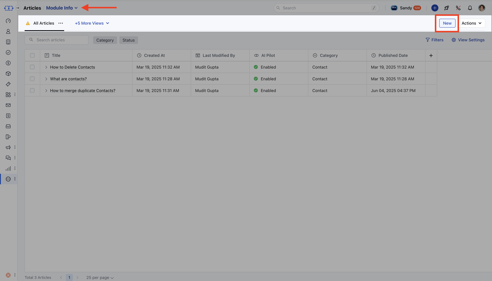
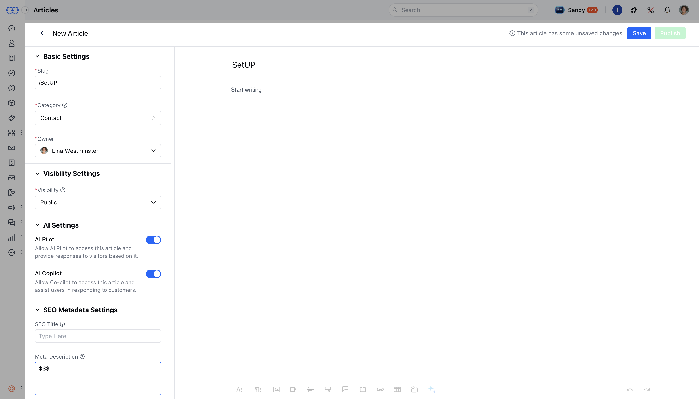
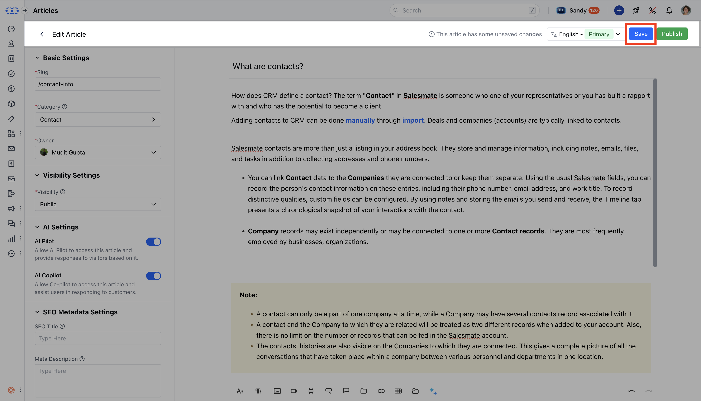
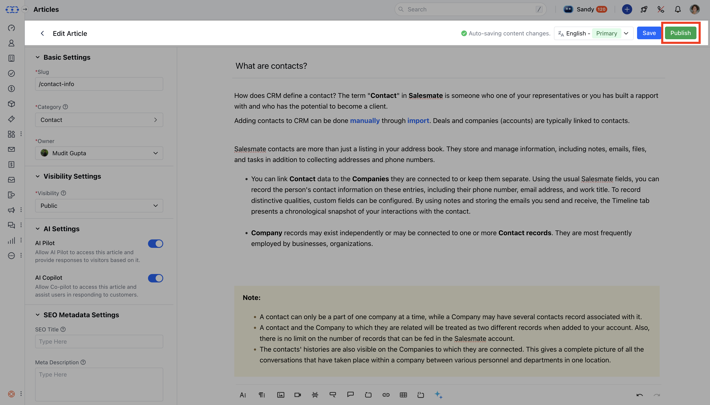

You can easily create and manage knowledge base articles for your team and customers, which helps you deliver faster and more effective support.

<Note>

- **Note:** You’ll need “**Create Articles**” permission to create an article.
- [Learn more](https://support.salesmate.io/hc/en-us/articles/44391129991449)

</Note>

### **Topics covered:**

- [Steps to Create a Knowledge Base Article](#steps-to-create-a-knowledge-base-article)

- [Save or Publish Your Article](#save-or-publish-your-article)

- [Additional Features](#additional-features)

### Steps to Create a Knowledge Base Article

- **In the left sidebar, click** Articles to view your knowledge base.

- If you have more than one knowledge base, choose the one you want to add the article to.

- **Click** New on the article list page to begin drafting your article.

### Fill in the Article Details

Once inside the editor, here’s what you’ll need to complete:**Language **: Default is English or your main KB language. If multiple languages are available, you can choose one.

- **Title **: Enter a clear title (max 150 characters).

- **Body **: Add your content using the rich text editor. You can format text, add links, images, code blocks, tables, and more (max 3000 characters).

- **Slug **: The article’s URL, auto-generated from the title. You can edit it—just make sure it’s unique and valid.

- **Category **: Pick an existing category or create a new one to organize your article.

- **Owner **: By default, you’ll be listed as the author, but you can assign it to someone else.

- **Visibility **: Decide who can see this article: * Public – Visible to everyone, including customers

- Internal – Only your team can view it * Restricted – Limit access based on specific contact rules (must set at least one rule)

- **AI Settings **: If Sandy AI is enabled, the article can be used to respond to visitor questions or assist your team with replies.

- **SEO Settings **: Add a title and meta description (up to 150 characters) to help your article appear in search results.

- **Tags **: You can add searchable keywords to make your article easier to find.

- **Attachments **: Upload up to 10 files (max 20MB each) in supported formats like PDF, DOCX, PPT, XLS, CSV, and more.

- **Allow Comments **: Let logged-in users leave comments. If not logged in, they’ll be asked to enter their email.

### Save or Publish Your Article

- **Save as Draft **: Use this if you’re not ready to publish yet. Title and body are required to save.

- **Publish **: Make the article live once all required fields are filled in.

### Additional Features

- **[** Version History :](https://support.salesmate.io/hc/en-us/articles/44524731580441) Every save or publish creates a new version. You can restore previous versions anytime.

- **[** Sandy AI Integration :](#steps-to-create-a-knowledge-base-article) Published articles automatically update Sandy AI’s knowledge base (if enabled).

- **[** Permissions :](https://support.salesmate.io/hc/en-us/articles/44391129991449) Only users with the right permissions can create, edit, or publish articles.
