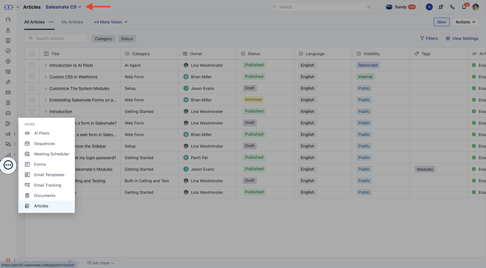
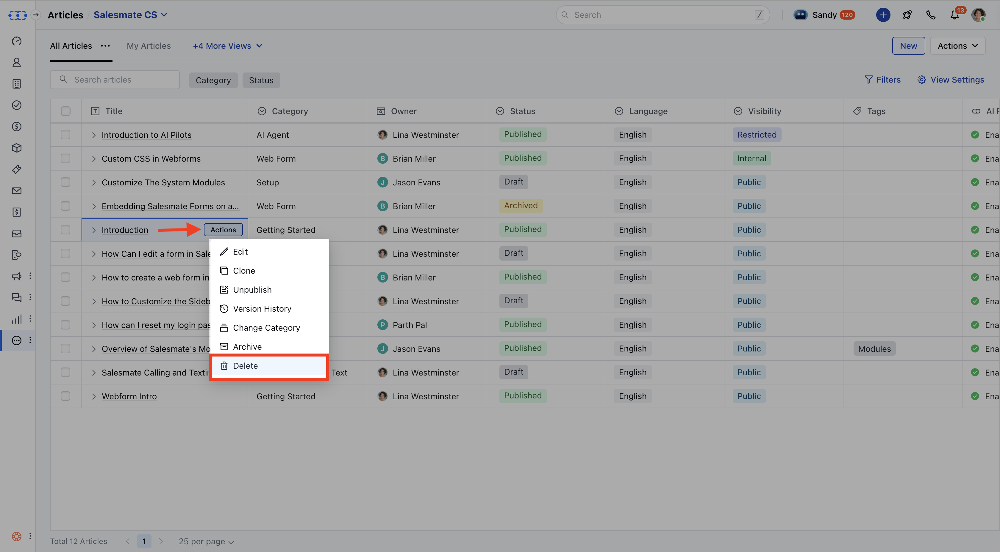
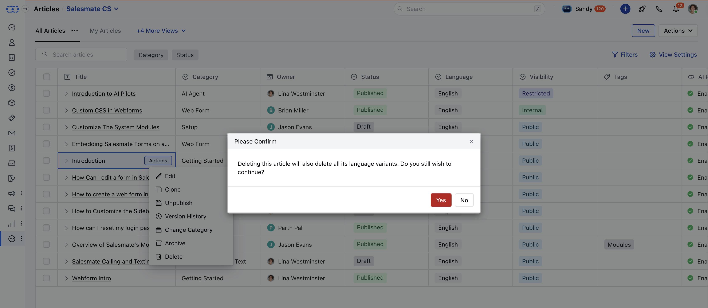

In Salesmate, you can permanently delete a knowledge base article if it is no longer needed. This action removes the article from the system and cannot be undone, so ensure that deletion is the right choice before proceeding.

<Note>
**Note:**You need**"Delete Articles"**permission to unarchive an article.

</Note>

### How to Delete an Article

* **Click on** Articles under

* **More**from left side outreach.

* If multiple knowledge bases exist, select the appropriate one from the top left corner.

* Locate the article you want to delete.

* **Click on the** Actions button and choose

* **Delete**.

* A confirmation dialog will appear:

* If the article has a**single-language translation**, the prompt will state:**"Are you sure you want to delete this article? This action is irreversible."*** If you prefer to retain the article but remove it from visibility, consider**archiving**instead. You can learn more from [here](https://support.salesmate.io/hc/en-us/articles/44524718191769).

* **Click** Yes to confirm.

* **A success message will appear:** “Deleted successfully.” 

<Note>
**Note:**When deleting an article with multiple language variants, dialog will say: "**Deleting this article will also delete all its language variants. Do you still wish to continue?**"

</Note>
