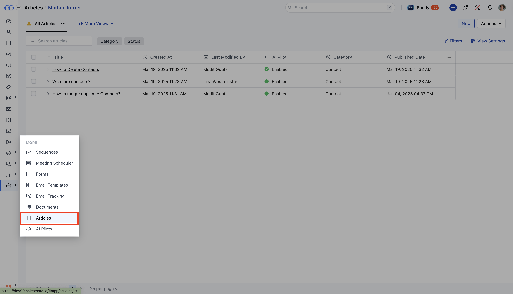
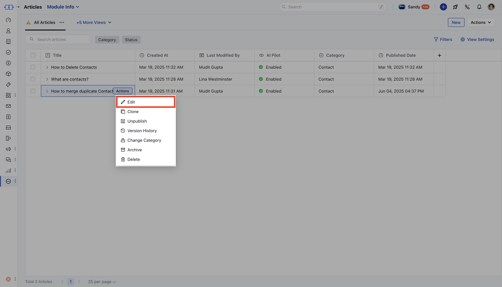
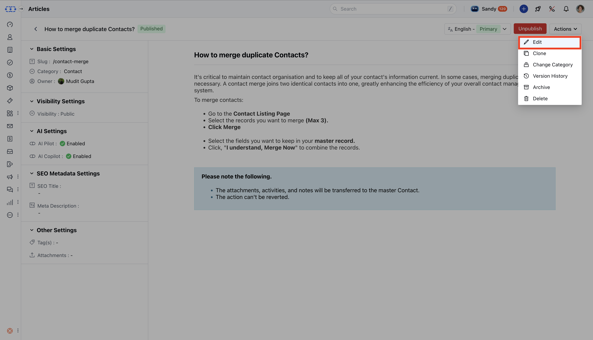
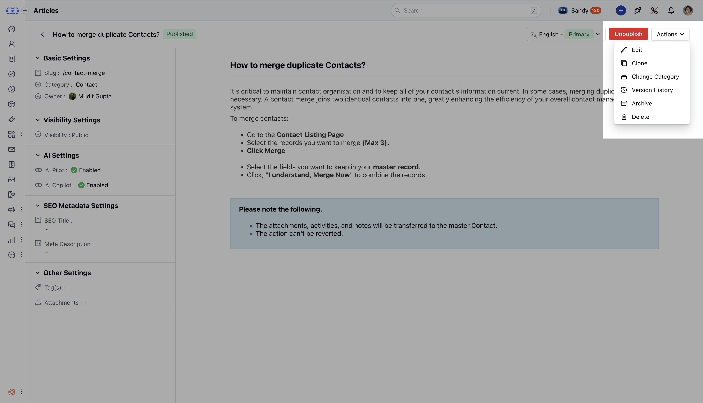

Salesmate allows you to edit your knowledge base articles at any time, whether you're making quick changes to a draft, updating a published article, or adding translations for other languages.

<Note>
**Note:**You’ll need “**Edit Articles**” permission to make any changes. Users without “**Publish**” permission can still update articles, but cannot make them live. [Learn more](https://support.salesmate.io/hc/en-us/articles/44391129991449)

</Note>

### Topics Covered

* [Steps to Edit a Knowledge Base Article](https://support.salesmate.io/hc/en-us/articles/44524638853785-How-to-Edit-Knowledge-Base-Article#h_01JRYPNRM4R457JA33DNPWRW9D)

* [Editing an Article in Draft Stage](https://support.salesmate.io/hc/en-us/articles/44524638853785-How-to-Edit-Knowledge-Base-Article#h_01JRYPNRM41BY3XHNXMGCTFV01)

* [Editing an Article in Published Stage](https://support.salesmate.io/hc/en-us/articles/44524638853785-How-to-Edit-Knowledge-Base-Article#h_01JRYPNRM59Y1EWGD2AEE24RSG)

* [Editing Articles in Other Languages](https://support.salesmate.io/hc/en-us/articles/44524638853785-How-to-Edit-Knowledge-Base-Article#h_01JRYPNRM6AXKF2ZAW7C08XARW)

### Steps to Edit a Knowledge Base Article

* **Navigate to the** Articles section from the left sidebar.

* Locate the article you want to modify from the listing page.

* **Hover over the article, then click** Edit from the action menu or click directly on the article title.

* **If you have** edit permissions , you’ll be taken to the editor; if not, you’ll be redirected to the

* **article detail view**instead.

* **The article opens in either** Draft or

* **Published**mode based on its current status.

### Editing an Article in Draft State

* **If the article is still in** draft , you'll be taken directly to the editor.

* Make your changes, and then:

* Click**Save**to save the draft manually, or wait for auto-save (every 60 seconds). * Click**Submit for Approval**or**Publish**when you're ready to proceed.

### Editing an Article in Published State

* **Clicking a** published article takes you to the

* **detail view**.

* Any content changes you make here will:

* Be saved in a**new draft version**. * Not affect the live article until you click**Publish**.

* To view or edit these changes, open the editor, it will display the draft version.

### Configuration Changes:

* Configuration updates (like changing Slug, Category, Visibility, or AI Settings) require publish permission and when these changes are saved, the article is automatically published.

* Without publish rights, you won’t be able to edit these settings.

### Additional Actions for Published Articles

While viewing a published article, you can also:

* Edit the content (saved as a draft)

* Clone the article

* Unpublish it (which reverts it to a draft)

* Reassign or change the category

* Review the article’s version history

* Archive the article

* Permanently delete it

### Editing Articles in Other Languages

If you’re working with a translated version of the article (i.e., not in the primary language):

* You can freely edit the body content.

* However, certain fields will remain locked, including:

* Slug * Category

* Visibility * AI settings
