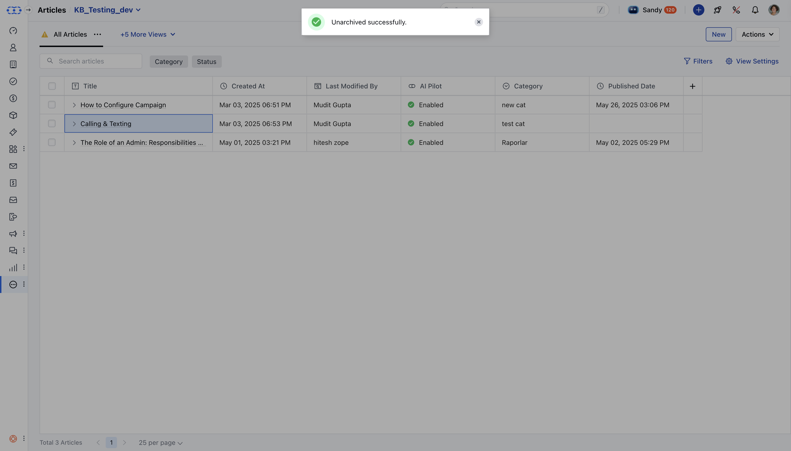

In Salesmate, you can unarchive a knowledge base article to restore it for public or internal access. Unarchiving brings the article back to its original state, making it accessible again.

<Note>

**Note:** You need **"Edit Articles"** permission to unarchive an article.

</Note>

###  How to Unarchive an Article

- **Navigate to** Articles from left side outreach under

- **More**.

- If multiple knowledge bases exist, select the appropriate one.

- **Locate the article you want to** unarchive.

- **Click on the** Actions button and choose

- **Unarchive.

- A confirmation dialog will appear: **_"Are you sure you want to unarchive this article? It will be restored to its previous state."_** Click **Yes** to confirm.

- **A success message will appear:**“Unarchived successfully.”**

<Note>

**Note:**The article status is changed to **Draft** when you unarchive an article.

</Note>
