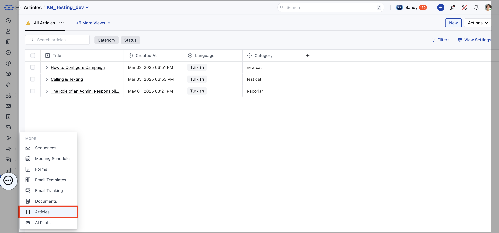
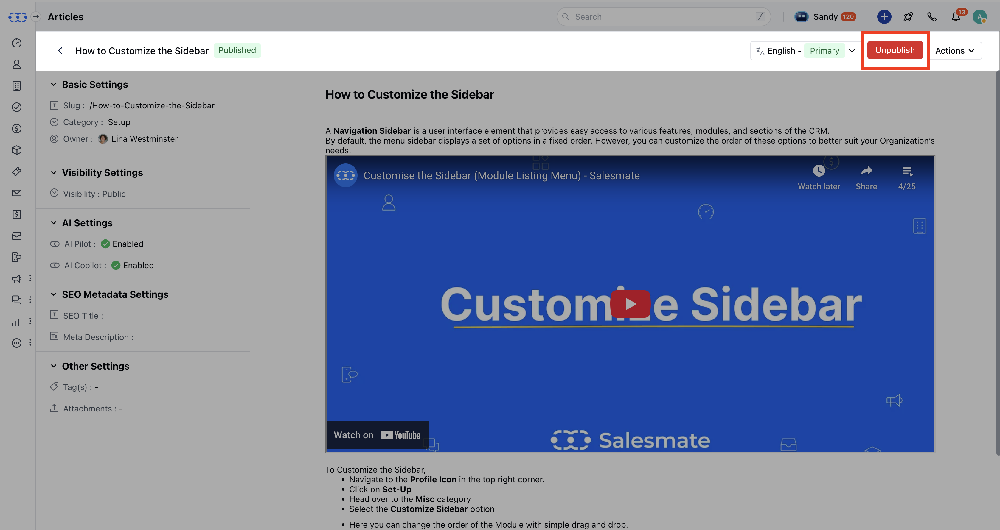
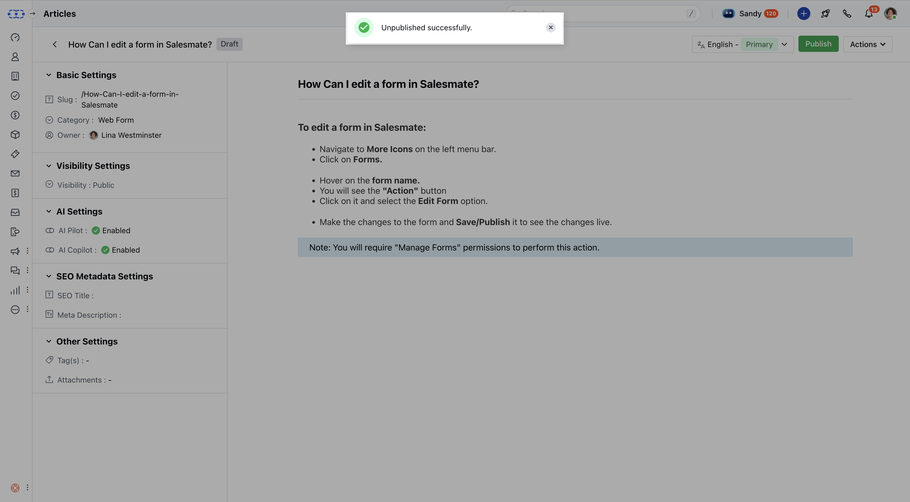

Unpublishing an article removes it from public or internal visibility while keeping it as a draft for future updates. This helps maintain accurate and relevant content while preserving article statistics and history.

<Note>

**Note:** You need **"Publish Articles"** permission to unarchive an article.

</Note>

###  How to Unpublish an Article

- **Navigate to** Articles from the left side under

- **More**.

- If multiple knowledge bases exist, select the appropriate one.

- **Click on the article you want to** unpublish . You will be redirected to the article detail page.

- **Click on the** Unpublish button at the top.

- - **A success message will confirm:** “Unpublished successfully.”

<Note>

**Note:** If you have articles in multiple language, then it will give you a pop-up confirming **Unpublishing this article will also unpublish all its language variants. Do you still wish to continue?**

</Note>
