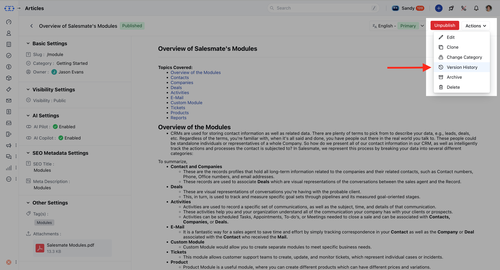
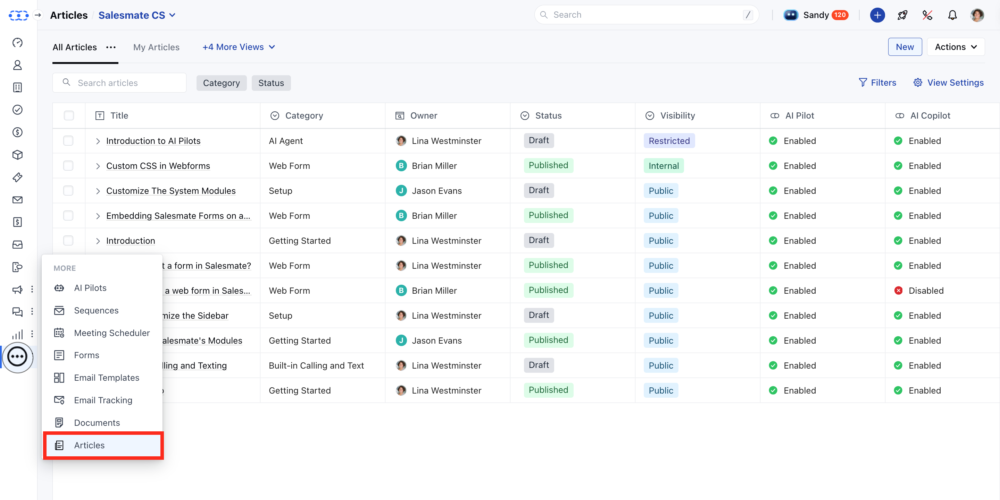

The**Article Version History**helps maintain a detailed record of content updates, ensuring transparency and allowing you to view, compare, or revert to previous versions of an article. Each version stores who made the change, when it was made, and what was changed, supporting better collaboration and accountability.

<Note>
**Note:**You must have "View Articles" permission to access version history. Additionally, to restore a previous version, you must have both**edit**and**publish**permission. [Learn more.](https://support.salesmate.io/hc/en-us/articles/44391129991449)

</Note>

### To check the Version History

* **Navigate to the** Articles module from the sidebar.

* **Locate and click on the** article title you want to review.

* **On the** article detail page , click the

* **Actions**button.

* **Select** Version History **

*** Once you click on Version History, a collapsible panel will appear on the left-hand side.

* There would be two filters visible, ***Period:**To view the versions published under the filtered duration. ***User:**To find the versions published or modified by selected users.**

**When a version is selected, the article content associated with that version will load on the canvas. You’ll also see details like:

* **The** user who published it

* **The** date and time of publication

* **The** version number ### Restore the version:

* **If you have both** edit and

* **publish**permissions, you'll see a "Restore this version" button once you move to the older versions of the article.

* **Hit** Yes to restore the selected version.

### Highlight Changes:

When you select a version, you’ll also have the option to**"Compare with previous version"**.
This helps you understand what changes were made compared to the version just before it.

***Content****Added:**Highlighted in**green**(e.g., new text or images).

***Content****Deleted:**Highlighted in**red**(e.g., removed paragraphs).

<Note>
**Note:*** This comparison only applies to the selected version and the one immediately preceding it.   Example: Selecting version 7 and making a choice will compare with the previous version. It will compare it with version 6 and display the changes.

* We only highlight text-related changes in the title and body of the article when compared with the previous version.

</Note>
