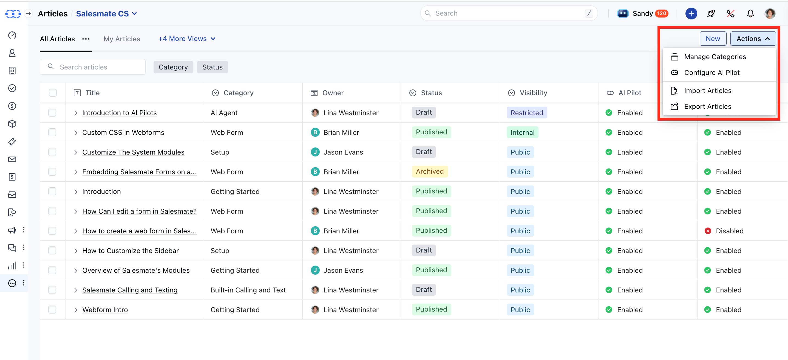

The **Article Listing** screen provides a comprehensive view of all knowledge base articles created within your account. It supports multi-language management, robust filtering, bulk operations, and more.

<Note>

**Note:** Only users with “**View Articles**” permission can access the article listing page.

</Note>

###  **Topics covered:**

- [Access Knowledge Base Articles](#access-the-knowledge-base-article-listing)

- [Actions on Articles](#actions-on-article)

- [Filters](#filters)

- [Bulk Operations](#bulk-operations)

- [Additional Operations](#additional-operations)

###  Access the **Knowledge Base Article** Listing

- **Access the** Articles feature from the left menu bar.

- You will be redirected to the Article Listing screen.

You will see the list of columns with the following names:

- **Title:** The name of the article.

- **Category:** The selected category for the article.

- **Owner:** The user assigned as the article owner

- **Status:** Current article status: Draft, Published, or Archived.

- **Language:** The primary language in which the article is written.

- **Visibility:** Visibility level: Public, Internal, or Restricted (with rules).

- **AI Pilot:** Whether AI Pilot is enabled for this article.

- **AI Copilot:** Whether AI Copilot is enabled for internal assistance.

- **Last Modified By:** The last user who modified any part of the article.

- **Last Modified Date:** Timestamp of the most recent edit to the article.

- **Tags:** Tags to improve article discoverability.

###  Actions on Article

- **Edit **: Open the article editor to update the article’s content or settings.

- **Clone **: Duplicate an article’s structure and content to create a new one quickly.

- **Version History:** Allows you to review and restore previous versions of the article.

- **Change Category:** Moves selected articles to a different category.

- **Archive:** Moves the article out of the active list without deleting it.

- **Delete **: Permanently remove the article from the knowledge base.

###  Filters

On the article listing page, you have quick access to the **Category** and **Status** filters. For additional filtering options, click the **Filters** button to access more fields and narrow down your article search.

###  Bulk Operations

- **Change Category:** Moves selected articles to a different category.

- **Change Owner:** Reassigns ownership of selected articles to another user.

- **AI Pilot:** You can enable or disable AI Pilots for selected articles.

- **AI Copilot:** You can enable or disable AI Copilots for selected articles.

- **Unpublish:** Unpublish the selected articles.

- **Delete:** Delete the selected articles.

Please refer to this [Bulk Operations on Knowledge Base Articles](https://support.salesmate.io/hc/en-us/articles/44524733757977-Bulk-Operations-On-Knowledge-Base-Articles) for more information.

###  Additional Operations

The **Actions** button on the article listing page provides access to the following operations:

- **Manage Categories:** Redirects to the _Organize Categories_ screen under the Knowledge Base setup, allowing users to manage article categories.

- **Configure AI Pilot:** Opens the AI Pilot configuration screen, where the current Knowledge Base can be added for AI-driven assistance.

- **Import Articles:** Redirects to the import screen where articles can be uploaded via a CSV file.
- [Learn more](https://support.salesmate.io/hc/en-us/articles/44633577758873-Import-Articles-from-a-CSV)
- **Export Articles:** Enables downloading article data in bulk for backup or offline use.

