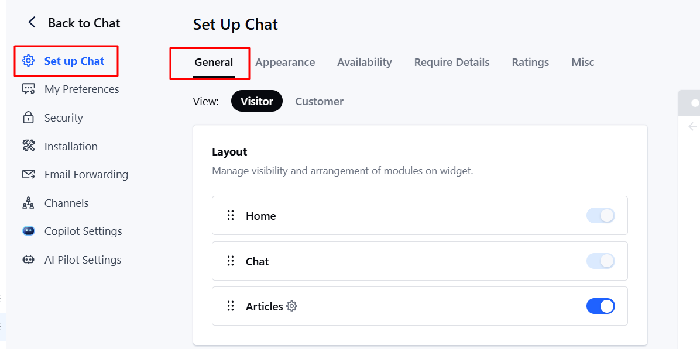
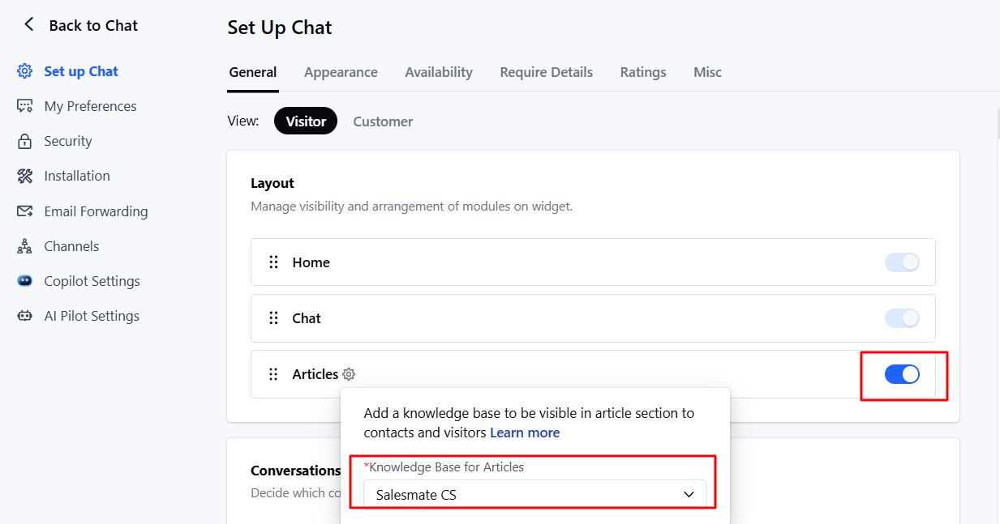

In this article, we will learn about how to configure the widget layout to display a dedicated space for published articles, making them accessible to visitors or contacts directly from the Messenger widget. This feature enhances the customer experience by providing self-service options and easy access to helpful resources.

###  **Topics covered:**

- [How to Access Article Settings](#how-to-access-article-settings)

- [Understanding Visitor and Contact Tabs](https://support.salesmate.io/hc/en-us/articles/44633769500569-Articles-Space-in-Chat-widget#h_01JWEDHJ3D2T2JVTKNE0M94AA9)

- [Enabling the Articles Feature](#enabling-the-articles-feature)

- [Configuring the Knowledge Base](#configuring-the-knowledge-base-_if-no-knowledge-base-exists_click-on-the-dropdown-to-create-one-if-you-dont-the-option-will-be-disabled-automatically)

###  How to Access Article Settings

- **Navigate to** Chat

- Click on **Chat Settings**

- **Click** Set up Chat

- Click on **General ** Under **Layout**, you can manage the Article settings.

###  Enabling the Articles Feature

- **Enable the toggle switch for** "Articles" to make articles accessible in the chat widget.

- **Click the** gear icon next to Articles to select the appropriate Knowledge Base.

###  Configuring the Knowledge Base **_If no Knowledge Base exists:_**Click on the dropdown to create one. If you don’t, the option will be disabled automatically.

- **_If a Knowledge Base exists:_** If only one knowledge base is available, it will be selected by default.

- If multiple knowledge bases exist, the first one will be selected. _ If a knowledge base is already configured in **Copilot settings**, it will appear here by default. _ If none or multiple exist, the field will appear blank.

* **_Choosing a different Knowledge Base than Copilot’s:_** When you try to choose a different knowledge base than what is chosen under Copilot, you will see this message: "It seems you are using a different knowledge base for Copilot. Are you sure you don’t want to keep it the same"?

- Upon confirmation, the new selection will be saved. Otherwise, it will revert to the Copilot knowledge base.

<Note>

**Note:** You will need “Manage Chat Settings” or “Manage Unified Inbox” permissions to update these settings.

- The Knowledge Base can be configured without enabling articles for the customer side in Messenger.

- The Home and Chat sections of the chat's layout are always enabled, and they cannot be disabled.

</Note>
