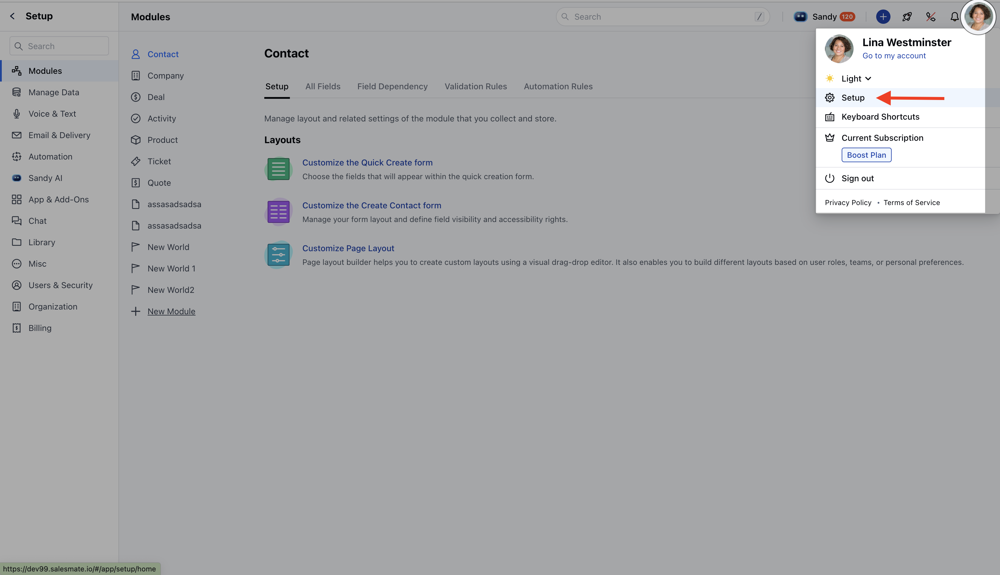
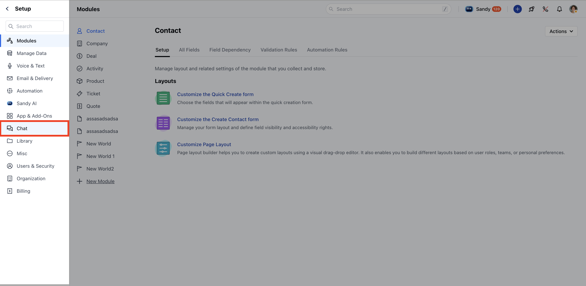
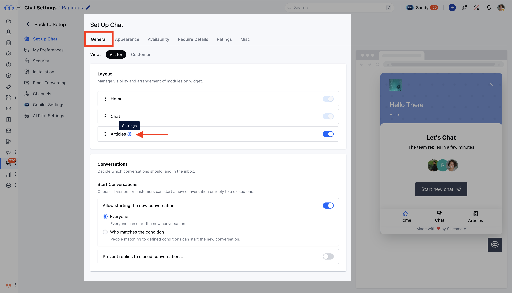
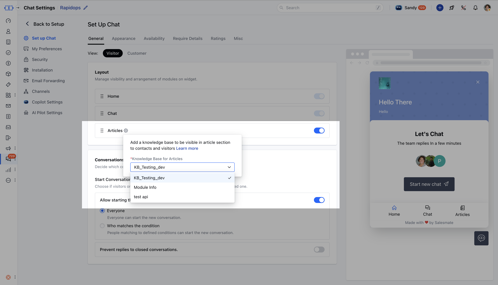
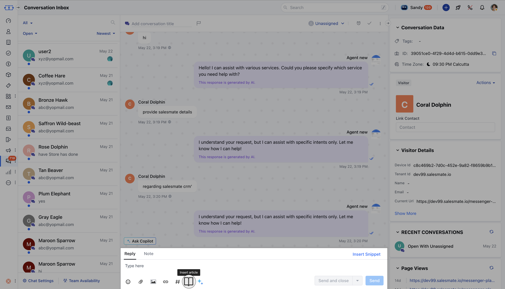
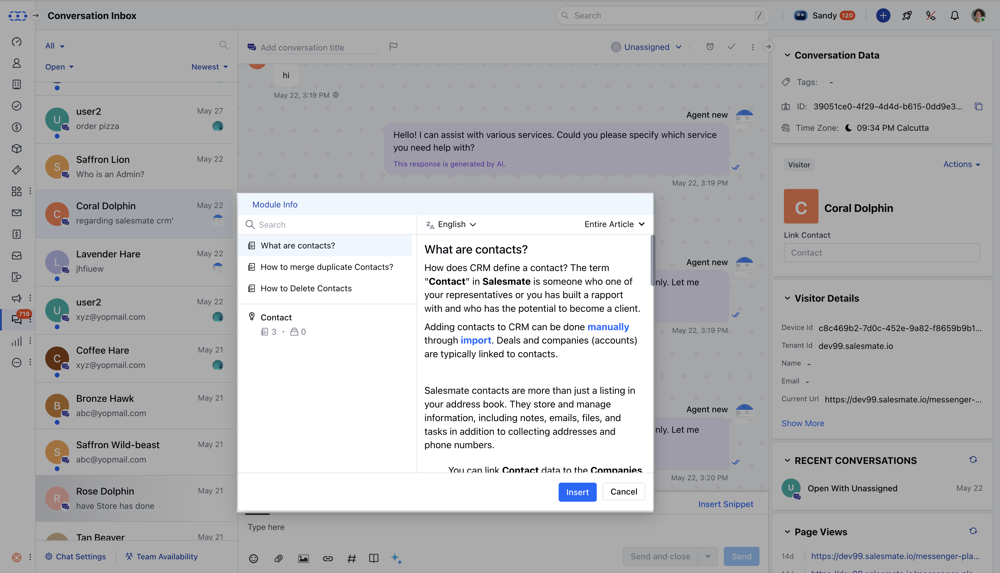
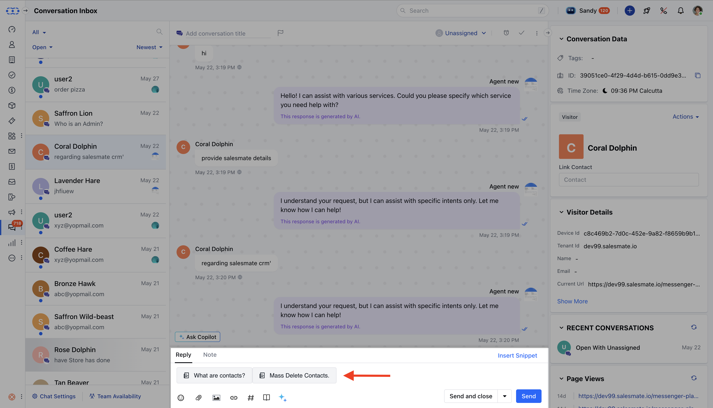

In this article, we will learn about how to share Knowledge Base (KB) articles—or specific sections of them during a chat conversation. This feature provides targeted information to customers quickly and efficiently, improving the overall customer experience. Whether sharing a full article or highlighting a specific section, this guide outlines the process step-by-step. Within chat, articles can be shared in two ways:

- **Entire Article:** Share the complete content of an article.

- **Specific Section:** Share a particular section or heading within the article.

This ensures customers receive targeted information based on their needs.

### **Topics covered:**

Here’s what is covered in this article:

- [Setting Up the Knowledge Base for Chat](#setting-up-the-knowledge-base-for-chat)

- [Searching for an Article to Share](#searching-for-an-article-to-share)

- [Inserting the Article into Chat](#inserting-the-article-into-chat)

- [How the Article Appears in Chat](#how-the-article-appears-in-chat)

- [Practical Use Case](https://support.salesmate.io/hc/en-us/articles/44633719356441-Share-Articles-in-Chat#h_01JWED8VE38FSK8CYHP228YDR2)

### Setting Up the Knowledge Base for Chat

Before sharing articles, it is necessary to configure the **Knowledge Base** in chat settings.

- **To configure this, please go to** Chat

- Click **Chat Settings or** head to profile icon from top right and click to setup.

- **Head to** Setup chat **

- ** Under **General** Within Layout, click ** on settings icon besides Articles **

- ** The articles available to share come from the **Knowledge Base** selected in the ** Articles layout settings **.

- **Upon clicking settings If you do not have a knowledgebase configured then a popup will appear prompting you to** Configure Now .

### Searching for an Article to Share

- **You can Insert** Articles of Selected Knowledge Base in Setup during Conversation.

- **Enter the** article name into the

- **search bar**.

- **Click on the desired article to open its** preview .

### Inserting the Article into Chat

- **Click the** Insert button or press

- **Enter/Return** to add the article into the chat editor.

- **If the** Entire Article is selected, the article title will be displayed in the article card.

- **If a** specific heading is selected, that heading will be highlighted in the article card.

### How the Article Appears in Chat

When a visitor or customer clicks on the article link:

- **The article will open in Messenger, even if the** Article Section is disabled in the Messenger layout.

<Note>

### Note:

- If the article is deleted or archived, an error alert will appear: “Article not found. Please check the knowledge base to ensure it is not archived or deleted.”

- If the user lacks permission to view articles, the sharing option will be disabled with the message: “You don’t have permission to view articles.”

- **If the Article Section is not enabled in the Messenger layout, the option to share articles will** not be available in the chat editor.

</Note>
