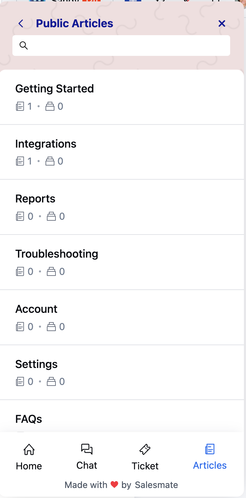
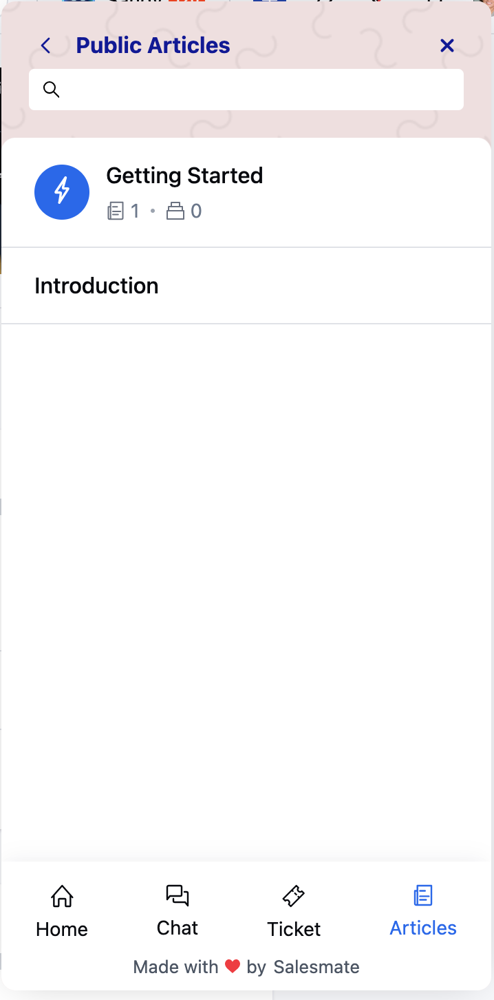
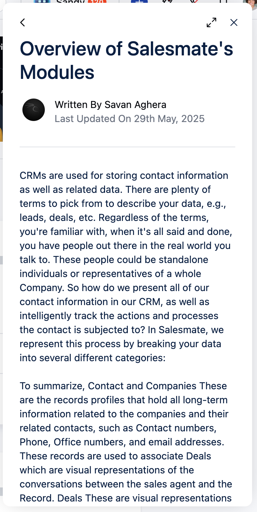
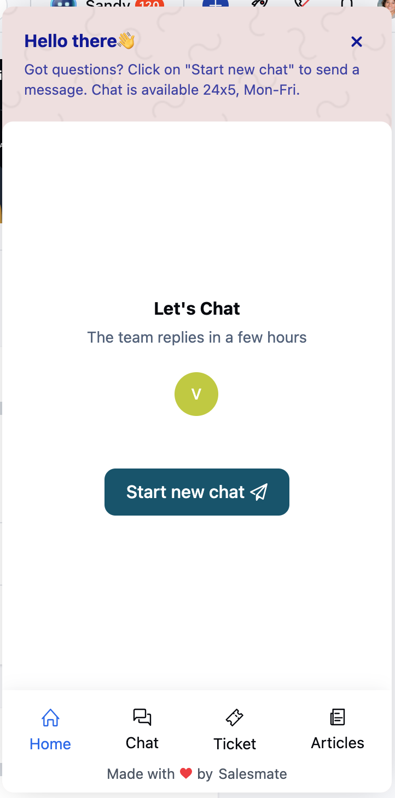

In this article, we will learn about how to view Knowledge Base articles directly from the Messenger widget. Once the Article space is enabled, visitors and contacts can seamlessly access published articles within their chat experience, creating a self-service help center environment.

Once you have enabled the Article space within your chat widget, the articles published within your knowledge base will become visible to your contacts. The published articles are shown within the Article tab on the chat screen. This guide will help you understand how the articles tab will preview on your customer's end.

To understand how to create articles, please visit
[How to create Knowledgebase Articles](https://support.salesmate.io/hc/en-us/articles/44524627800729)

###  **Topics covered:**

- [Navigating the Articles Section](#navigating-the-articles-section)

- [Viewing an Article](#viewing-an-article)

- [Widget Tabs and Navigation](#widget-tabs-and-navigation)

###  Navigating the Articles Section

### **Homepage View ** The homepage view is visible on the customer's end when they try to initiate a chat

- To let them access homepage view of your articles, [embed chat](https://support.salesmate.io/hc/en-us/articles/360058369732#h_01GK3KF0FQVYHYRX93C2MJ0V95) on your website.

- After the chat is embedded, customers will be able to see the articles section if enabled.

- To understand how to enable and configure article section, please visit
- [Article Space in Chat](https://support.salesmate.io/hc/en-us/articles/44633769500569)

### **Category Page ** To understand how to create a category, please visit
[How to Create a Category](https://support.salesmate.io/hc/en-us/articles/44524557277465)

- Upon clicking on any Category, it will open by displaying the category clicked at the top

- The articles present in that category will be shown below the category title

- Subcategories will be shown below the articles present in the primary category

###  Viewing an Article

When you click on an article:

- - The **preview** will load in Messenger and expand automatically. * The opened article will display the following information: Form Title, Written By, Last Update date, and Table of Contents.

- Clicking on the **back arrow** will take you back to the category page _ Clicking the **X** button will close the chat pop-up _ Click on the **Arrows** beside the X button will resize the article opened

###  Widget Tabs and Navigation

When a conversation is ongoing in the widget, four tabs are displayed at the bottom:

- **Home:** Returns to the homepage with the greeting and welcome message.

- **Chats:** Opens the “Your conversations” screen, showing all conversations.

- **Articles:** Opens the category listing screen, similar to conversation lists, with icons, headers, and descriptions.

- **Tickets:** Opens the ticket listing screen with the header “Your tickets”.

<Note>

**Note:** The Article section must be enabled on the Messenger widget. Refer to the related article for setup instructions.

- **If the Article space is disabled** :

- Customers will not see the Articles section in the widget. * They will not be able to search for or access articles via Messenger.

- Tickets tab will only be visible to your contacts. It will be hidden by default for visitors.

</Note>
