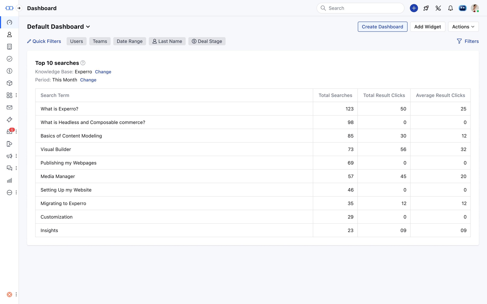

The **Total Number of Searches report** monitors the total number of searches executed within the knowledge base. The report gives insights into user search patterns and content discoverability.

The report informs you about how frequently users are searching for information and if they are discovering related content.

*   The data is displayed as a grid report, offering a structured view of search activity.
*   **Count of Total Searches:** The number of individual searches done by visitors on the knowledge base.
*   The report takes the number of total unique searches as the measure for assessing search behavior and content discoverability.
*   The report will, by default, display data for the **last 30 days**, and you can modify the period.
*   The report allows comparison with the previous period to identify search trends over time.
*   The number of searches per day may be displayed in the form of a line chart for viewing in comparative terms.
    *   The **Y-axis:** Shows the number of searches and the **X-axis:** Shows the date.
*   Add this report to your dashboard by clicking on the [Add widget](https://support.salesmate.io/hc/en-us/articles/360049849771-Manage-widgets-and-filters) and choosing the **system or Knowledge Base** filter on the left panel then selecting the report and clicking on the **Add to Dashboard** option.
*   **Date Range:** Adjust the time frame to analyze click activity over a specific period.

### Usages

*   Identify trends in user search behavior.
*   Improve content discoverability based on frequently searched terms.
*   Use insights to enhance knowledge base structure and search efficiency.

<Note>
**Note:**

*   You will need to select one knowledge base if you have multiple Knowledge bases in the account when you add this widget to the dashboard.
*   If you have only one then it will be selected by default.

</Note>