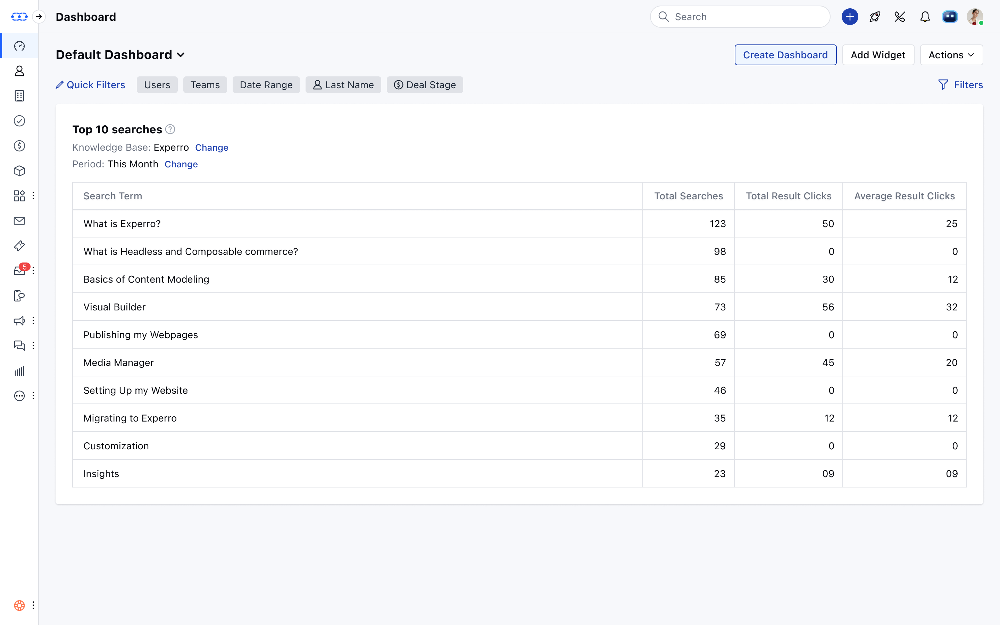

The **User Feedback report** gathers user sentiment on whether they enjoyed or disliked an article. The feedback is used to determine content that is up to user standards and where improvement is needed.

The report monitors the way users interact with the article through reactions, enabling you to know which content is doing well and which needs to be updated.

- The data is displayed as a grid report, offering a structured view of user feedback.

- **Article Title:** Displays the title of the article.

- **Article ID:** Unique identifier for the article.

- **Total Likes:** Number of people who found the article helpful or liked it.

- **Total Dislikes:** Number of people who found the article not helpful or disliked it.

- **No Reaction:** Number of unique person visits that resulted in no reaction to the article.
- The data is displayed in descending order based on the number of likes.
- The report relies on user feedback as a measure of article usefulness and satisfaction.
- The report will automatically display data for the **last 30 days**, and you can alter this range.
- There is a drill-down feature, so you can click on the article title to view more detailed information regarding user feedback and engagement.
- This report may also be displayed as a **pie chart** with the ability to drill down and see detailed article feedback.
- Add this report to your dashboard by clicking on the [Add widget](https://support.salesmate.io/hc/en-us/articles/360049849771-Manage-widgets-and-filters) and choosing the **system or Knowledge Base** filter on the left panel, then selecting the report and clicking on the **Add to Dashboard** option.

- **Date Range:** Adjust the time frame to analyze click activity over a specific period.

- **Article Category:** Filter by categories like Setup Guides, FAQs, or Troubleshooting to focus on relevant article performance.
- You can switch between grid view and pie chart to visualize the data in a preferred format.

### Usages

- Identify articles with high positive feedback to understand what works well.
- Improve underperforming articles based on negative feedback.
- Use insights to create more engaging and helpful content.

<Note>

- **Note:**

- You will need to select one knowledge base if you have multiple Knowledge bases in the account when you add this widget to the dashboard.
- If you have only one, then it will be selected by default.

</Note>
