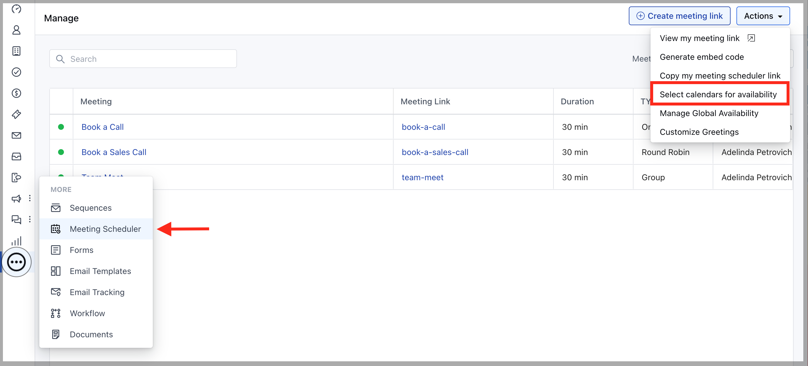
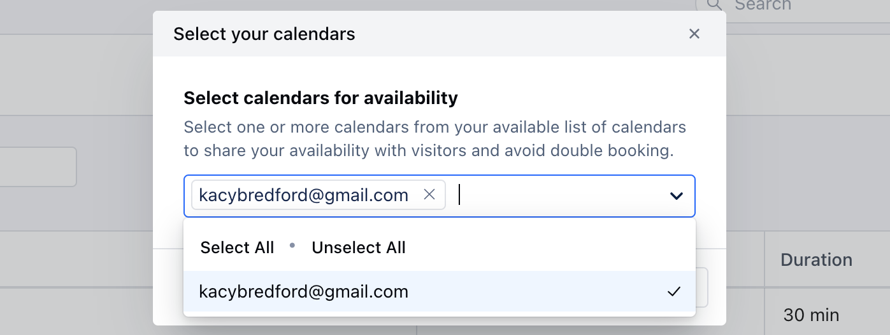

- **Double booking** is when someone schedules **more than one** appointment for the same **time slot.

- ** In order to avoid double booking, we need to ensure that all the relevant calendars are connected under your account to check for availability.

<Note>

**Note:** By default Salesmate checks for the available slots under your primary and the in-built system calendar.

</Note>

# How to select Additional Calendars

In order to select multiple calendars, please follow the below steps:

- **Navigate to the** More option from left sidebar menu

- **Click on** Meeting Scheduler

- Under **Actions** on the top right corner select **Select Calendars For Availability**

- **A pop-up dialogue box would open up prompting you to** Select Calendars For Availability .

- Selecting one or more calendars from the available list of calendars will share your availability with visitors and will avoid double booking.

- **Select from the list of calendar options under the** dropdown menu, which will allow you to select

- **multiple** calendars from your selected calendar account under **Calendar Sync**.

- **After you have made the required changes, hit** Save .

- **Now the availability for new meetings would be checked under all the** selected calendars to check for the slots.
