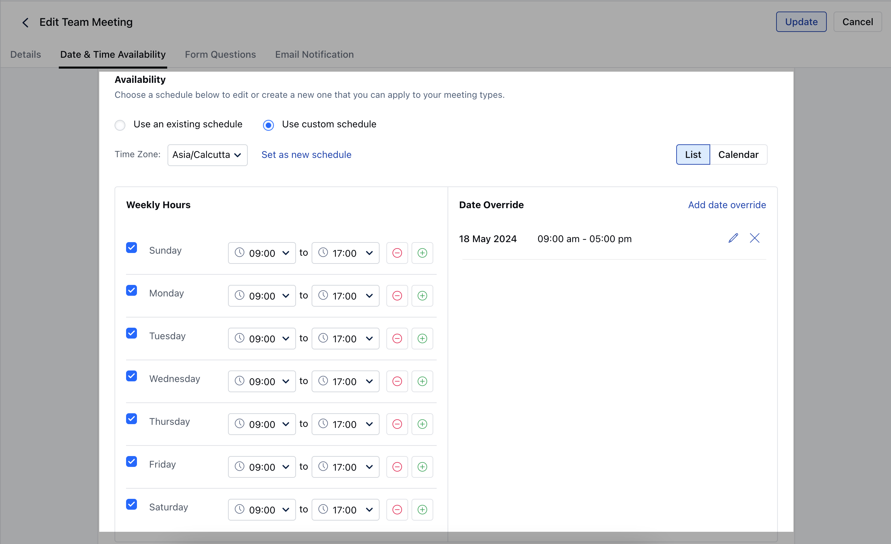

**Topics Covered:**

* [Update Date and Time Availability of Meeting scheduler](https://support.salesmate.io/hc/en-us/articles/4405391317517#h_01HXDWH72123KKKAE351KGVSHX)

* [Availability](https://support.salesmate.io/hc/en-us/articles/4405391317517#h_01HXDWHH3NF0RZPCAGR4KDX2F9)

* [Custom Schedule](https://support.salesmate.io/hc/en-us/articles/4405391317517#h_01HXDWHVPXQZDD21DQHB3W93XW)

## Update Date and Time Availability of Meeting scheduler

To update the date and time availability, follow these steps:

* **Navigate to the** More option from left sidebar menu

* **Click on** Meeting Scheduler

* Select the**Meeting**for which you wish to update.

* **Choose** Date and Time Availability .

***Meeting Date Range:**There are four options while setting up the meeting date range, namely: ***X Calendar Days:**The contact can book a slot on your calendar till x days in the future from the current date. ***X Business Days:**The contact can book a slot on your calendar till x days in the future from the current date excluding weekends for the availability. ***Date Range:**The contact can choose from the list of options under a specific date range specified by you. ***No date range limit:**The contact can book a meeting on any future date on the calendar.

***Meeting Duration:**Meeting duration is the time span for which the calendar will be booked. The various options that are available are: ***15****minutes*****30**minutes ***45**minutes ***60**minutes * _**Custom**_ - Here you would be able to select custom time span in minutes or hours.

***Buffer Time:**Some of your appointments might require time before or after you meet with your customer to set up. You can set buffer time before appointments start, after appointments end, or both to give users the extra time they need to prepare for their next appointment. The available options are: ***No Buffer*****1**minute ***10**minutes ***15**minutes (**Default**) ***30**minutes ***45**minutes ***1**hour

***Show available time slots in increments of:**To set the starting time of each time slot under your calendar, the user will be able to set up the increments according to their requirement. The available options are: ***5**minutes ***10**minutes ***15**minutes ***30**minutes (**Default**) ***45**minutes ***1**hour

***Minimum Notice****Time:**If you are running on a busy schedule, any last-minute surprises can ruin or disrupt your day. In order to avoid any kind of unexpected meeting bookings, you can set up a**minimum notice period**to ensure how soon meetings can be booked. Users will be able to set the time in**minutes**,**hours**, or**days**.

***Maximum Allowed Event:**You can set the**maximum**number of meetings that can be booked per day according to your requirement. By default, the value would be set to**100**.

***Timezone display:**If you want the client to view the availability according to their**timezone**or the user's timezone on the calendar, you can select the required option. * Automatically detect and show the times in my invitee's time zone

* Lock the timezone (best for in-person events)

***Private Event:**If you wish to host a**private**event that can only be accessed via**URL**, then you can mark the checkbox to set the meeting type as private.

### Availability

Availability allows the user to specify the time span during which he or she is available, as well as the exception slots during which they are not. There are two options available to the user:

***Use an existing schedule**- The users will be able to use the existing schedules that are managed or created by the Admins of the account. * Select the existing**schedule**that you wish to use from the dropdown. * Once selected, the users will be able to see the schedule.

* By default, the "**Default availability**" schedule would be selected. * The users will not be able to edit the timezone of the existing schedule.

### Custom Schedule

When a user does not wish to utilize one of the**pre-defined**availability schedules, they can create their own custom schedule that will only apply to this calendar.

* **Users can select the** timezone for the defined time slots from the dropdown menu. For instance, if the timezone selected is IST and the time slot on the calendar is 6 am to 4 pm then the given time slot would be defined as per IST.

* **When a user clicks on "** use custom schedule " then by default the weekly hours would be selected as 9 am to 5 pm Monday to Friday.

* There are two available options under the custom schedule, namely:

* [**List View**](https://support.salesmate.io/hc/en-us/articles/4405391317517#h_01HXDVE2GX6CNZ2H6CVXFGEZFZ) * [**Calendar View**](https://support.salesmate.io/hc/en-us/articles/4405391317517#h_01HXDVE2GXB5SNS1CSMGVX1TZQ)

#### List View

* Under the list view, users will be able to define the specified time slots for the weekdays.

* **If no timeslot is defined for a particular day, then by default the user will be considered** unavailable for that day.

* Multiple time slots can be also be defined for a particular day.

* If there are any overlapping time slots then the availability would be calculated in a continuous manner. For instance, if a user has defined time slots as 9 am to 12 pm and 10 am to 2 pm then the system would consider the availability as 9 am to 2 pm.

* **Users can also define the** Date overrides i.e if they are not available on a particular working day or there are any holidays that need to be defined.

### Date override

* **To override the date, you can simply click on** Add date override .

* On clicking, you will be asked to choose the dates for which you would like to override.

* While selecting the dates, the system would show you the availability that you have defined for those days.

* The user can: ***Add**new time slots ***Remove**time slots

* **In order to make yourself** unavailable , you can simply remove all the slots.

* **In order to** remove the date override you can simply click on the

* **X**icon.

* **To** edit the date override, the user can simply click on the

* **pencil**icon and make the necessary updates.

* **Select the relevant date and time slots and hit** Update .

* **In case the user does not select any time slots, the system will consider them as** unavailable for those dates.

* **All the dates would be shown** individually under the date override section even if the user has selected multiple dates.

#### Calendar View

* **The calendar would be shown in a** monthly fashion by which the user would be able to see the availability on specific days.

* If the user is not available then no slots would be shown on that specific date.

* **If the slots on a specific day do not contain any date override, then they will be denoted by a** grey dot on the calendar

* **If the slots on a specific day do contain date override, then they will be denoted by an** orange dot.

* To add or edit overrides for a day, the user can simply click on any day under the calendar and update the time slots.

* The user can also select multiple dates and select the time slot for those dates, which will override the existing schedule for those time slots.

* **Admin users can save the new schedule by clicking on** Set as a new schedule .

* **When the user clicks on "** Set as new schedule ", a pop-up box would open up prompting the user to enter the

* **name**of the schedule.

* **Once the schedule is saved, the newly created schedule would be selected as default under "** Use an existing schedule ".
