Every organization has a specific **schedule** or shifts under which they operate and therefore it is imperative that we manage them accordingly.

<Note>

**Note:** The option to Manage Global Availability can only be done by the users having **Admin** Profile.

</Note>

- **Topics covered:**

- [How to Manage the Availability](#how-to-manage-the-availability)

- [Creating a New Schedule](#creating-a-new-schedule)

- [Edit Schedule](#edit-schedule)

- [Edit Title](#edit-title)

- [Delete Schedule](#delete-schedule)

- [Clone Schedule](#clone-schedule)

- [Set Schedule as Default](#set-schedule-as-default)

### How to Manage the Availability

To manage Global Availability follow the below mentioned steps:

- **Navigate to the** More option from left sidebar menu

- **Click on** Meeting Scheduler

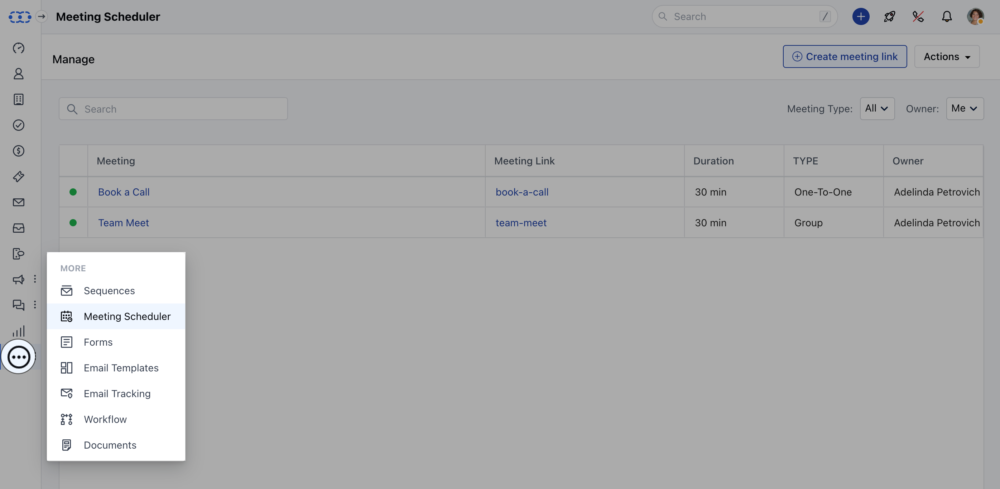

- **Under** Actions on the top right corner select

- **Manage Global Availability**.

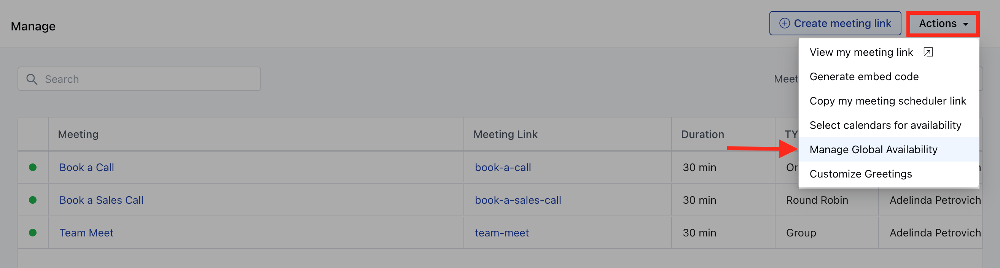

Or

- **Navigate to the** Profile icon on the top right corner.

- **Click on the** Setup .

- **Head over to the** Misc category

- **Click on** Availability

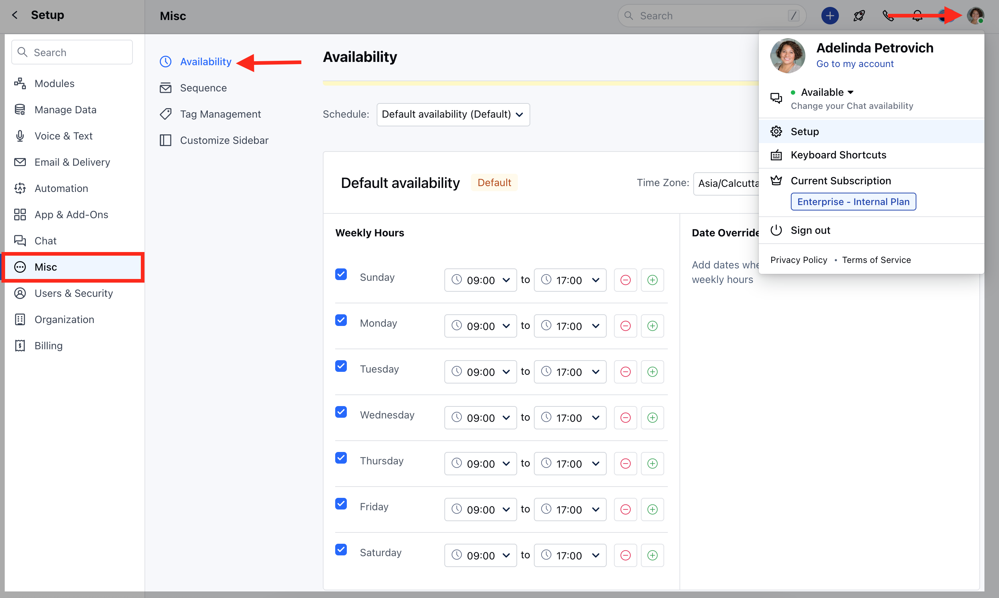

<Note>

**Note:** Currently, this setting is only applicable to the "Meeting Scheduler".

</Note>

### Creating a New Schedule

To create a new schedule, follow below steps:

- **Go to the** Manage Global Availability page.

- **Click on the** New Schedule Button on the top right corner.

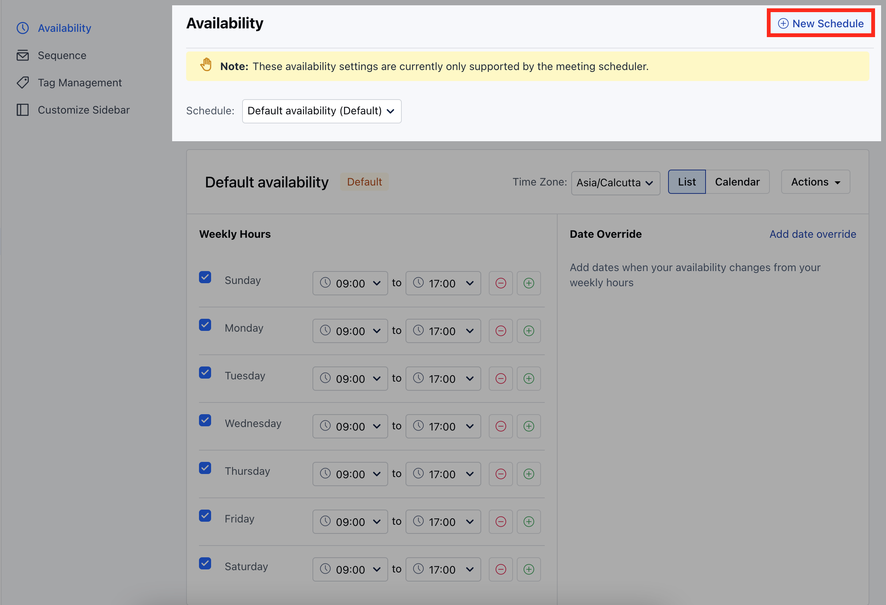

- **A pop dialogue box would open up prompting you to provide the New** Schedule

- **Name** of the Schedule.

- **Hit the** Create button and your new schedule will be successfully saved.

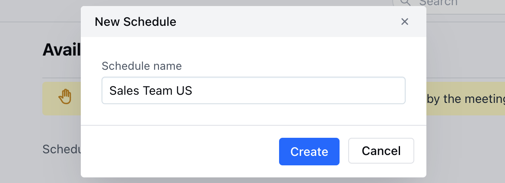

### Edit Schedule

To edit a specific schedule, follow the below steps:

- **Go to the** Manage Availability Page.

- **Select the** schedule that you wish to edit under the dropdown option.

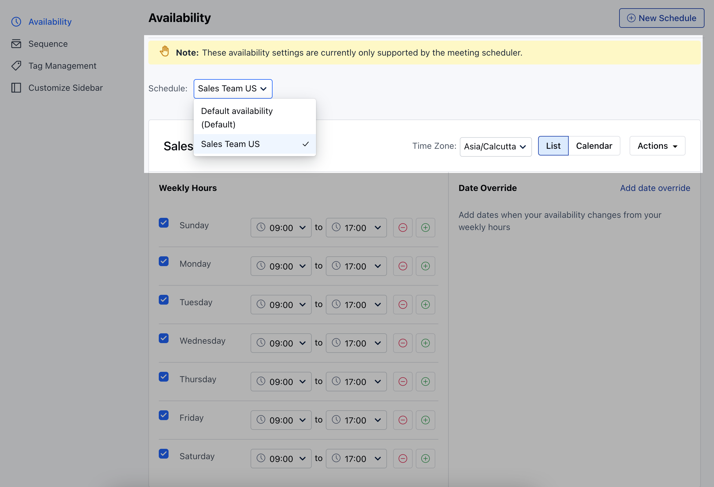

- **Once you select the schedule, you will be able to edit the** weekly hours and

- **Date Override** as required.

- **Users will get the option to select the** timezone for the specified weekly hours or the defined time slots.

- There are two views that are visible on the screen:

[**List View**](#list-view)
*
[**Calendar **View **](#calendar-view)

### List View

- Under the list view, users will be able to define the specified time slots for the weekdays.

- **If no timeslot is defined for a particular day, then by default the user will be considered** unavailable for that day.

- **Multiple **time** slots can be also be defined for a particular** day **.

- **If there are any overlapping time slots then the availability would be calculated in a continuous manner. For instance, if a user has defined time slots as** 9:00 AM to 12:00 PM and

- **10:00 AM to 2:00 PM** then the system would consider the availability as **9:00 AM to 2:00 PM**.

- **Users can also define the** Date overrides i.e if they are not available on a particular working day or there are any holidays that need to be defined.

- **A pop-up will be shown saying "** Changes Saved " once you update the time slots.

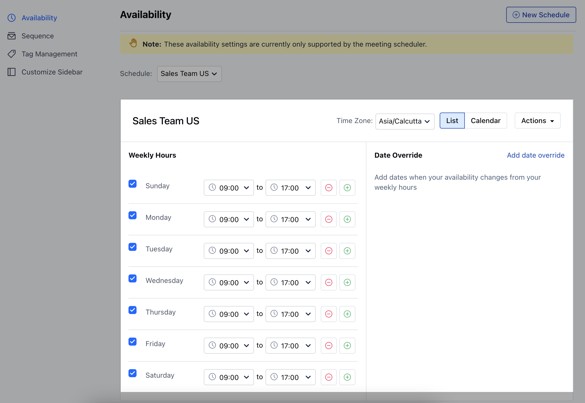

### Date Override

- **To override the date, you can simply click on** Add date override .

- On clicking, you will be asked to choose the dates for which you would like to override.

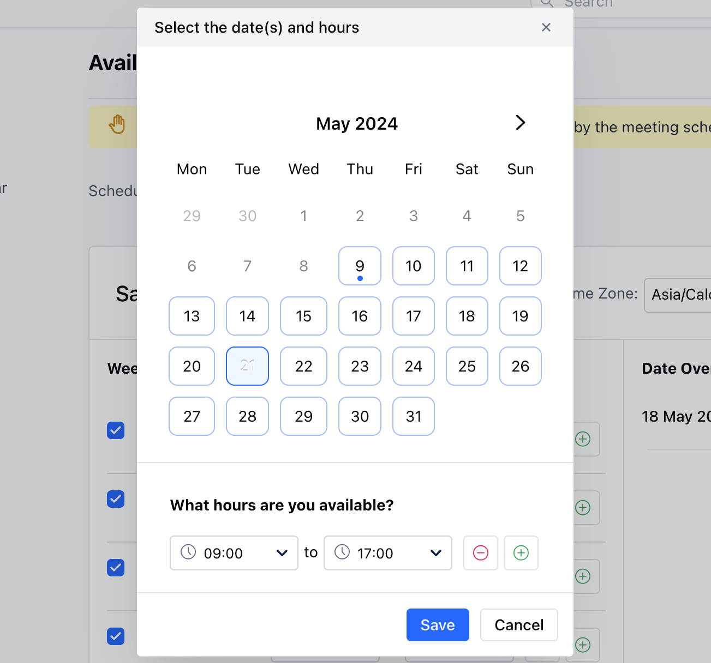

- While selecting the dates, the system would show you the availability that you have defined for those days.

- The user can: **Add **new time slots**Remove ** time slots

- **In order to make yourself** unavailable , you can simply remove all the slots.

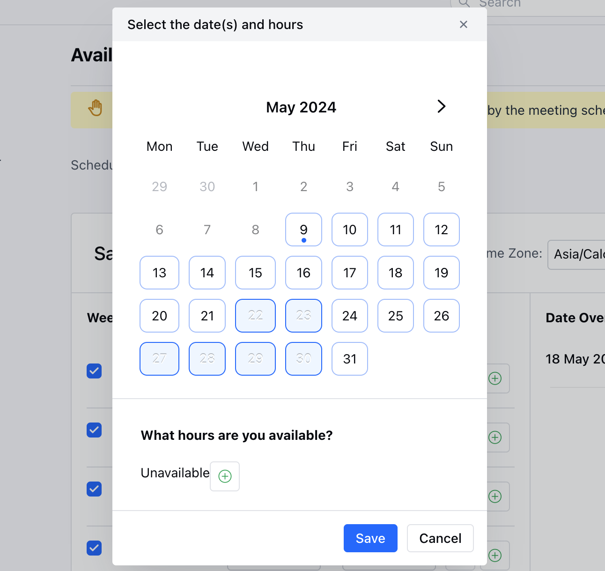

- **In order to remove the** Date Override you can simply click on the

- **X** icon.

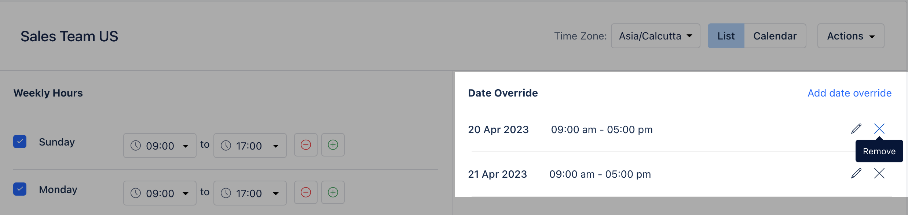

- **To** edit the date override, the user can simply click on the pencil icon and make the necessary updates.

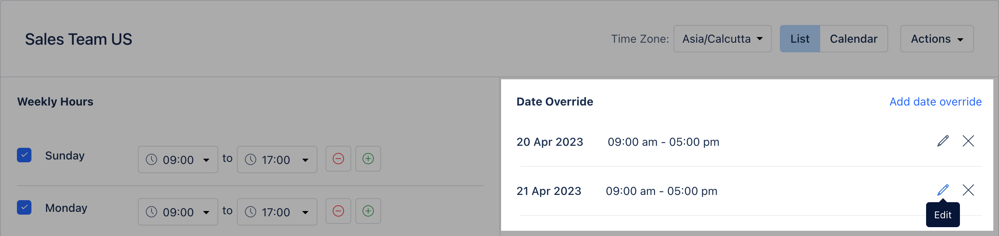

- **Select the relevant date and time slots and hit** update .

- **In case the user does not select any time slots, the system will consider them as** unavailable for those dates.

- All the dates would be shown individually under the date override section even if the user has selected multiple dates.

### Calendar View

- **The calendar would be shown in a** monthly fashion by which the user would be able to see the

- **availability** on** specific **days **.

- **If the user is** not available then

- **no slots** would be shown on that **specific date**.

- **If the slots on a specific day do not contain any date override, then they will be denoted by a** grey

- **dot** on the calendar

- **If the slots on a specific day do contain date override, then they will be denoted by an** orange dot.

- **Users can also** edit the time slots under the calendar view by simply

- **clicking** on any block/day, similar to the list view.

- **Any changes made are** saved in real-time.

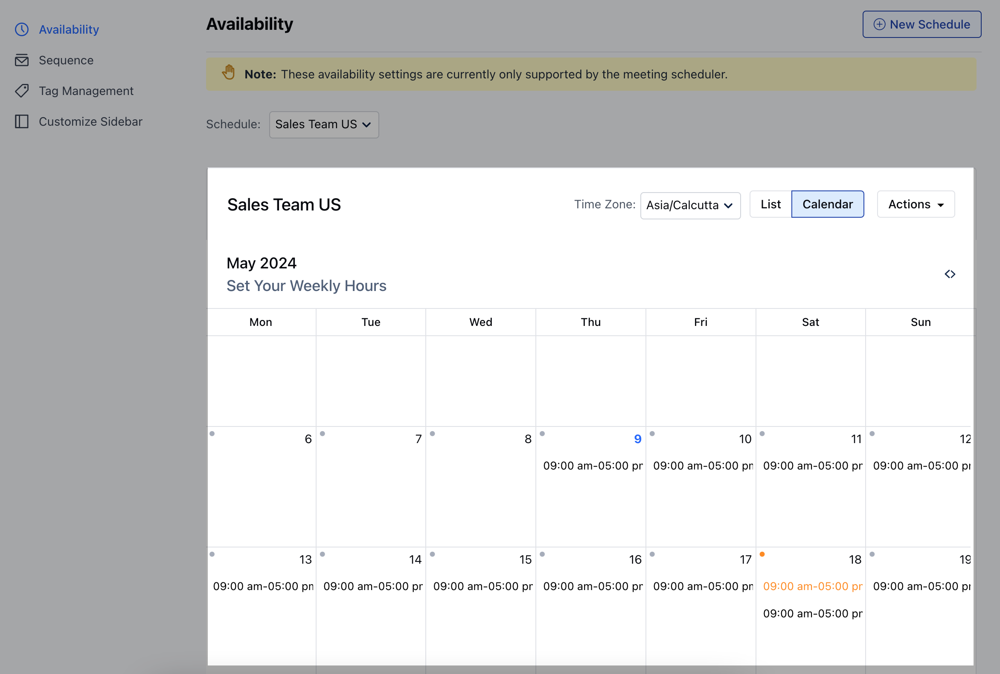

### Edit Title

To edit the title of the schedule, follow the below steps:

- **Navigate to the** Profile icon on the top right corner.

- **Click on the** Setup .

- **Head over to the** Misc category

- **Click on** Availability

- Select the required schedule for which you wish to **Edit the Title** from the dropdown.

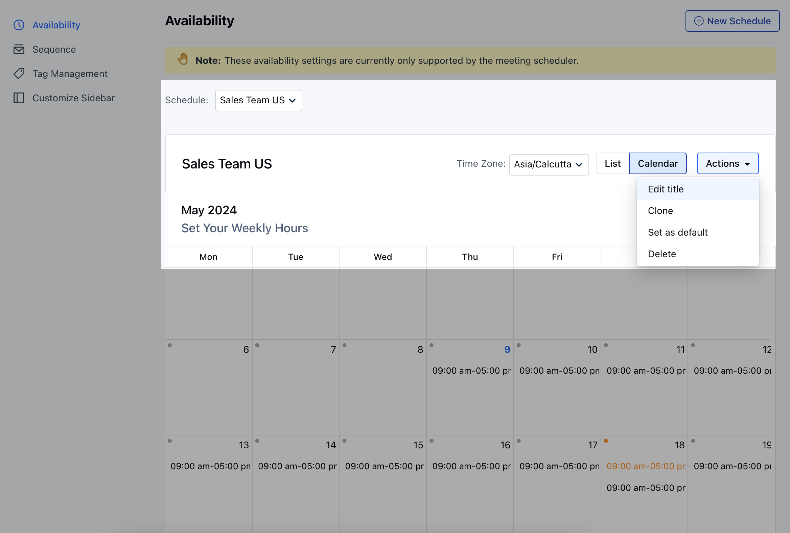

- **Click on** Actions and select

- **Edit title**.

- Once you click on Edit title, a pop-up dialogue box would open up prompting you to edit the title.

- **Hit** Update to save the changes.

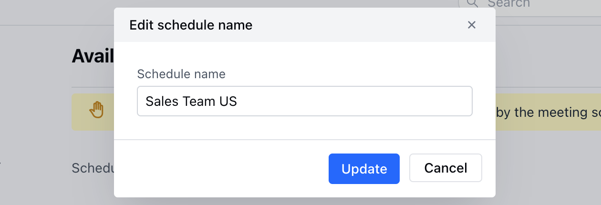

### Delete Schedule

In order to delete a schedule, follow the below steps:

- **Navigate to the** Profile icon on the top right corner.

- **Click on the** Setup .

- **Head over to the** Misc category

- **Click on** Availability

- Select the **schedule** from the list under the dropdown.

- **Once you select a schedule, click on** Actions and choose the option to

- **Delete**.

- Confirm the pop-up message to delete.

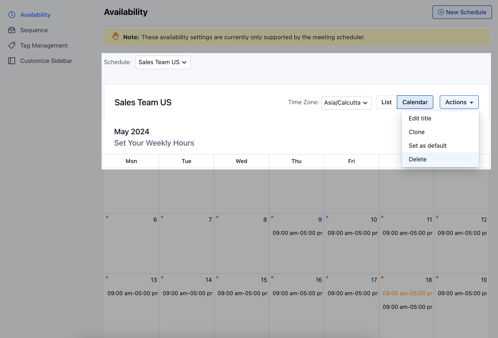

- Please note, any records associated with this schedule will be set to custom availability with these hours.

### Clone Schedule

To Clone the schedule, follow the below steps:

- **Navigate to the** Profile icon on the top right corner.

- **Click on the** Setup .

- **Head over to the** Misc category

- **Click on** Availability

- Select the **schedule** from the list which you wish to clone under the dropdown

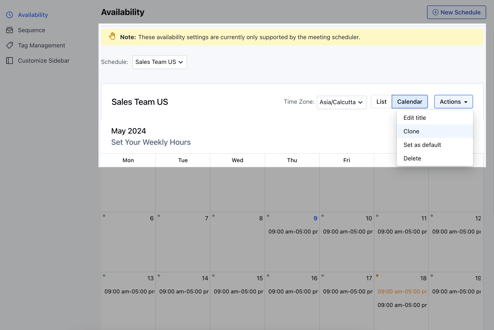

- **Click on** Actions and select

- **Clone ** A pop-up box would open up prompting you to write the name of the new schedule

- **Click on** Create to save the new Schedule.

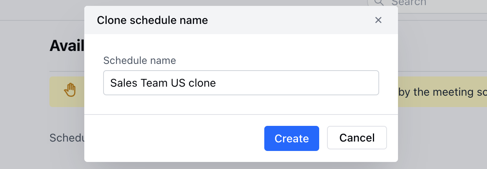

### Set Schedule as Default

To set the schedule as **Default**, follow the below steps:

- **Navigate to the** Profile icon on the top right corner.

- **Click on the** Setup .

- **Head over to the** Misc category

- **Click on** Availability

- Select the **schedule** for which you wish to set it as **Default** from the dropdown.

- **Click on** Actions and select

- **Set as default**.

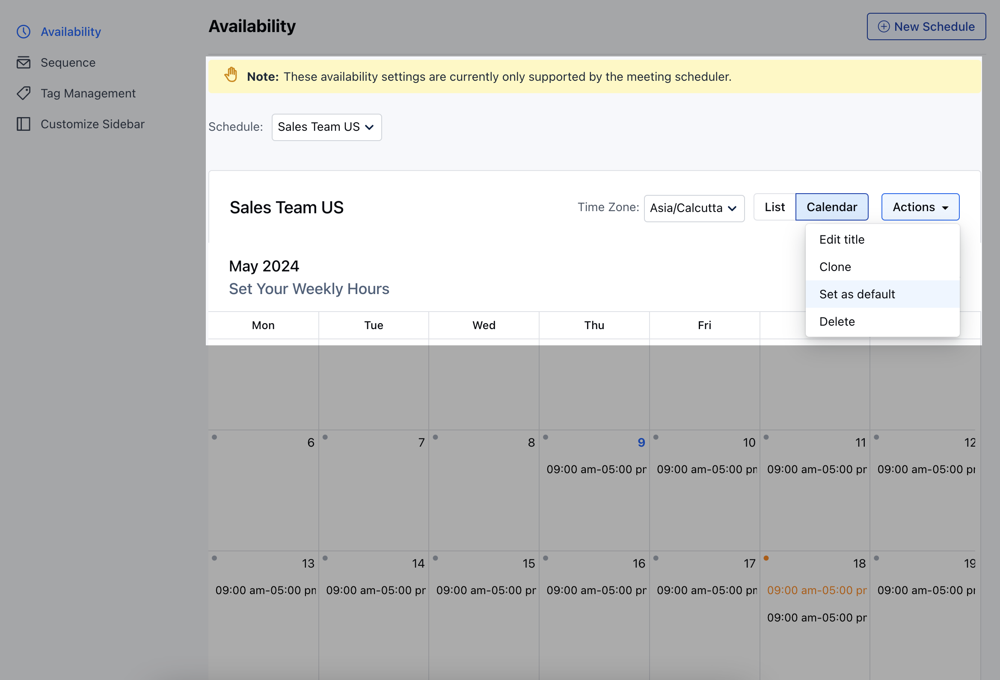
