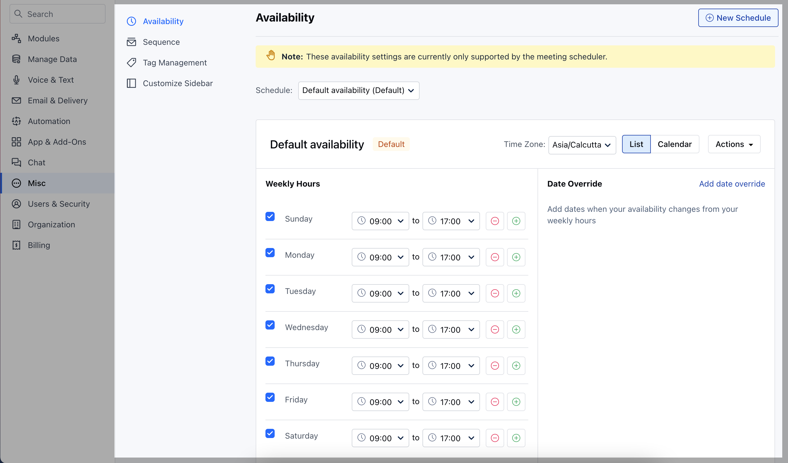
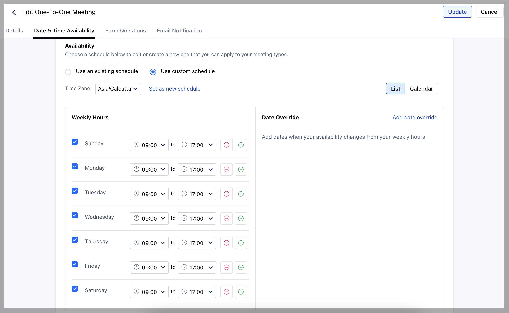

Every Organization or a Company has specific**time slots**under which they operate and therefore it becomes a necessity to**manage**them to ensure their proper functioning. Availability refers to the**defined**period of time under which the users will be able to schedule meetings with their clients. Setting up availability for different users helps to avoid double booking and safeguards users from having their calendars booked at**unavailable**hours.

### Types of Availability

Availability is divided into 2 different types, namely:

* [Global Availability](https://support.salesmate.io/hc/en-us/articles/4405391331981#h_01HXE0PDVJHEF5T3RM0F3Y62M0)

* [Custom Availability](https://support.salesmate.io/hc/en-us/articles/4405391331981#h_01HXE0PDVJF2YF3XPTWM3KWEWD)

### Global Availability

* The users under a company work according to the schedule that is defined by the organization.

* The admins under the account will be able to manage these schedules so that they can be directly used by the users without any kind of modification. [Learn more](https://support.salesmate.io/hc/en-us/articles/4405397144845)

### Custom Availability

* When the users under an organization work under different time slots when compared to that of the company, custom availability can be used.

* If the users do not wish to use the pre-defined timeslots that are defined by the company, they can simply opt for their own custom schedule. [Learn more](https://support.salesmate.io/hc/en-us/articles/4405391317517)

