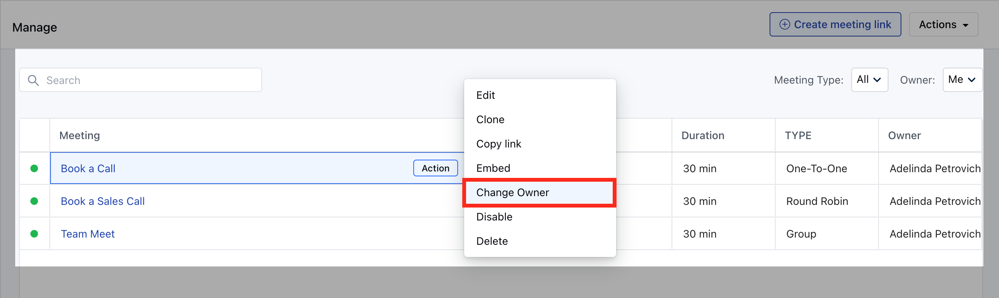
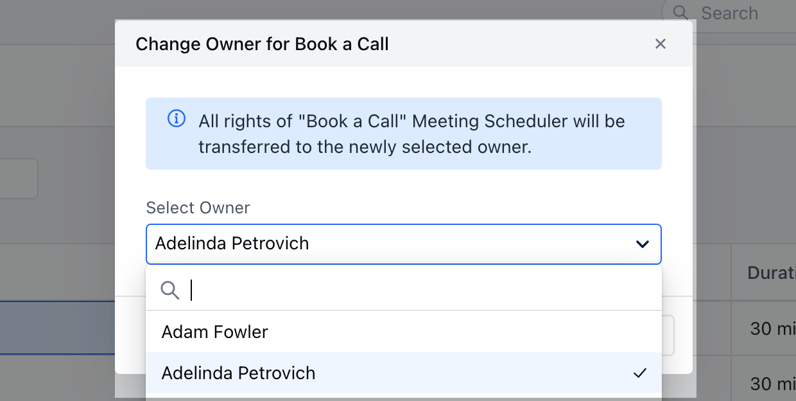

You can create multiple Meeting schedules and assign them to your teammates or update exiting meeting schedules to new owners, this can be useful if you have new members in your team.

To**Change Owner**of a Meeting Scheduler, follow the below-mentioned steps:

* **Navigate to the** More option from left sidebar menu

* **Click on** Meeting Scheduler

* **Hover over the** Meeting name of which you wish to change the ownership

* **Click on the** Action button

* **Hit the** Change

* **Owner**option

* **Select the** Owner (User) to whom you want to transfer the

* **ownership**of the particular Meeting Scheduler.

* All rights of the relevant Meeting Scheduler will be transferred to the newly selected owner.

* **Click on** Save to return back to the Meeting Scheduler menu List.

