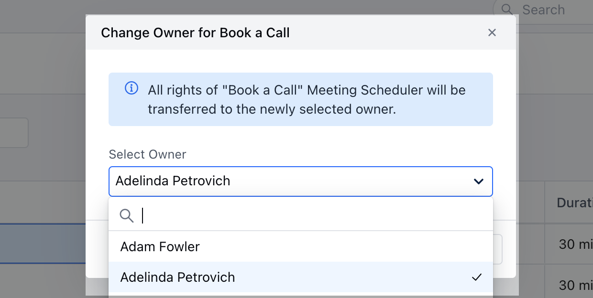

You can create multiple Meeting  and assign them to your teammates or update exiting meeting  to new owners, this can be useful if you have new members in your team.

To **Change Owner** of a Meeting , follow the below-mentioned steps:

- Navigate to the **More**  option from left sidebar menu
- Click on **Meeting **

- Hover over the **Meeting** **name** of which you wish to change the ownership
- Click on the **Action** button
- Hit the**Change Owner**  option

- Select the **Owner** (User) to whom you want to transfer the **ownership** of the particular Meeting.
- All rights of the relevant Meeting  will be transferred to the newly selected owner.
- Click on **Save** to return back to the Meeting  menu List.

