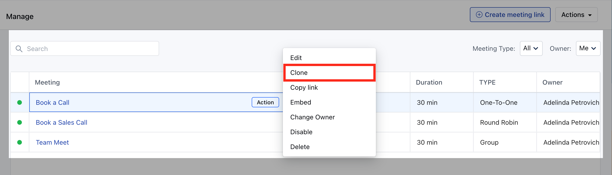
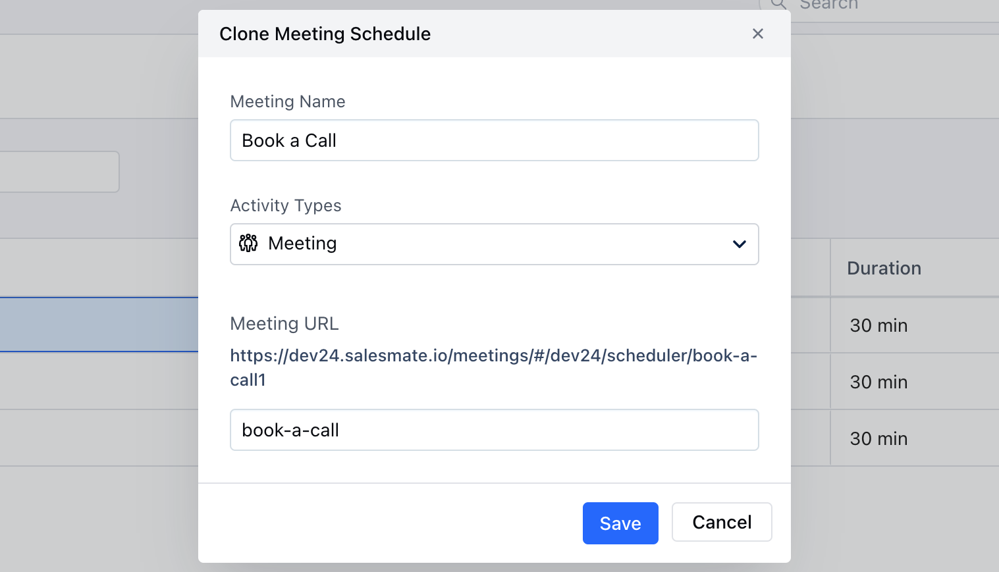

Salesmate offers you **Clone** functionality to save your crucial time by duplicating an exiting scheduler and customizing it for your current needs with minimum effort.

While creating a new meeting scheduler, you may use the existing scheduler's customization to save your few steps, thus you can Clone a meeting scheduler.

To **Clone** a Meeting Scheduler, follow the below-mentioned steps:

- **Navigate to the** More option from your left sidebar menu

- **Click on** Meeting Scheduler

- **Hover over the** Meeting Name which you wish to Clone

- **Click on the** Action button

- **Hit the** Clone option

Once clicked you will be presented with the following options:**Meeting Name:** You can feed the name of the new meeting scheduler

- **Activity Type:** Select the activity type which should get created upon successful booking

- **Meeting URL:** Customize the meeting URL suffix

Click on **Save** to find further options for customizing the [**Meeting Scheduler**](https://support.salesmate.io/hc/en-us/articles/4405390306189).
