### **One-To-One** A personal meeting refers to a one-to-one call wherein a customer can book a call with you individually, but others cannot join that meeting.

The Scheduler helps to create a dedicated space in your Calendar to interact with your customers/leads by booking a one-to-one call with you.

- [Create Meeting Link](#create-meeting-link)

- [Date and Time Availability](#date-and-time-availability-meeting-date-rangedefine-the-date-range-for-which-you-can-accept-the-meetings-following-are-the-option-through-which-you-can-set-up-the-date-rangexdays-in-future-from-the-current-date-which-will-comprise-of-two-variants-eg30-days-calendar-days-if-you-select-this-option-invitees-can-book-a-call-for-any-day-in-the-next-30-days-business-days-if-you-select-this-option-invitees-can-book-a-call-on-any-weekdays-ie-except-for-the-weekendssatsun-custom-date-range-this-allows-you-to-select-the-date-range-of-your-choice-like-current-week-month-quarter-or-year-alternatively-you-can-define-your-custom-start-and-end-date-no-date-range-limit-there-will-be-no-date-range-on-this-selection-invitees-will-be-able-to-book-a-meeting-even-for-the-next-year)

###  Create Meeting Link

To create a **Personal Meeting** Schedule link:

- **Navigate to the** More Icon from the left menu bar

- **Click on the** Meeting Scheduler

- Head over to **Create Meeting Link**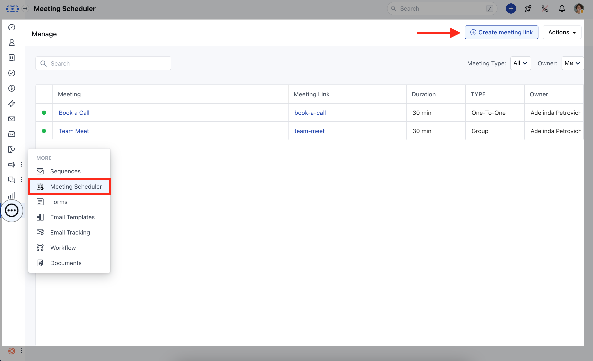

<Note>

**Note**:

- This option will be available only if the [Calendar Sync](https://support.salesmate.io/hc/en-us/articles/4405390306189) is enabled.

- You can also enable the sync upon notification popup being prompted if sync is broken/disconnected - "Please enable calendar sync for using this feature. Click here to connect the calendar."

</Note>

- **Select** One-To-One meeting

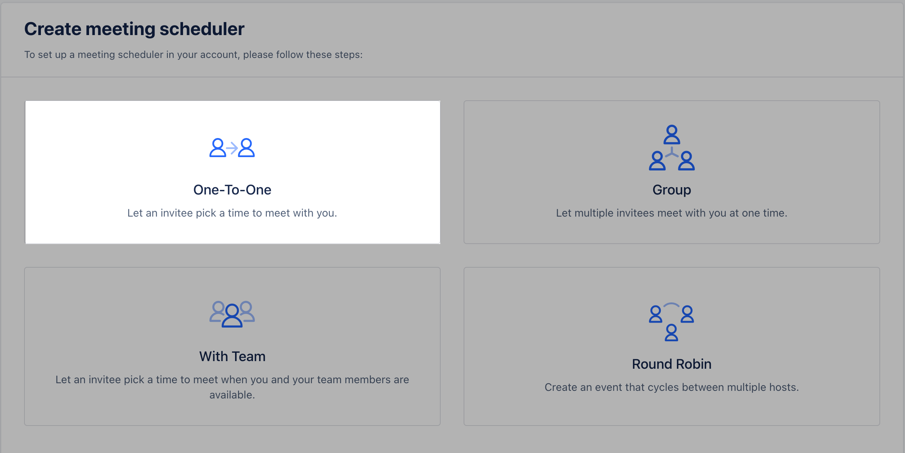

Once you select the Meeting type, you will be directed to the page wherein you can customize the meeting details:**Meeting Name:** The meeting name will appear on the browser to your invitees while they are booking the event.

- **Meeting description:** The description will appear as an additional context to customers for booking any new meeting. * Give your invitees a hint of how this meeting can help them.

- **Meeting URL:** The meeting URL is the unique link you can share with your customers to book a meeting on your calendar. * Please note that the meeting URL can't be changed once it has been created

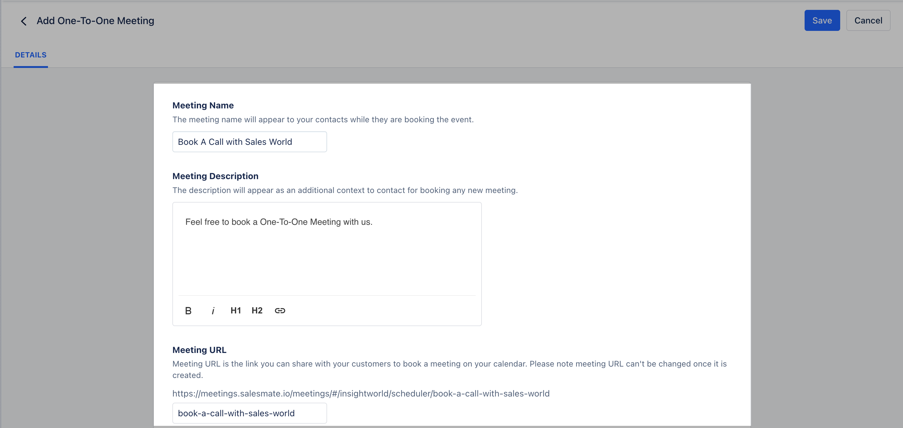

- **Meeting Location:** The location field helps your customer to understand where both parties will connect at a scheduled time.

- **In-Person **: It will be a blank section where the user can add the location of the meeting. You can add your unique conferences link via which invitees can join an online session or just the name of the place where the meeting would take place.

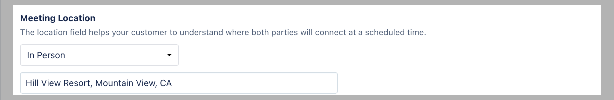

- **Phone Call **: This selection means that the meeting will be a phone call wherein the user will either call their customer or vice versa**I will call Invitee **: This will give the invitee an option to feed their number at the time of booking**My invitee should call me **: You will get an option to enter your number on which the invitee would be calling at their preferred time

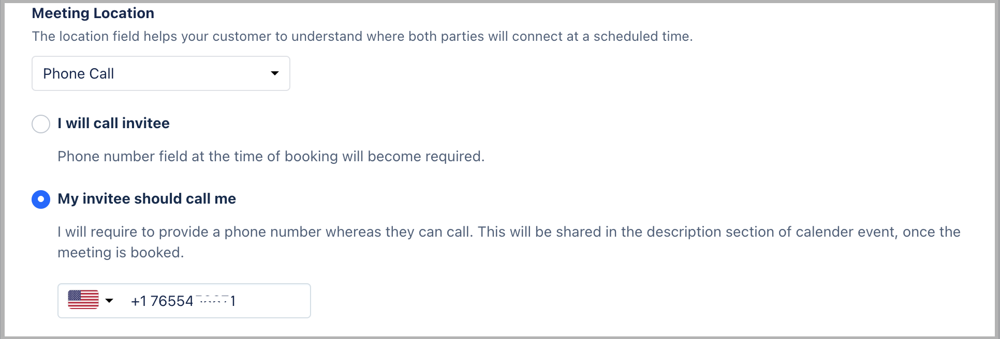

- **Zoom:**
- [It is a simplified video conferencing and messaging tool that helps you connect over screen sharing with your customers](https://support.salesmate.io/hc/en-us/articles/4406507771661)

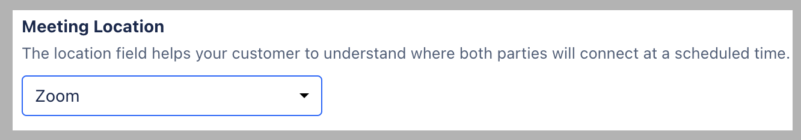

<Note>

- *Note**:

- **It requires you to pre-configure your Zoom application with Salesmate by clicking on Profile Icon >** Setup >

- **Apps & Add Ons**>**Apps**>**Zoom**>**Install**.

- Alternatively, you will be prompted on the Zoom selection to connect with Zoom - "Zoom hasn't configured. Go to apps to configured it." Click on the Message to get redirected to the app for zoom connection.

</Note>

- **Activity Types:** This option helps you to choose the new activity being created with the selected activity type.

- **Add Tags:** The Selected tags will get applied to the newly created activity which would help plan any automation or segmentation.

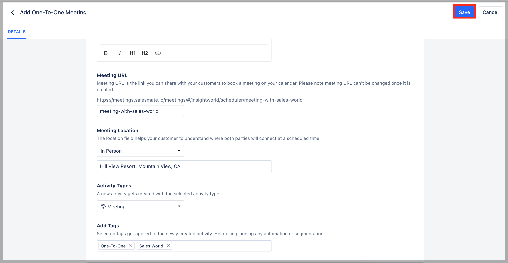

- **Click on the** Save button, to be directed to the next set of actions to configure availability and advanced options as per your requirement.

###  Date and Time Availability **Meeting Date Range:**Define the date range for which you can accept the meetings, following are the option through which you can set up the date range**"X"**days in future from the current date, which will comprise of two variants, Eg:**30 Days ***Calendar Days**: If you select this option, invitees can book a call for any day in the next 30 days. **Business Days**: If you select this option, invitees can book a call on any weekdays i.e. except for the weekends(Sat/Sun). **Custom Date Range: This allows** you to select the date range of your choice like Current - Week, Month, Quarter, or Year. Alternatively, you can define your custom start and end date. **No Date range limit:** There will be no date range on this selection, invitees will be able to book a meeting even for the next year.

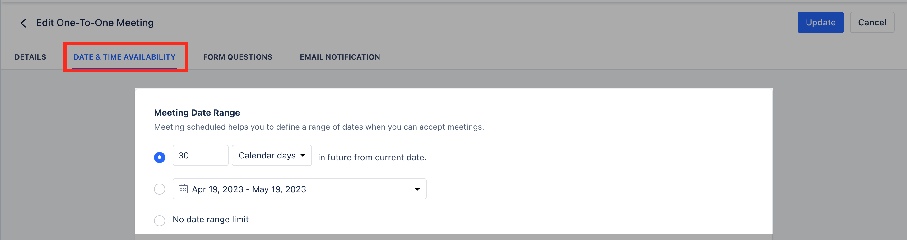

- **Availability:**Choose your daily time availability for which you can accept the calls/ meetings** List ** view for custom schedule selection

* The view helps you in defining Day(s) and hours by selecting the Time Zone and managing date overrides using a List of days as a selection menu.

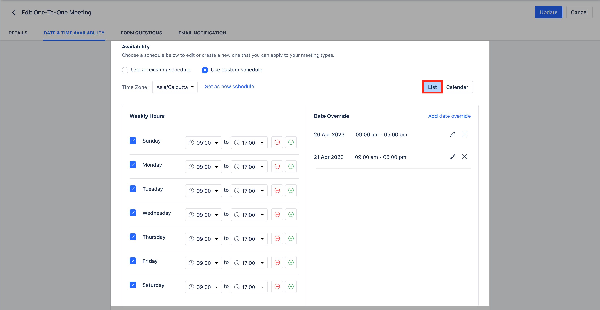

- **Use an Existing schedule:** By default business days (Mon - Fri) and common business hours (9 AM - 5 PM) will be selected along with your personal time-zone

- **Use Custom Schedule:**Here you can create multiple schedules by selecting: _ Custom business**days **of the week _ Custom business**hours ** of the day * Custom **Timezone **Set as new schedule:** It helps you to save custom portfolios to be shared with other users. This saves hours to be reused with other events types. You can manage all your schedules under availability.

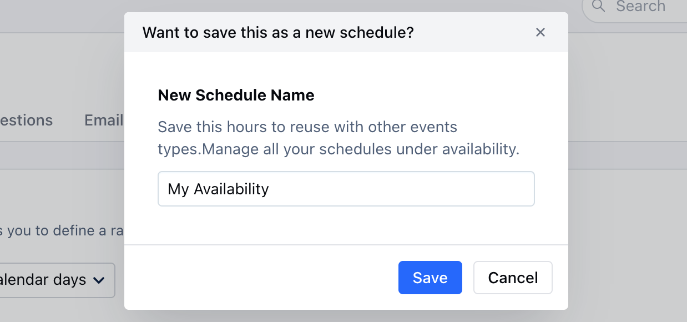

- **Date Override:** Users can add dates when their availability changes from regular weekly hours.

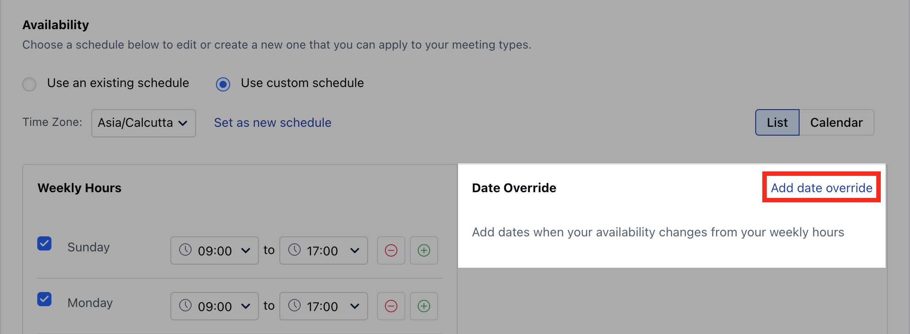

- **By clicking on "** Add date override " user's can define the date(s) and hours of their availability for the limited duration for which the meeting schedule can be booked.

- *Calendar** view Date(s) and Hours selection

- The current view offers defining Day(s) and hours by selecting the Time Zone using a Calendar view along with a custom schedule screen.

- **Select Business** Days

- Select the Available **Time** Slots

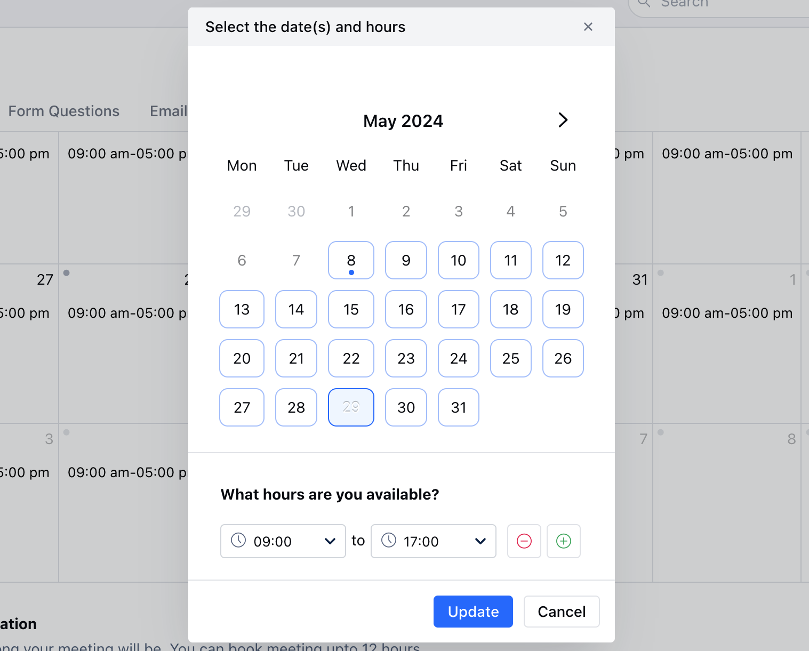

- **Meeting Duration:** Select how long your meeting can go on, you can book a meeting for up to 12 hours.

- **Buffer Time:** Allot time before or after the meeting to prepare for the next one or wrap the current.

- **Show available start times in increment of:** Select the frequency of the slots to be displayed * Eg: if you have select 1 hour here, then the slots will be shown as 8:00 AM, 9:00 AM, 10:00 AM & so on

- **Minimum Notice Time **:*_**Set the minimum amount of time before a meeting that someone can book with you. _ Eg: If you select this as 4 hours and it's 12:00 pm right now then the invitee will see the next available schedule after 4 pm

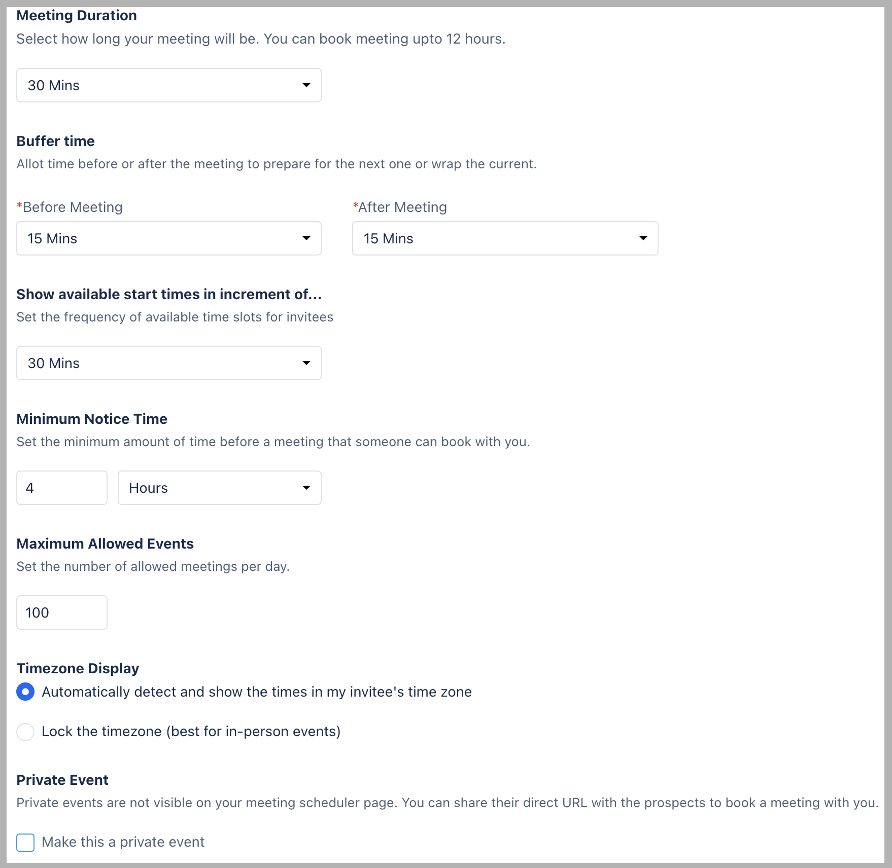

- **Maximum Allowed Events:** Select the maximum events that can be booked in a day

- **_Timezone Display:_** Automatically detect and show the times in my invitee's time zone: It will auto convert your available time slots into their timezone slots

* Lock the timezone (best for in-person events): A single timezone will be locked where the invitee can only see the timezone you have locked

- **Private Event:** Select the check box to make this a Private event which the invitees can only see if they have a Scheduling link for this meeting

Once this has been personalized proceed with Setting up **
[Form Questions](#date-and-time-availability-meeting-date-rangedefine-the-date-range-for-which-you-can-accept-the-meetings-following-are-the-option-through-which-you-can-set-up-the-date-rangexdays-in-future-from-the-current-date-which-will-comprise-of-two-variants-eg30-days-calendar-days-if-you-select-this-option-invitees-can-book-a-call-for-any-day-in-the-next-30-days-business-days-if-you-select-this-option-invitees-can-book-a-call-on-any-weekdays-ie-except-for-the-weekendssatsun-custom-date-range-this-allows-you-to-select-the-date-range-of-your-choice-like-current-week-month-quarter-or-year-alternatively-you-can-define-your-custom-start-and-end-date-no-date-range-limit-there-will-be-no-date-range-on-this-selection-invitees-will-be-able-to-book-a-meeting-even-for-the-next-year)
** and
[**Email Notification**](#date-and-time-availability-meeting-date-rangedefine-the-date-range-for-which-you-can-accept-the-meetings-following-are-the-option-through-which-you-can-set-up-the-date-rangexdays-in-future-from-the-current-date-which-will-comprise-of-two-variants-eg30-days-calendar-days-if-you-select-this-option-invitees-can-book-a-call-for-any-day-in-the-next-30-days-business-days-if-you-select-this-option-invitees-can-book-a-call-on-any-weekdays-ie-except-for-the-weekendssatsun-custom-date-range-this-allows-you-to-select-the-date-range-of-your-choice-like-current-week-month-quarter-or-year-alternatively-you-can-define-your-custom-start-and-end-date-no-date-range-limit-there-will-be-no-date-range-on-this-selection-invitees-will-be-able-to-book-a-meeting-even-for-the-next-year)
.
