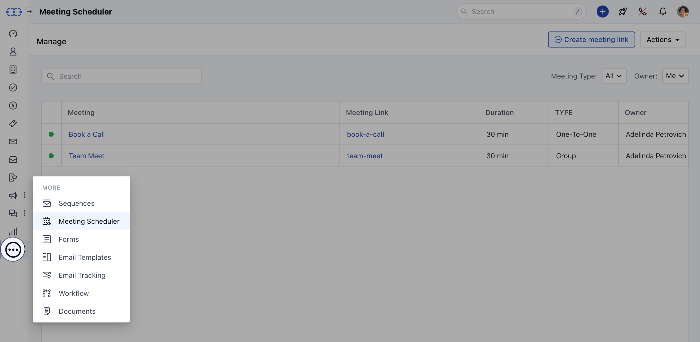
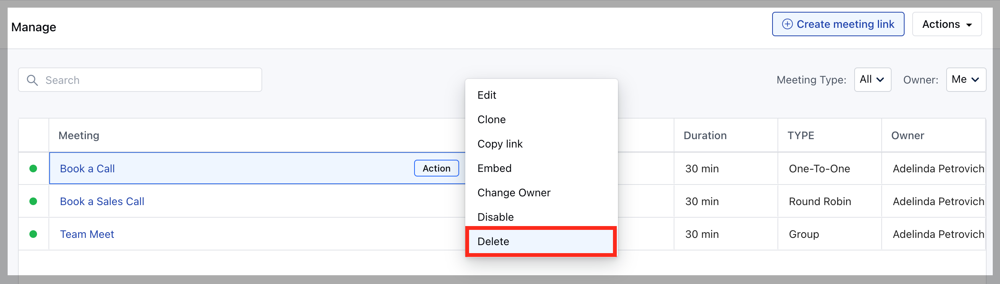

You can **Delete** the schedulers if you wish to discontinue with them at any time which furthermore will not let customers schedule any meetings/ calls.

- Once Deleted, contacts will be unable to schedule further meetings with deleted meeting scheduler.

- Meetings previously scheduled will not be affected after this action has been performed.

To **Delete** a Meeting Scheduler, follow the below-mentioned steps:

- **Navigate to the** More option from left sidebar menu

- **Click on** Meeting Scheduler

- **Hover over the** Meeting Name which you wish to Delete

- **Click on the** Action button

- **Hit the** Delete option

- **Confirm the** Delete Pop up message

<Note>

**Note**: This Action is irreversible and the Meeting Scheduler cannot be restored once deleted.

</Note>
