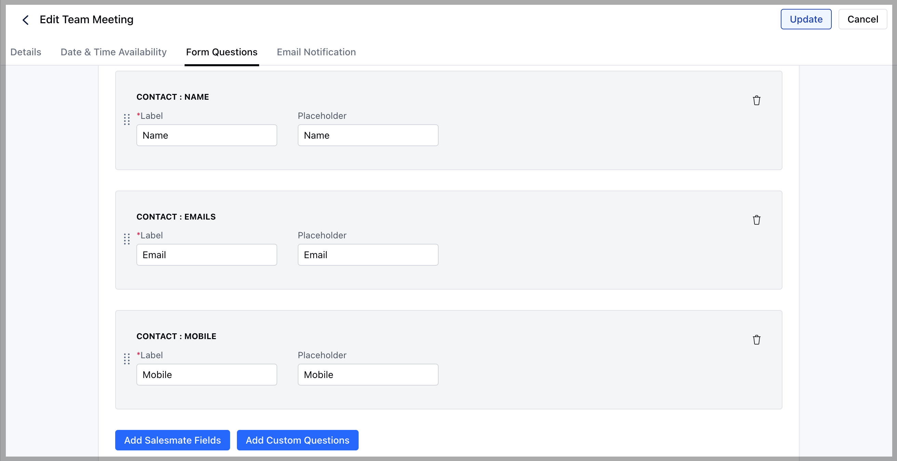
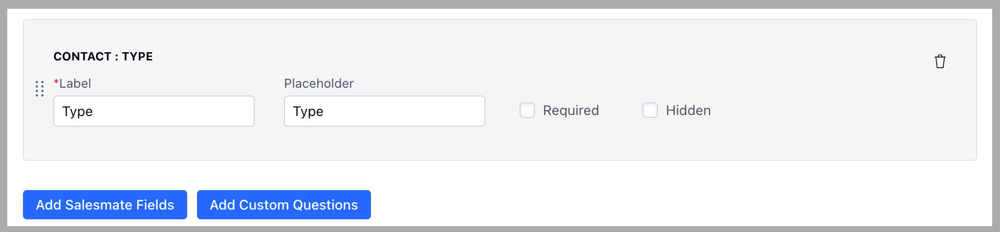
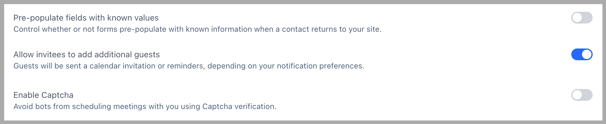
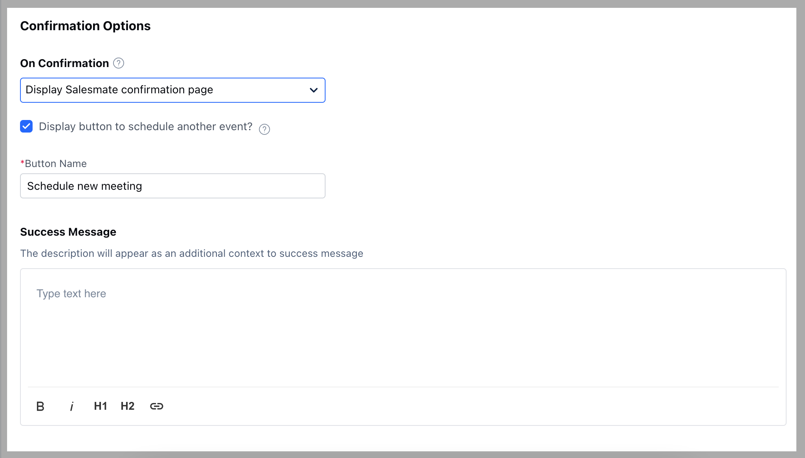
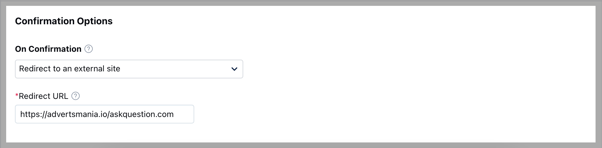

#### **Form Questions**

Ask your prospects and customers a few qualifying questions when they’re booking meetings with you. Contact properties will be automatically added to your Salesmate CRM.

To customize the question form:

* **Navigate to the** More option from your left sidebar menu  
* **Click on** Meeting Scheduler

* Select the Meeting  
* **Complete the steps —** Details and Date & Time Availability as per the selected [Meeting Type](https://support.salesmate.io/hc/en-us/articles/4405390436493)  
* **Go to “Form Questions”**

* **Click on “Add Salesmate Fields”** to add any existing fields from the Contact module  
  * *Example:* Description field to capture their requirements or purpose of the call.  

* **Click on “Add Custom Questions”** to add new custom fields as questions that are not part of your account as fields but are relevant to the meeting question form.  
  * *Example:* Select type custom field as a question to let invitees choose their preference.  

* **Pre-populate fields with known values:** Enabling this will automatically fill the fields with the value stored in the browser.  
* **Enable Captcha:** Enabling this will avoid bots from booking repeated calls.  

---

#### **Confirmation Options**

* Customize a meeting confirmation message on how you would like to notify the invitees on the scheduling page.  

* You can choose whether to show a successful confirmation message to your customers or auto-redirect them to a website URL for the next steps.  

**On Confirmation:**

* **Display Salesmate Confirmation Message:** Salesmate's default confirmation message will be shown.  
* **Display button to schedule another event:** If selected, it will display a button to the invitee to book another call.  
  * **Button Name:** You can customize the button name. By default, it is shown as “Schedule Another Meeting.” You can rename it (e.g., “Schedule New Meeting”).  
  * **Success Message:** You can include an additional message above the default message to make it look more personalized.  
    *Example:* “Your meeting is booked with \{Organization Name\}.”
 

* **If the user chooses “Redirect to an external site” for On Confirmation**, they will be asked to provide the URL to which the invitee should be redirected after the booking.

Once this has been personalized, proceed with the final settings under [Email Notifications](https://support.salesmate.io/hc/en-us/articles/4405400597133).
