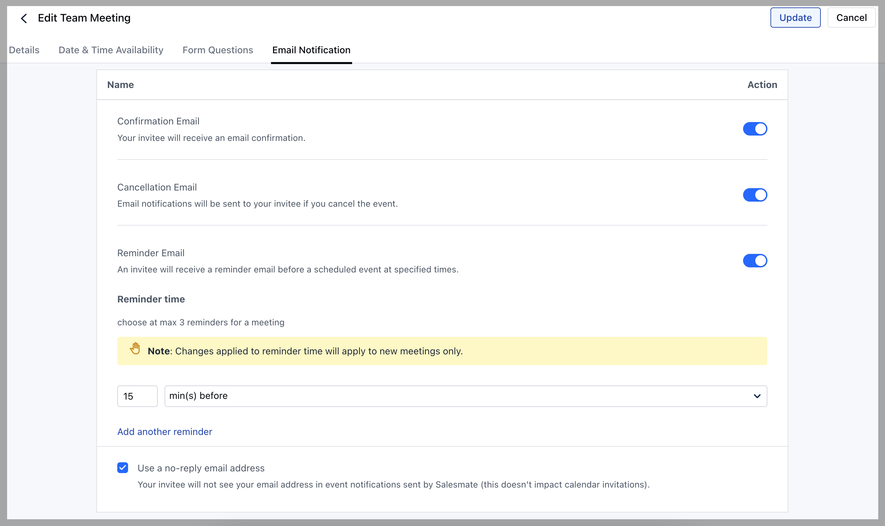

When invitees successfully schedule a meeting with you, they get an on-screen confirmation message by default. However, you can choose to send them a notification email by customizing it under the scheduler settings.

 To manage the notification, follow the below-mentioned steps:

- **Navigate to the** More option from your left sidebar menu

- **Click on** Meeting Scheduler

- **Select the** Meeting .

- **Complete the steps - ** Details ,

- **Date & Time Availability**, and
- [**Form Questions**](https://support.salesmate.io/hc/en-us/articles/4405400576525)
as per the selected
[**Meeting Type**](https://support.salesmate.io/hc/en-us/articles/4405390436493)

- **Click on the** Email Notification Tab **_Confirmation Email _**Toggle ON to send the confirmation email after a successful meeting booking from noreply@meetings.salesmate.io by default where your name will auto-appended.

- **_Cancellation Email _**Toggle ON to send the cancellation email once the invitee cancels the scheduled meeting from noreply@meetings.salesmate.io by default where your name will auto-appended.

- **_Use a no-reply address _** Turn ON to send the meeting reminders and notification emails from a no-reply address even if your domains are verified in Salesmate.

- If you wish to send the notification emails from your own domain, then you can turn off this option and
- [verify the domains.](https://support.salesmate.io/hc/en-us/articles/360006983771)

<Note>

**Note:** Enabling these notifications does not prevent Calendar systems to send notifications based on your default settings.

- If the user’s calendar is synced with Salesmate and the event booked gets synced to the user's calendar. In this case, the person who has booked the meeting will get two notifications for the booking. One from the calendar provider and another from Salesmate.

- Here Owner Name is the name of the owner of the meeting scheduler and the Owner's Email is the email address of the owner of the meeting scheduler.

</Note>

- *_Reminder Email _** Toggle ON to send the invitee a reminder email before the scheduled event at specified times.

- Click on **Add another reminder** to schedule a new reminder before the meeting. * You can select a maximum of three reminders for a meeting.

- Reminders can be added for intervals of **Min**(s),**Hours**(s),**Days**(s) before a meeting.

- **Click on** Update to finish the final installation.

