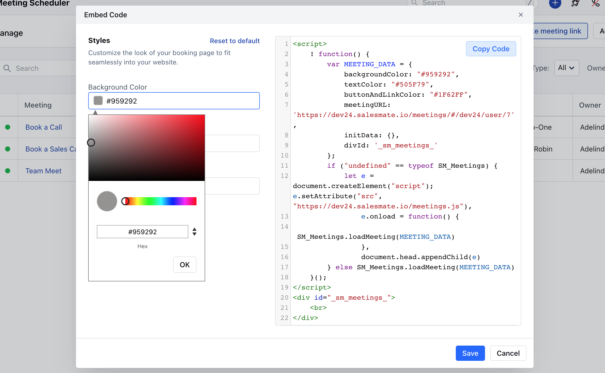
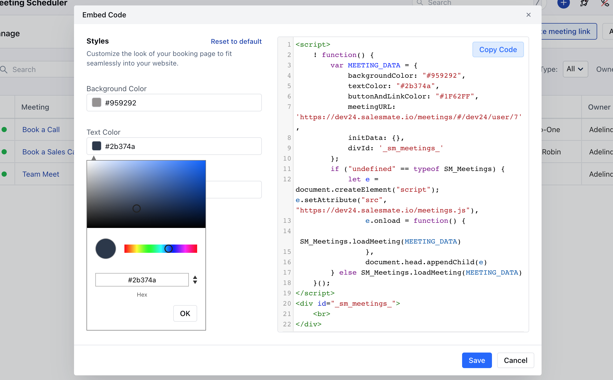
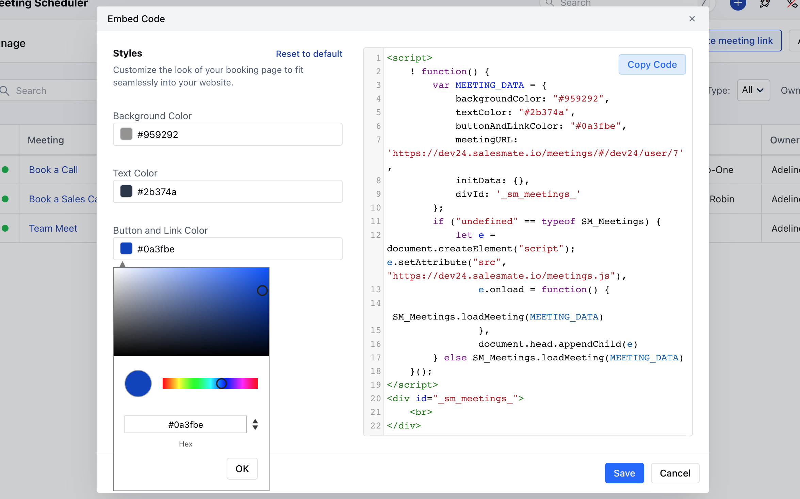

You can generate the code of a particular meeting scheduler and directly copy/paste it into any website to render it. Once the embedded code is generated, it gives you options to customize the embedded code. You can Customize the,**Backgroud Color**

- *Text Color**

- *Button and the Link Color**

Once the Customization is done, click on **Save**
