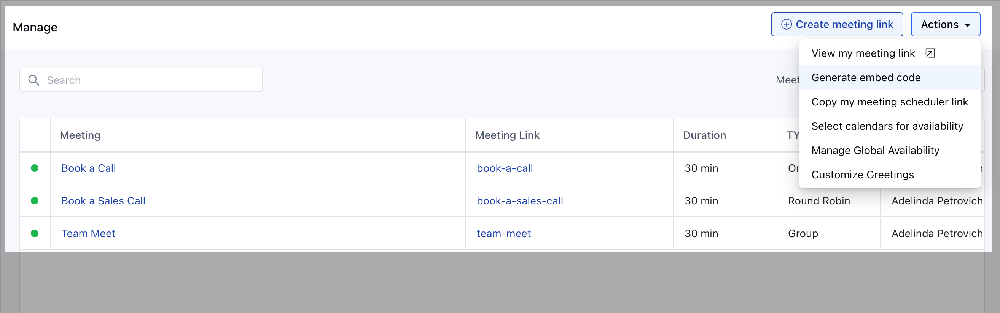
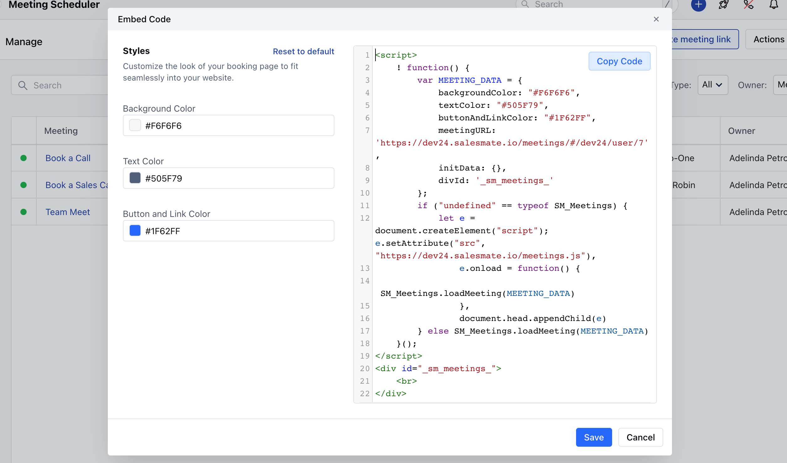
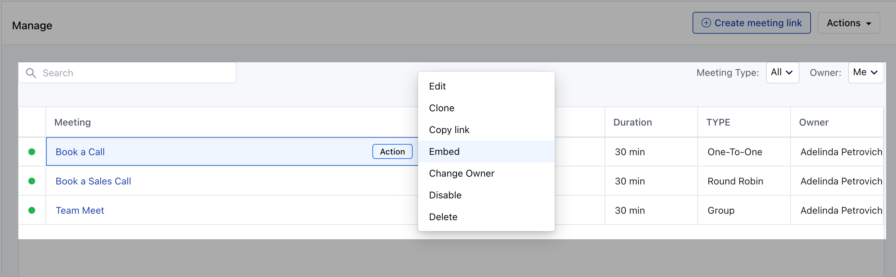
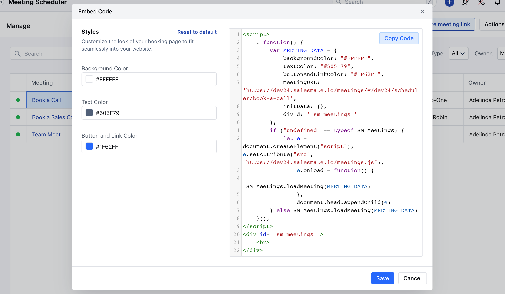

Whether you already created a meeting scheduler that you would now like to embed into your website or you just need access to a meeting scheduler embed code you already created, this will help you achieve it.You can generate the code of a particular meeting scheduler or a particular user and directly copy/paste it into any website to render it.

### Generate embed code for particular user.

To copy the code, follow the steps below:

Navigate to the**More**option from left sidebar menuClick on**Meeting Scheduler**

Click on**Actions**menu of the Meeting**\>> Generate embed code.**

Copy the code and paste it to your website.

### Generate embed code for particular meeting scheduler

Navigate to the**More**option from left sidebar menuClick on**Meeting Scheduler**

Click on**Actions against the meeting >>**Click on**Embed**####

In both cases, you can then adjust the appearance (**customize parameters**like Background Color, Text Color, Button & Link Color ) to fit your site and click**Copy Code**to paste it your website

### Are you a developer?

By making a JavaScript API call, you can create an inline embed on demand. This will allow you to delay the appearance of the embed until specific actions are completed, or until information is collected to be used for pre-filling the booking form. [**Learn More.**](https://support.salesmate.io/hc/en-us/articles/4405404132749)
