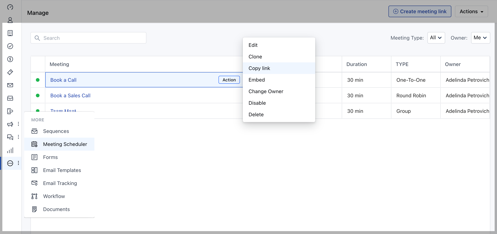

Share your Meeting Scheduler link so invitees can quickly go to your scheduling page and book with you.Topics Covered:

[Locate your meeting scheduler links](https://support.salesmate.io/hc/en-us/articles/4405397621389#1)[When you share your Meeting Scheduler link](https://support.salesmate.io/hc/en-us/articles/4405397621389#h_01HXE2GRF861PVSSE5RH7NTP1B)[Multiple ways to share your link](https://support.salesmate.io/hc/en-us/articles/4405397621389#h_01HXE2GRF8WNFRQ3SV262PBZ4E)[Want to make yourself available to anyone in your network](https://support.salesmate.io/hc/en-us/articles/4405397621389#h_01HXE2GRF9VH6DB99YFV068KCE)[Control who schedules with you](https://support.salesmate.io/hc/en-us/articles/4405397621389#h_01HXE2GRF9F8R3J998J21P6M7V)

### Locate your meeting scheduler links

There are 2 types of scheduling links:

[**Landing page**](https://support.salesmate.io/hc/en-us/articles/4405397621389#h_01HXE54DF229MQSKQP702EM3WQ) link (the page with all of your active event types)[**Meeting specific page**](https://support.salesmate.io/hc/en-us/articles/4405397621389#h_01HXE54JM2VQ1AYN1GBD232NZJ) (the scheduling page for a specific event type)

Once you locate your landing page link and your meeting scheduler page links, you can copy and share them to your invitees.

### To share your meeting scheduler links

####**Landing page,**Navigate to the**Profile Icon**from the left menu barClick on the**Meeting Schedular**Head over to the**Actions**optionClick on the**Copy My Meeting Schedular Link**

####**Meeting Specific Page,**Navigate to the**Profile Icon**from the left menu barClick on the**Meeting Schedular**Click on the**Meeting Link**Select**Copy Link**under**Actions**dropdown

### When you share your Meeting Scheduler link

Your invitees can click it and:

Visit your**landing page**lists all the types of event you offerChoose a meeting schedule you offerThen select a date and time to book with you**Tip**: to control the type of event they can book, instead of sending them to your landing page, send them a link to a**meeting specific page**that shows available times for just that type of meeting.

### Multiple ways to share your link

Share your link from:

Your email signatureThe body of an emailA text messageA link on your websiteYour social media Any other way you communicate with invitees

### Want to make yourself available to anyone in your network

Add your Meeting Scheduler link to your email signature. You can even add the link to your online profile or website to make yourself always available to the public.

### Control who schedules with you

If you prefer to be more exclusive, share your links only with people you want to meet with. You can also create**private event****types**that hide the event from your Landing Page.
