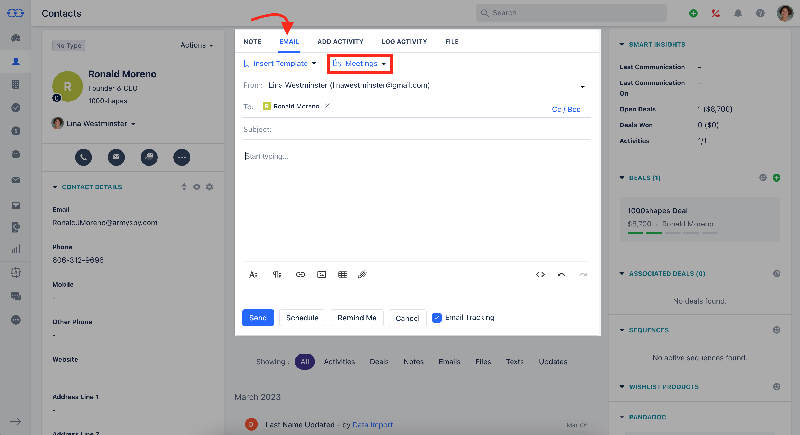
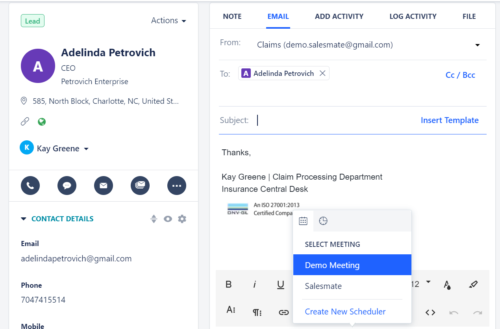
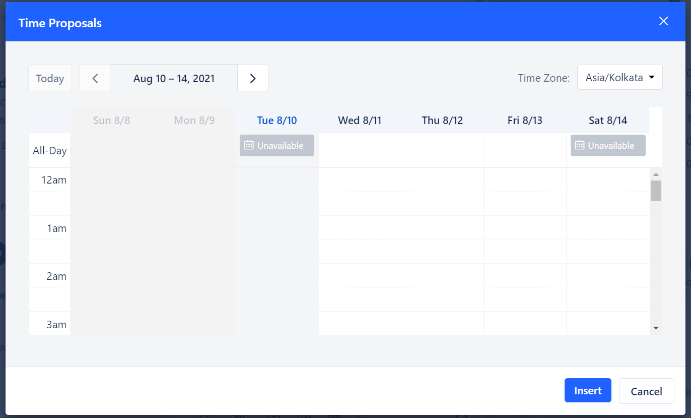
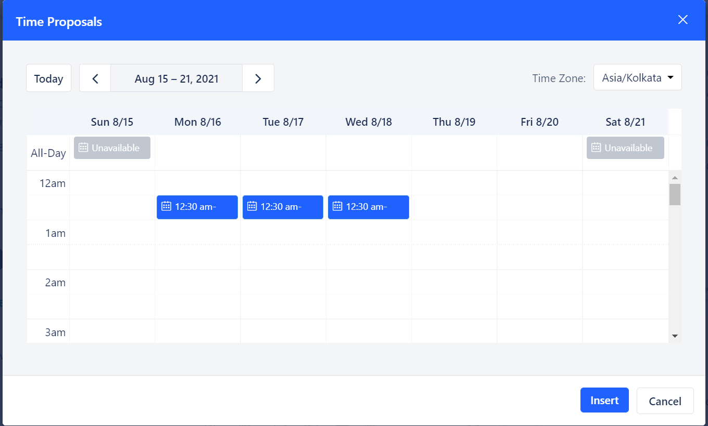
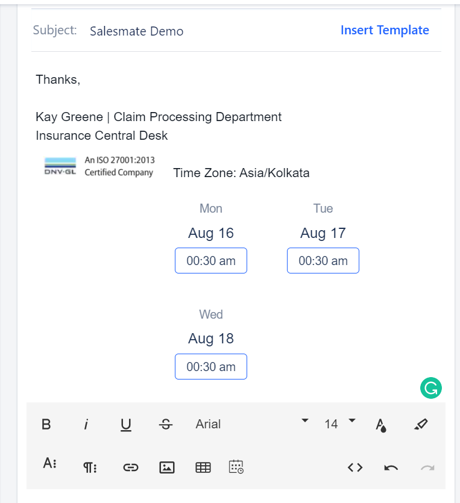
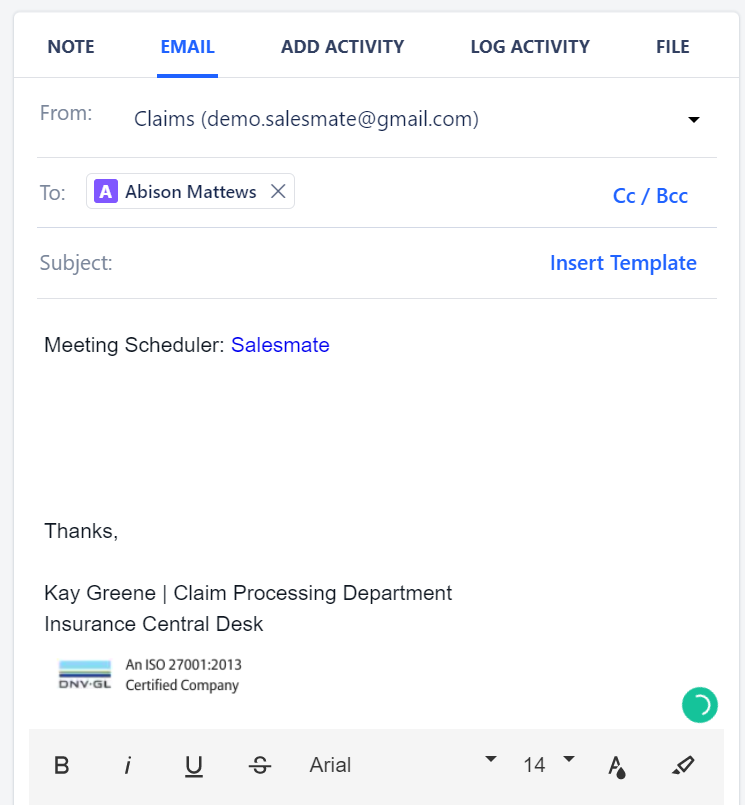

You can share your Calendar availability over an email. To share your availability over an email,

Click on any contact >>**Email**. Click on **Meeting.

When you click on the **Meeting** button you will get the popup where you can view the active meeting Links and the Timeslots.

Click on the scheduler that you want to insert in the email.

### Picking Time on Email Scheduler

You can pick the time which you want to your customer and add it in the email. To pick the time:

Go to **Email Compose** Screen >> Click on **Scheduler** Click on the **Pick Time(Clock)**button.

Here, Grey indicates the slots that are already booked. You can select up to 3 slots to add to the email.

Select the slots and hit on the **Insert** button.

