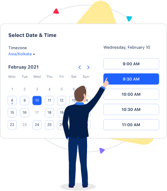
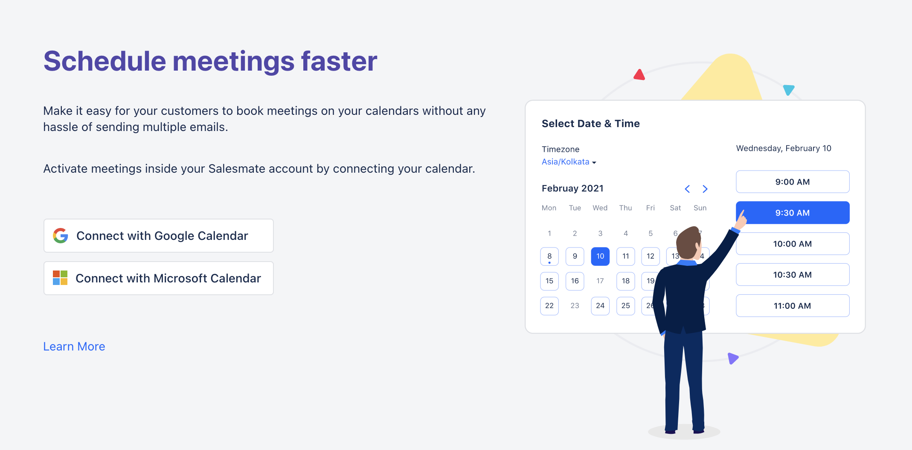

- *Meeting Scheduler** is a Salesmate's tool for scheduling meetings professionally and efficiently, eliminating the hassle of back-and-forth emails so you can be super productive.

Share meetings links with your contacts so they can effortlessly book a slot with you.

<iframe width="560" height="315" src="https://www.youtube.com/embed/HRr1eZ-IdI4" title="YouTube video" frameborder="0" allow="accelerometer; autoplay; clipboard-write; encrypted-media; gyroscope; picture-in-picture; web-share" allowfullscreen/>

- **With Salesmate's inbuilt** Meeting Scheduler , eradicate the use of an external meeting scheduler.

- Set your availability and let recipients choose the perfect meeting time and book more bookings with ease.

###  Connect your
[**Google calendar**](#connect-your-google-calendarhttpssupportsalesmateiohcen-usarticles213779789-or-microsoft-calendarhttpssupportsalesmateiohcen-usarticles360004213311-in-just-one-click)
or
[**Microsoft Calendar**](#connect-your-google-calendarhttpssupportsalesmateiohcen-usarticles213779789-or-microsoft-calendarhttpssupportsalesmateiohcen-usarticles360004213311-in-just-one-click)
in just one click.

- On the main menu page, Click Connect your Calendar

- In the dialog box, click
- [Google](#connect-your-google-calendarhttpssupportsalesmateiohcen-usarticles213779789-or-microsoft-calendarhttpssupportsalesmateiohcen-usarticles360004213311-in-just-one-click)
/
[Microsoft](#connect-your-google-calendarhttpssupportsalesmateiohcen-usarticles213779789-or-microsoft-calendarhttpssupportsalesmateiohcen-usarticles360004213311-in-just-one-click)
(Office 365), to Connect your calendar.

- As you connect your calendar with Gmail or Office 365, booked meetings will sync with your connected calendar so your appointments will always be up-to-date.

- Once you’re set up, insert the meeting link to your website, any email, template, or campaign. Recipients can click the meeting link and choose an available time slot.

- **In the Salesmate Meeting scheduler, you can choose the type of meeting scheduler that you want to allow your users to choose whether a** one-to-one meeting or group meeting or team meeting, or round-robin meeting.

- Set your custom **date & time availability** by only offering times that work with your availability across all of your calendars. Open your schedule only to the days and times that work for you. When your invitee chooses a meeting slot, it’s instantly confirmed.

- **Add custom questions or add custom fields ** to the calendar to capture the specific customer requirements and make the agenda of the call.

- **Send personalized** email notifications to your contacts for meeting confirmations or cancellations. Also, send automatic email

- **Reminders** to your invitees for the event.

- **Need help?** Feel free to chat with us or write us at [support@salesmate.io](#connect-your-google-calendarhttpssupportsalesmateiohcen-usarticles213779789-or-microsoft-calendarhttpssupportsalesmateiohcen-usarticles360004213311-in-just-one-click) & we will be glad to assist you
