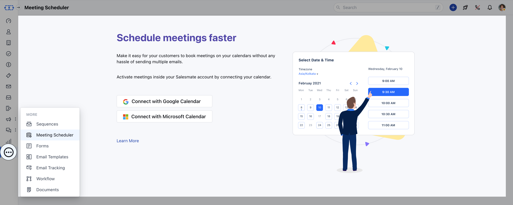
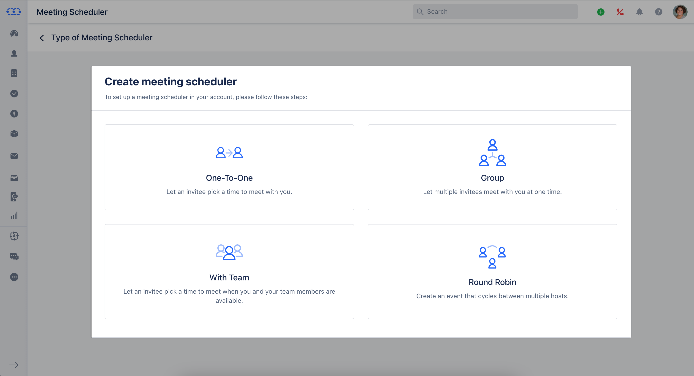

In Salesmate, there are **four** different **types** of **Meeting Scheduler** that you can create.

The Overall concept of meeting schedulers remains the same differentiating them on the basis to whom the meeting will be assigned and how many people can join the meeting will make this unique.

### Create Meeting Scheduler

To set up a meeting scheduler in your account, please follow the below-mentioned steps:

- **Navigate to the** Left Menu bar
- **Click on the** More Icon
- **Head over to** Meeting Scheduler option

As you select Meeting Scheduler, you would be prompted to connect with your [Calendar](https://support.salesmate.io/hc/en-us/articles/4405390306189). Following this, you would be prompted to select the **Types**.

**Following are the Meeting Scheduler Types:**

- [One-To-One](#please-select-one-of-the-below-mentioned-types)
- [Group](https://support.salesmate.io/hc/en-us/articles/4405390436493-Types-of-Meeting-Scheduler#h_01GBZ3B92AZ6P78ADN6S459W7J)
- [With Team](https://support.salesmate.io/hc/en-us/articles/4405390436493-Types-of-Meeting-Scheduler#h_01GBZ3BJ0C0RDC03MNDJE9Z9EV)
- [Round Robin](https://support.salesmate.io/hc/en-us/articles/4405390436493-Types-of-Meeting-Scheduler#h_01GBZ3BS94S6SD0D13MS5X4CM2)

### Please select one of the below-mentioned types:

**One-to-one Meeting:** 

- One-to-one virtual meetings offer you and your customers the upsides of meeting in with the setting, saving drive time, and acquiring adaptability and productivity.
- Let an Invitee pick a time to meet with you. Once the availability is set, your lead or contact can book a personal meeting with you.
- To know how to create a one-to-one meeting,
- [click here.](https://support.salesmate.io/hc/en-us/articles/4405390538125)

**Group Meeting:** 

- Allow multiple invitees to meet with you at one time same as scheduling a webinar.
- You need to know precisely which themes you wish to address, examine, and resolve. Convey the plan to the customer early with the goal that they realize how the gathering will be organized. This move additionally demonstrates polished methodology and commitment to a business coordinated effort.
- To know how to create a Group meeting,
- [click here.](https://support.salesmate.io/hc/en-us/articles/4405390553613)

**Team Meeting:** 

- Let the invitee pick a time when you and your team members are available.
- Allow the customer to pick multiple users from various departments they need to gather information with so all users can deal with the customers' inquiries.
- To know how to create a Team meeting,
- [click here.](https://support.salesmate.io/hc/en-us/articles/4405390541965)

**Round Robin Meeting:** 

- Create an event that cycles between multiple hosts. This option shows the individual availability of all selected users in the account. With this option, a contact can book a slot with a rep whose availability aligns best with their schedule.
- To know how to create a Round Robin meeting,
- [click here.](https://support.salesmate.io/hc/en-us/articles/4405396818829)