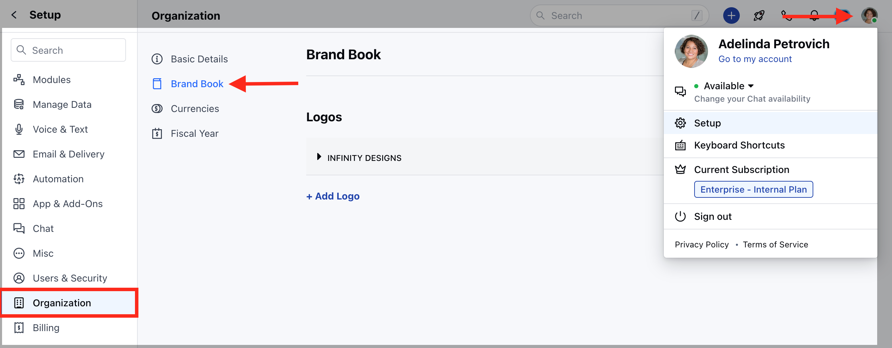
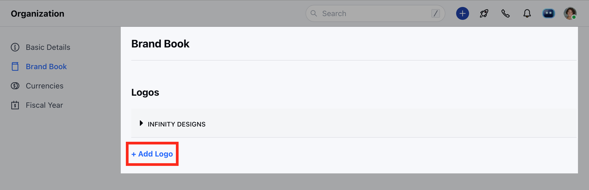
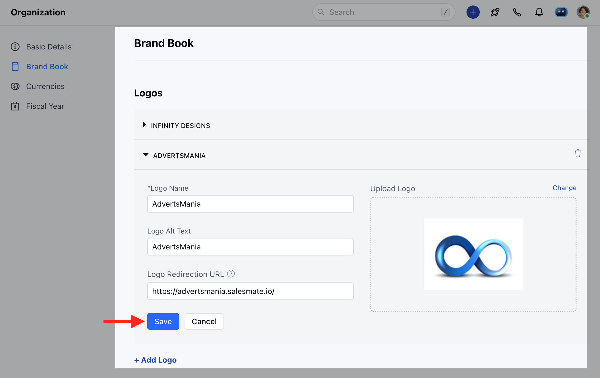
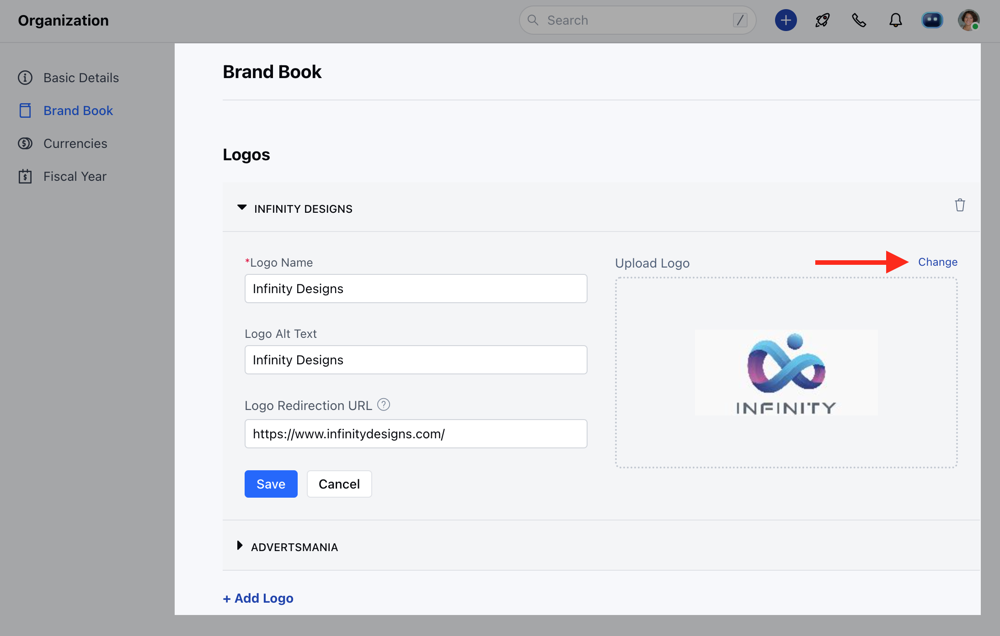

The **Brand Book** feature will allow you to configure your organization's **colors, logos, and** **template styles. **\
With the existing option, we allow adding **Logos** to the brand book.\
Upload multiple logos to use across Skara modules, like **Meeting Scheduler, Chat, and Chat Journeys.**\
Currently, with the Brand Book option you can add the logos to the [Meeting Scheduler Custom Greetings](https://support.salesmate.io/hc/en-us/articles/4674492918297) option.

**Note:** This action can be performed by the user who has admin rights.

Topics Covered in this Article:

- [**Add a Logo**](#add-logo)
- [**Update a Logo**](#update-a-logo)
- [**Delete a Logo**](#delete-a-logo)

### Add Logo

To add a Logo to the Brand Book, please follow the below steps:

- Navigate to the **Profile icon** on the top right corner
- Click on the **Setup**
- Head over to the **Organization**
- Click on the **Brand Book**

Now, click on the **"+ Add Logo"** button to add the logo.

This will open the below screen and will ask for the below information.

- **Logo Name:** Give a name to your logo, this name will be used to select the logo in Skara modules.
- **Logo Alt Text:** Give alternative text which should be displayed, in case the image doesn’t appear.
- **Logo Redirection URL:** Embed URL to your logo that redirects the users to a particular webpage.
- **Upload Logo:** Here upload the image from your system.

**Note:** Maximum size allowed 5MB\
Supported Image formats: .JPG, .JPEG & .PNG

### Update a Logo

To update a Logo to the Brand Book, please follow the below steps:

Navigate to the **Profile icon** on the top right cornerClick on the **Setup** Head over to the **Organization** Click on the **Brand Book**

Now open the Logo from the list that you wish to update.Here, you can now update the **Logo name, Logo Alt text, and Redirection URL**. To change the logo image click on the **Change** button and upload the new image.Once done, hit on **Save**

### Delete a Logo

To delete a Logo to the Brand Book, please follow the below steps:

Navigate to the **Profile icon** on the top right cornerClick on the **Setup** Head over to the **Organization** Click on the **Brand Book**

Open the Logo from the list that you wish to Delete and click on the **Delete icon** Upon clicking on the **Delete icon**, it will show a confirmation popup whether you wish to delete the logo or not.

Confirm the **Delete**

- \*Note:\*\*Deleting a logo will remove it permanently, and it will be removed from all places where it has been used.