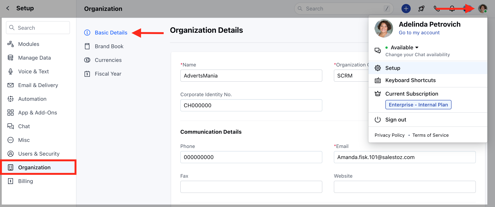
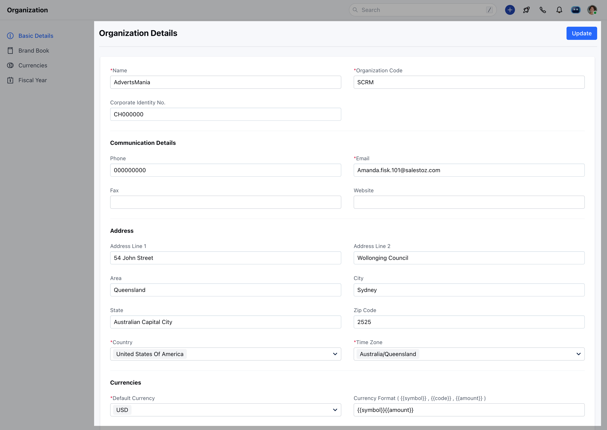
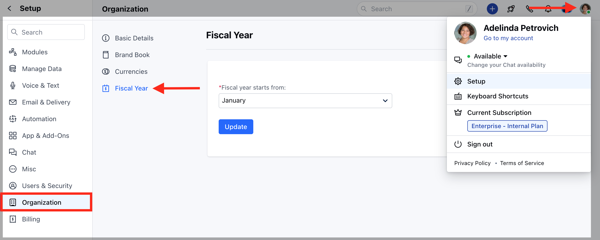
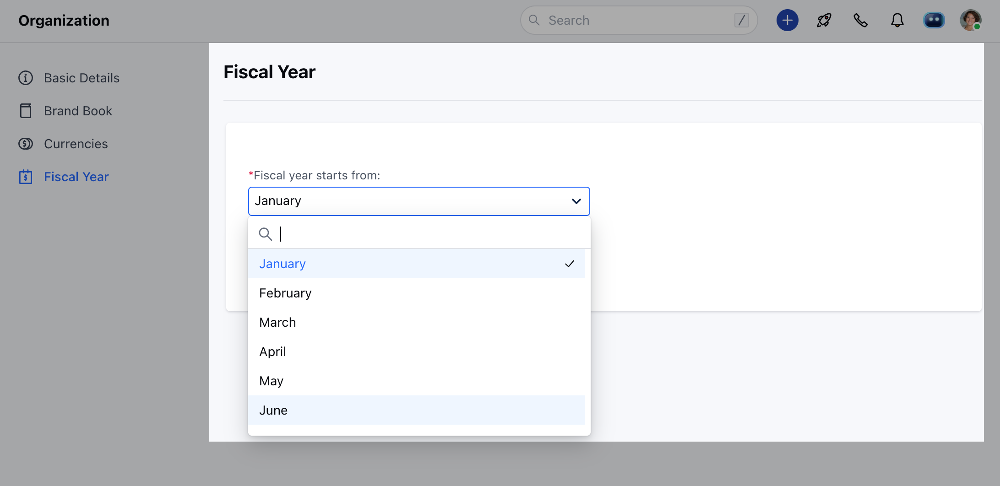
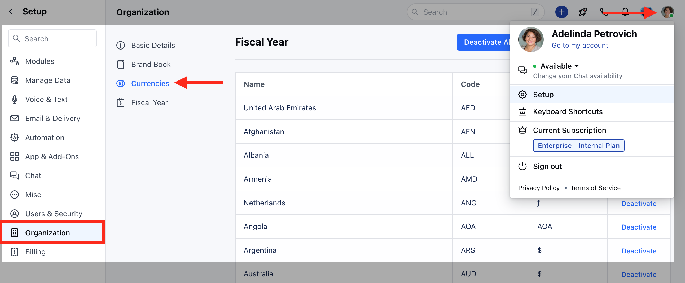
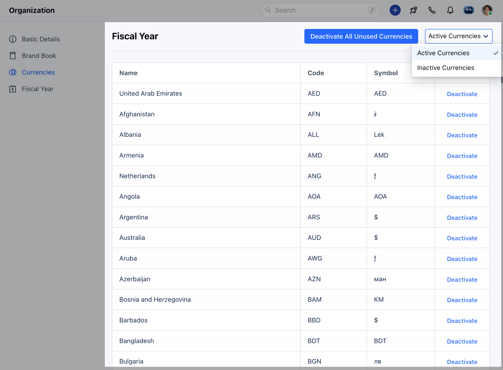

Organization Details lets you configure the details of your organization such as the geographic region in which your organization is located, communication details, and operational currency.

**Topics covered:** -

- [Organization Details](#organization-details)
- [Fiscal Year](#fiscal-year)
- [Currencies](#currencies)

<Note>
  **Note:** Admin rights are required to perform actions listed in this article
</Note>

### Organization details:

- Navigate to the **Profile Icon** on the top right corner
- Click on the **Setup**
- Head over to the **Organization**
- Click on the **Basic Details**

- You will be redirected to the Organization Details screen

<Note>
  Note :

  - The Default Currency in the set format will be used to display Sales figures throughout the system.
  - All conversations in the system will be listed according to the company time zone unless a user time zone is exclusively set in the user profile. 
  - The Company Disclaimer will be added to the footer of every mail sent from the Skara E-Mailing system.
</Note>

### Fiscal Year:

You can also set your organization's fiscal year from Organization Settings and choose the Start month.

- Navigate to the **Profile Icon** on the top right corner
- Click on the **Setup**
- Head over to the **Organization**
- Click on the **Fiscal Year**

  
- Once the fiscal start month is selected, fiscal quarters are automatically derived. By default, Skara's fiscal start month is set to April of the current year.
- You can specify the fiscal year name based on the start month.

- **For example**, let's say your fiscal year starts in Jan 2024 and ends in Dec 2024. Then, set the start month as January.

<Note>
  **Note:** The Fiscal Start Month affects the way your Goal Reports are derived.
</Note>

### Currencies :

While confirming your registration for Skara, it sets the default currency based on the country. However, you can change the default currency from **Organization details.** In case your organization deals in multiple currencies you can enable it by:-

- Navigating to the **Profile Icon** on the top right corner
- Click on the **Setup**
- Head over to the **Organization**
- Click on the **Currencies**

-  Activate the currency you need from the list of Inactive currencies.

