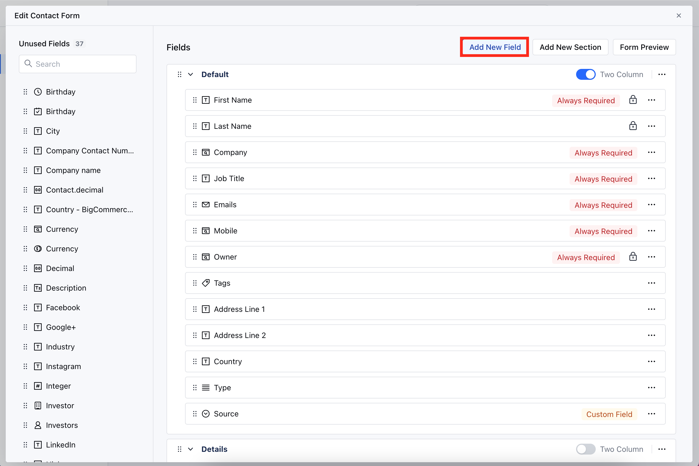
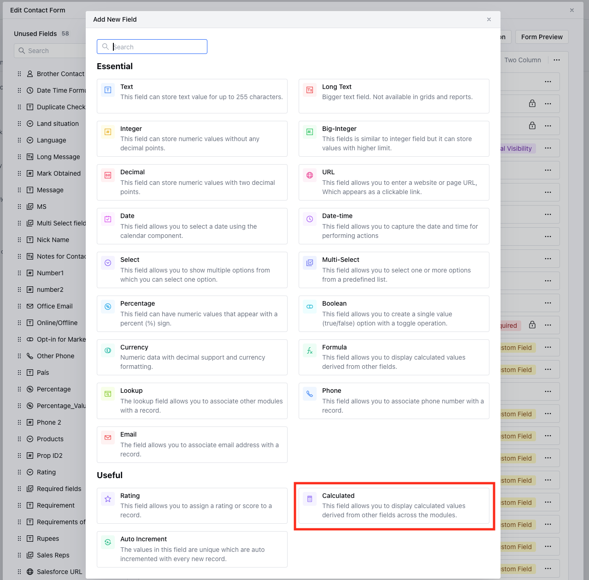
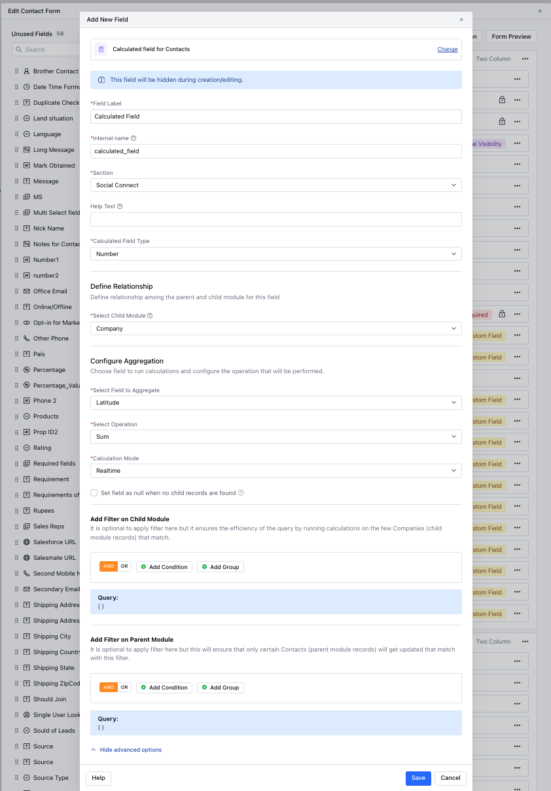

Calculated fields allow you to perform automatic calculations based on existing data from other fields or related modules.To Create Calculated Fields,

Navigate to the**Profile Icon**on the top right cornerClick on the**Setup**Head Over to the**Modules**CategorySelect the Module (**Contact, Company, Deal, Activities, Products, and Custom Modules**)

Go to the**All Detail Form Fields**sectionClick on**Add New Field**to create a new custom field

OR

Go to Customize the Module Create FormClick on the**Add New Field**

Select the Calculated Field or search the Calculated Field with the Quick Search option

Provide the following details**Field Label:**Define the label to identify the field**Internal Name:**Define the internal name for API integrations**Section:**Select the Section under which you wish the Field to fall.**Help Text:**Define Help Text to provide additional information to help your teammates understand the purpose of the field**Calculated Field Type:**Select the field type for this field. It supports the following for the first phase:
NumberDate**Define Relationship:**Define the relationship between the parent and child module for this field**Select Child Module:**You can choose the module associated with the module where you create this field. Please note that only the multi-lookup fields can be selected.**Configure Aggregation:**Choose a field to run calculations and configure the operation that will be performed.**Select Field to Aggregate:**This is the field on which calculations will be based, and you can choose it from the available fields in the child module, filtered by the selected**Calculated Field Type**.**Select Operation:**Select the operation to be performed on the values of the chosen field.For**Number Type,**the available operations are:**COUNT**: Counts all values.**SUM:**Sums all values.**AVERAGE:**Calculates the average of all values.**MIN:**Finds the minimum value.**MAX:**Finds the maximum value.For**Date Type**,**MIN:**Finds the minimum value.**MAX:**Finds the maximum value.**Calculation Mode:**Choose between real-time or Scheduled calculations.**Realtime:**The field will be updated in real-time as the base values change.**Scheduled:**Calculations will run at a fixed time, once every 24 hours.**Set field as null when no child records are found:**If checked, the calculated field will return null instead of 0 when no matching child records are found.**Advanced Options:**This section is optional but allows you to filter records for efficiency.**Add Filter on Child Module:**If you apply a filter to the child module, calculations will only apply to records matching the condition.**Add Filter on Parent Module**: Similarly, you can filter the parent module, ensuring that only specific parent records are updated.

Once done, click**Save**to add the calculated field.
