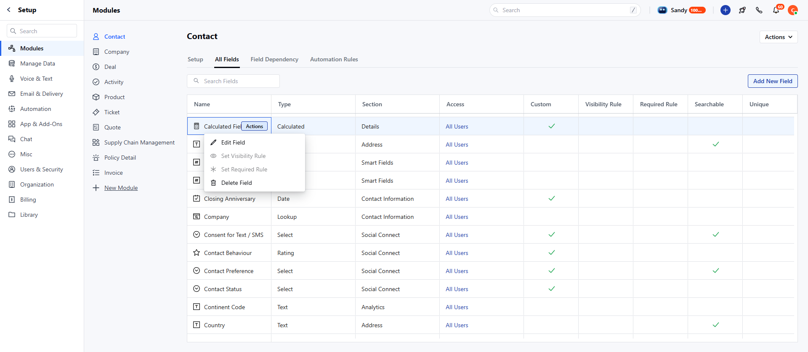
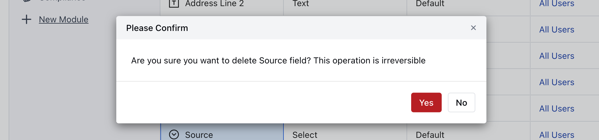

Deleting a calculated field will work similarly to any other custom field.\
To Delete Calculated Fields:

- Navigate to the **Profile Icon** on the top right corner
- Click on the **Set Up**
- Head Over to the **Modules** Category
- Select the Module(**Contact, Company, Deal, Activities, Products, and Custom Modules)**

- Go to **All Detail Form Field** **Section**
- Select the Calculated Fields to **Delete,** then hover over the field you wish to modify and click on the **Actions** button.

Confirm the action to continue deleting the field by clicking **Yes**.

<Note>
  Note:

  - You need “Manage Fields” permission to delete it. 
  - If you try deleting a custom field that is used as an aggregate field in the calculated field, it will throw an error message stating, “**Please remove this field from the calculated field(s) to delete it.**”
</Note>