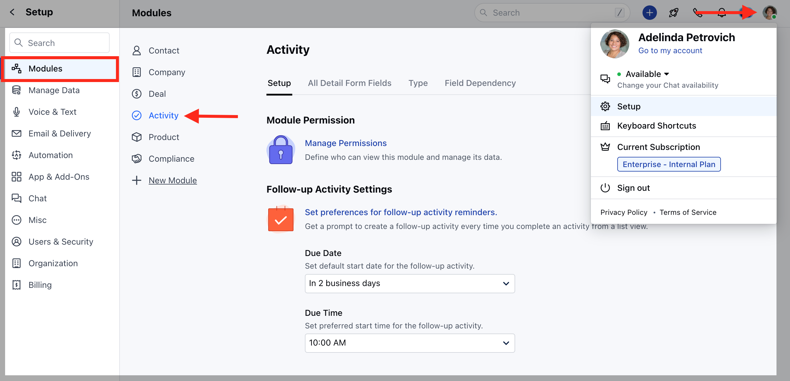
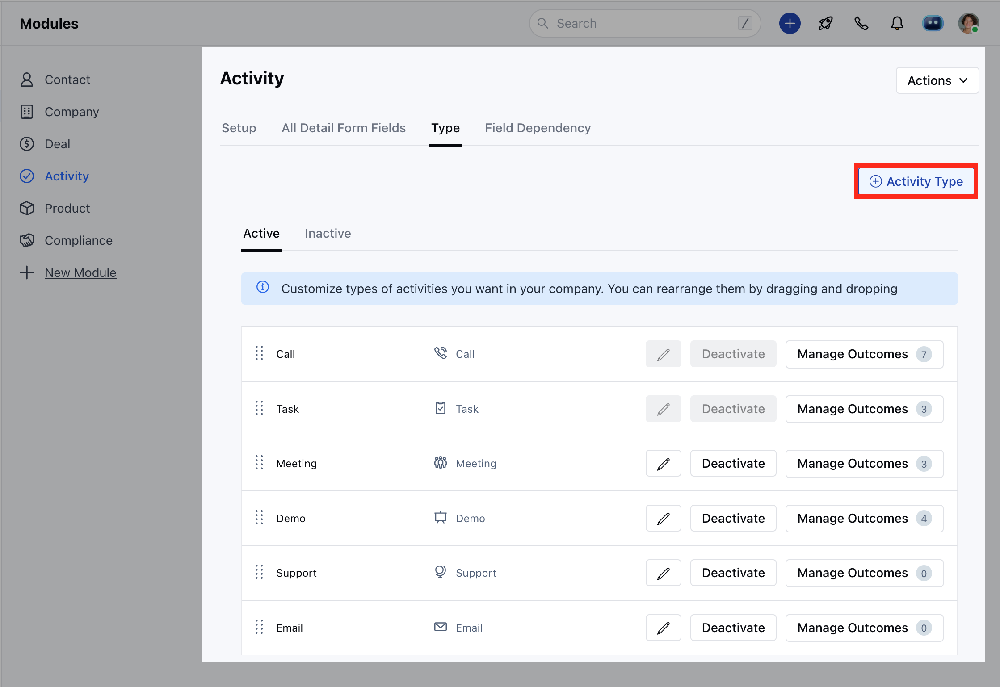
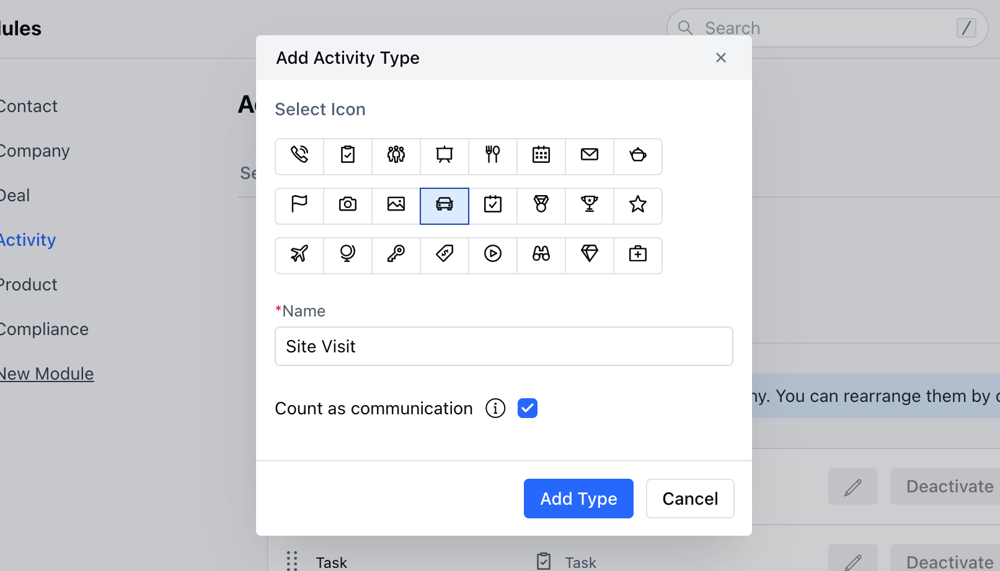

Skara comes preloaded with basic activity types viz. **Call, Task, Meeting, Demo**. You can create your **own activity types** and assign an **icon** to them.\
Activity Types will be listed based on the order defined in the Activity Type Menu. You can activate or deactivate an activity type. However, they cannot be deleted.

**To create a new activity type:**

- Navigate to the **Profile icon** in the top right corner.
- Click on **Setup.**
- Head over **Modules category**
- Click on Activity Module 

- Head to the Type Section
- All your activity types are listed on this screen.
- Click the + **Activity Type**  option to add a new activity type.

- Select the **Icon** for the Activity Type.
- Enter the **Name** of the new Activity Type.
- **Count as communication:** If enabled then the activity of the defined type will be considered as communication between you and the record. It will update Smart Fields like Last communication date, Last Communication mode, etc. of Contact, Company, and Deal records.

- You can rearrange the activity types by drag and drop.
- You can **Activate/Deactivate** or **Edit** existing Activity Types.

A new activity type is up and running! You will also be able to view the new activity type in the Activities drop-down screen.