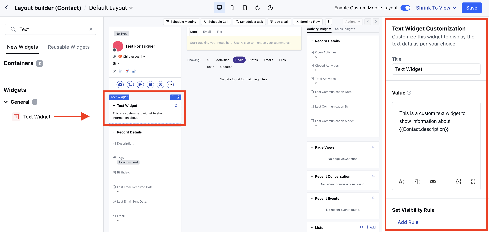

In Salesmate, the Custom Text Widget lets you display text on your detail screen layout. You can use it to showcase dynamic content, announcements, or tailored messages that update in real time. By using variables, you can pull live data from your primary module or organization, making your interface more informative and engaging.

### Steps to Configure the Custom Text Widget

Navigate to the**Profile Icon**in the top right corner.Click on**Set Up**Head over to the**Modules**categorySelect any Module.Click on the**Customize the Page Layout**option

Hover on the**Layout**option, the**Actions**button will appearClick on the**Actions**button and select the**Edit**option.

You will be redirected to the**Layout Builder Page**. Drag and drop the**Text Widget**from the left side to the Layout Builder.You can give the widget a specific**Title**and then add the**Values**based on the information you want to check.

You can add the attributes to check for the dynamic values and also add the static values.You can add text formatting, paragraph formatting, and link insertion options to make it more accessible and customizable.

**Note:**Variables come from the primary module and organization, and they update in real time when refreshed. Custom Lookups are not available.

By following these steps, you can customize the Custom Text Widget to display crucial announcements, dynamic updates, or any custom message that enhances the user experience in Salesmate.
