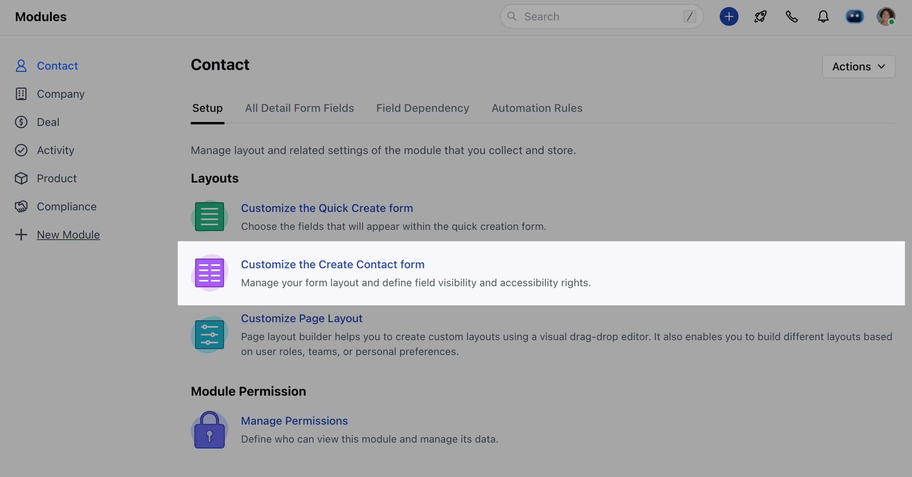
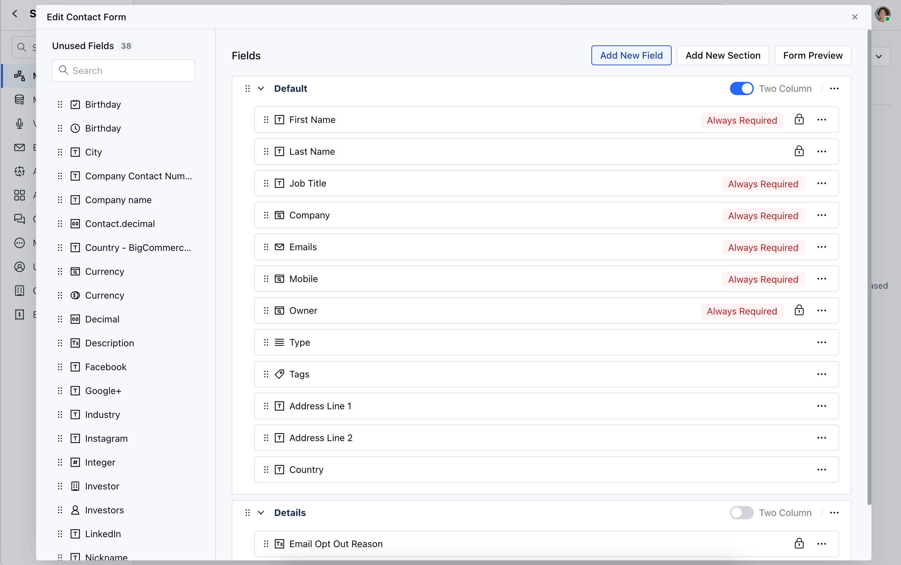
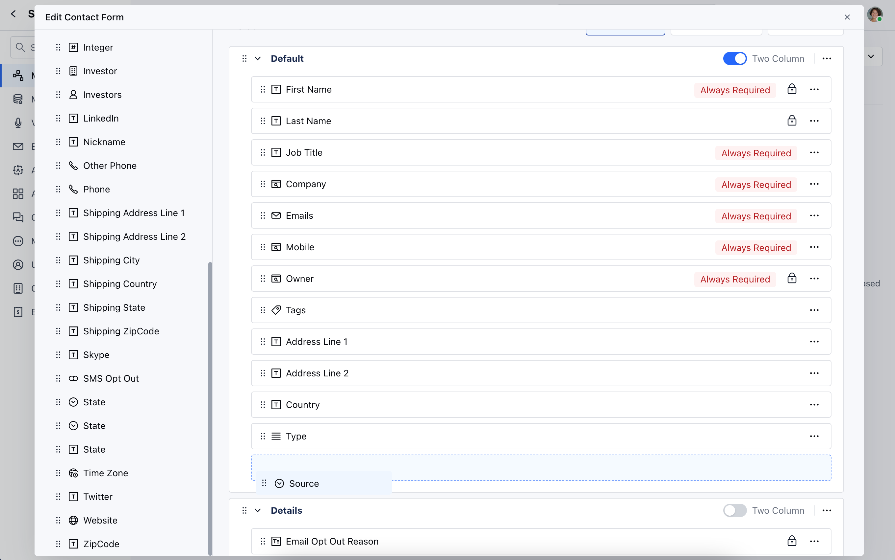
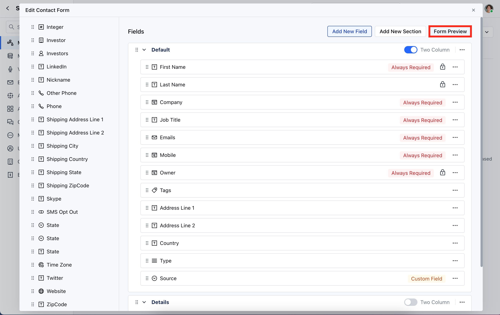
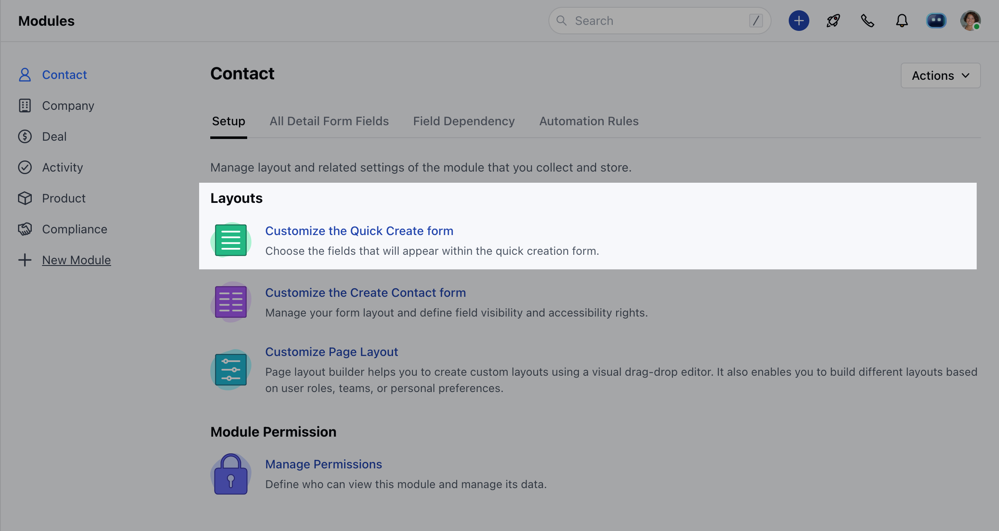
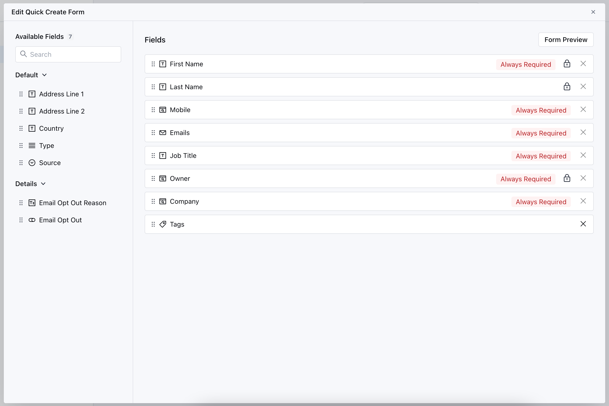
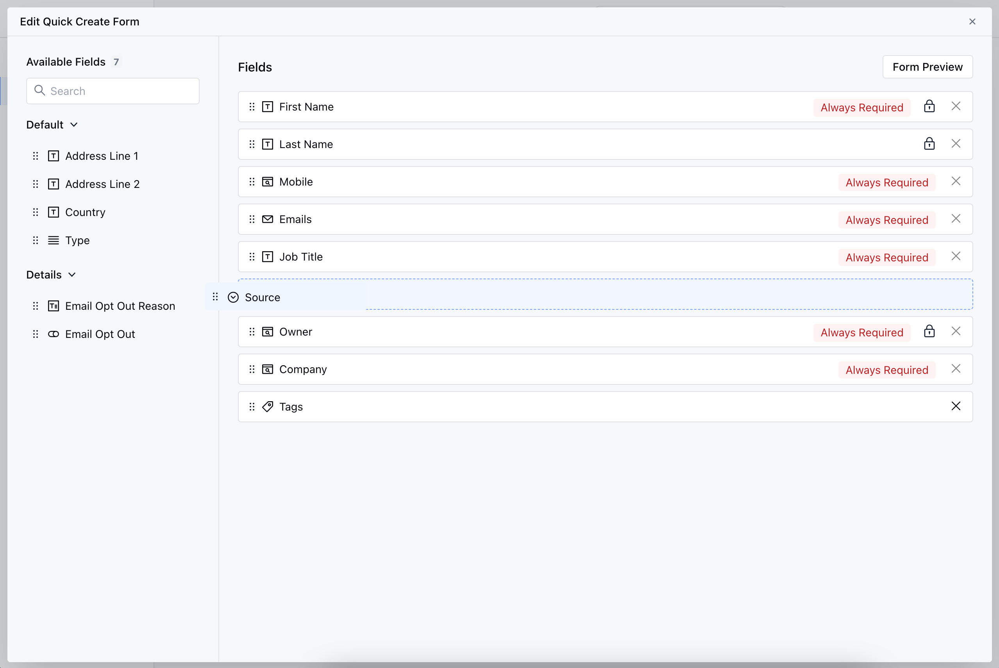
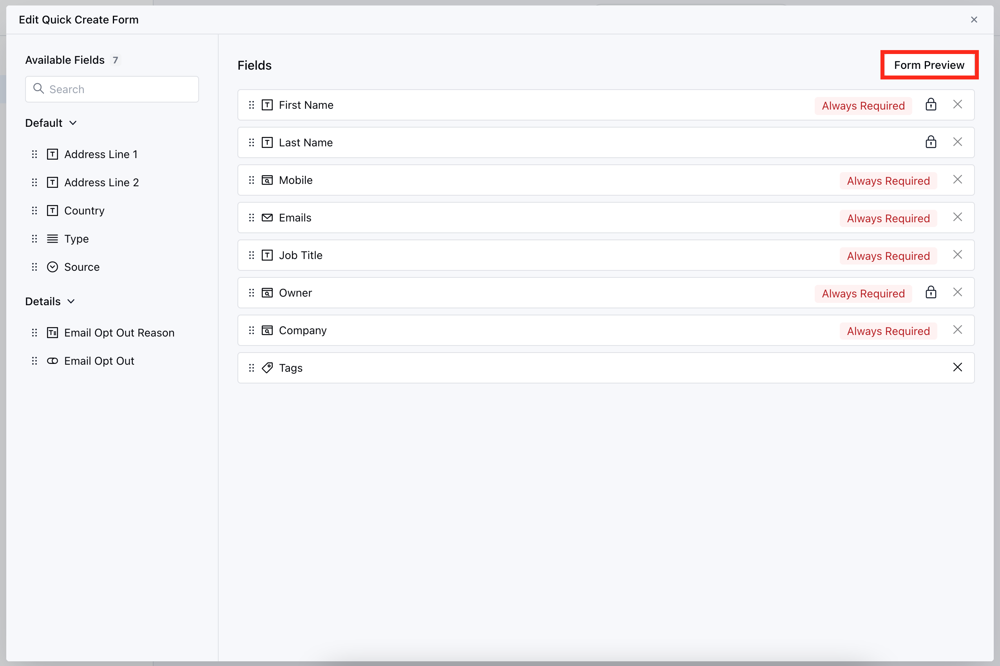

Using form layouts and custom fields you can capture all required info and reposition fields in the desired order. This feature is available for **Contact, Company, Deal, Products, and Custom Modules**.

<iframe width="560" height="315" src="https://www.youtube.com/embed/TO68F2jvE98" title="YouTube video" frameborder="0" allow="accelerometer; autoplay; clipboard-write; encrypted-media; gyroscope; picture-in-picture; web-share" allowfullscreen/>

**Topics Covered:**

- [How to Customize the Module Create Forms](#how-to-customize-the-create-form-in-modules)

- [How to Customize Module Quick Create Forms](#how-to-customize-module-quick-create-forms)

### How to Customize the Create Form in Modules

To customize the Module Create Forms,

Navigate to the **Profile Icon** on the top right cornerClick on the **Set Up** Head Over to the **Modules** CategorySelect the Module(**Contact, Company, Deal, Products, and Custom Modules)**

Click on **Customize the Create Module Form**

The Edit Module Form will be presented, enabling you to make additional modificationsThe screen is divided into two sections: on the left, you'll find Unused Fields, while the right section displays the current fields present in the form

You can customize the layout of the creation form by
[Managing sections](https://support.salesmate.io/hc/en-us/articles/29288603912857)
[Managing Fields](https://support.salesmate.io/hc/en-us/articles/360041831032-How-to-Create-Custom-fields)
You can effortlessly drag and drop fields into the "Unused" section if they're not needed during record creation, and vice versa, move fields from the "Unused" section to the active section on the right.

Additionally, you can rearrange the fields in your preferred order by simple drag and dropOnce you've configured your preferences, you can view the appearance with the Form Preview option.

### How to Customize Module Quick Create Forms

To customize the Module Quick Create Forms,

Navigate to the **Profile Icon** on the top right cornerClick on Set UpHead Over to the Modules CategorySelect the Module(** Contact, Company, Deal, Products, and Custom Modules)***

- *Click on** Customize the Quick Create Module Form ** under Layout

The **Edit Quick Module Form** will be presented to customize the form's fields Here,**"Available Fields"** displays a list of fields that can be included in the Quick Create Form, while **"Fields"** shows all fields currently present in the form.

You can customize the layout by selecting and arranging fieldsSimply drag and drop fields from the Available section to add them to the form, and vice versa to remove them.

Click the **Form Preview** to displays a preview of the form design.

