Page layout builder helps you to create custom layouts using a visual drag-drop editor. It also enables you to build different layouts based on user roles, teams, or personal preferences.

<iframe width="560" height="315" src="https://www.youtube.com/embed/YrFu8G_o0cM?list=PLyYol_VsdQ5kq3RxvfA2NaXeI_5bAaF1x" title="YouTube video" frameborder="0" allow="accelerometer; autoplay; clipboard-write; encrypted-media; gyroscope; picture-in-picture; web-share" allowfullscreen />

### **Topics covered:**

- [Layout Access](#layout-access)
- [How to Customize the Page Layout for Web](#how-to-customize-the-page-layout)
- [How to Customize the Page Layout for Mobile App](#how-to-customize-the-page-layout-for-mobile-app)

### Layout Access

| Layout Access            | Basic | Pro | Business | Enterprise |
| ------------------------ | ----- | --- | -------- | ---------- |
| Layout Access Org Level  | Yes   | Yes | Yes      | Yes        |
| Layout Access Role Level | ---   | -   | Yes      | Yes        |
| Layout Access Team Level | ---   | -   | Yes      | Yes        |
| Layout Access User Level | ---   | -   | Yes      | Yes        |

### How to Customize the Page Layout

To Customize the Page Layout,

- Navigate to the **Profile Icon** in the top right corner.
- Click on **Set Up**
- Head over to the **Modules** category
- Select any Module from **Contact or Company**

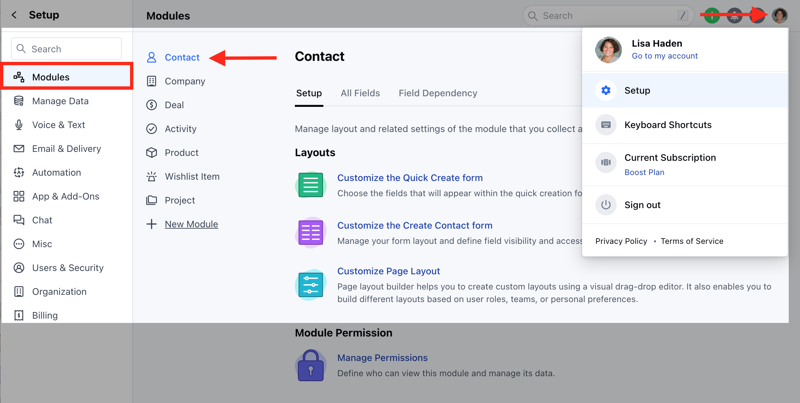

- Click on the **Customize the Page Layout** option
- Here, you can
  - [Create a New Layout](#create-a-new-layout)
  - [Customize the Default Page Layouts](#how-to-customize-the-page-layout)

### Create a New Layout

To create a New Page Layout,

- Click on the **Create New Layout** option on the right

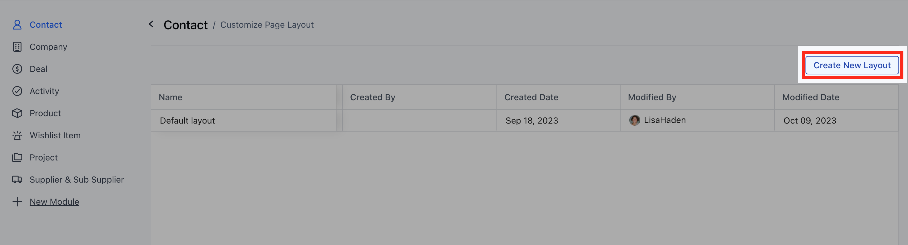

- A pop will open asking for the following details
- **Layout Name**: Enter the layout Name
- **Choose Layout Frame**: Select the appropriate Layout Frame from
  - 3 Column Layout - Default Layout
  - 2 Column Layout - Left Sidebar
  - 2 Column Layout - Right Sidebar
  - 2 Column Layout - Equal width
- Once you have provided the information, click the **Start Customization** button.

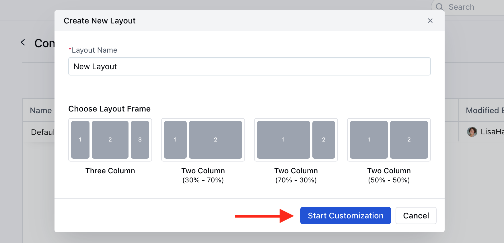

- You will be redirected to the **Visual Layout Builder** Page
- Here, a blank canvas will open with the selected layout frame and one action bar at the top. You can drag-drop the required widget on the screen to create a preferred layout.

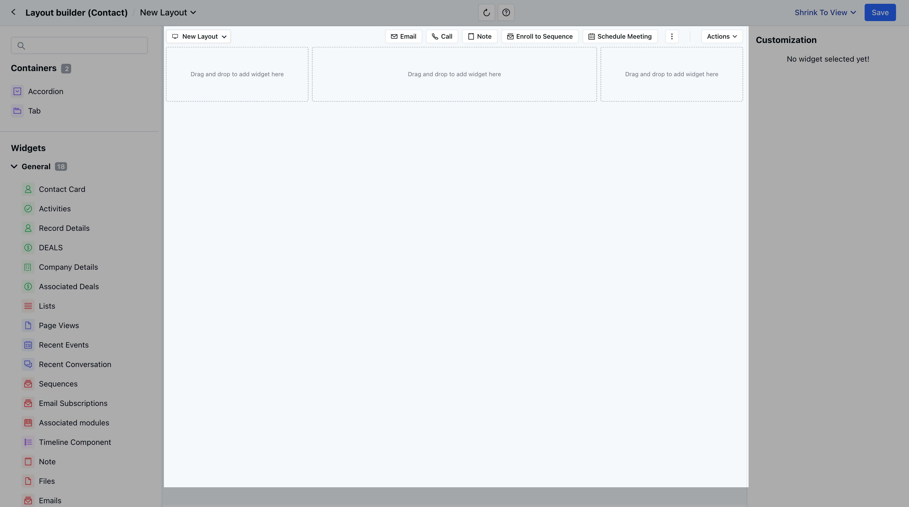

Build different **Accordions** and **Tabs** to organize the content in a specific structure.

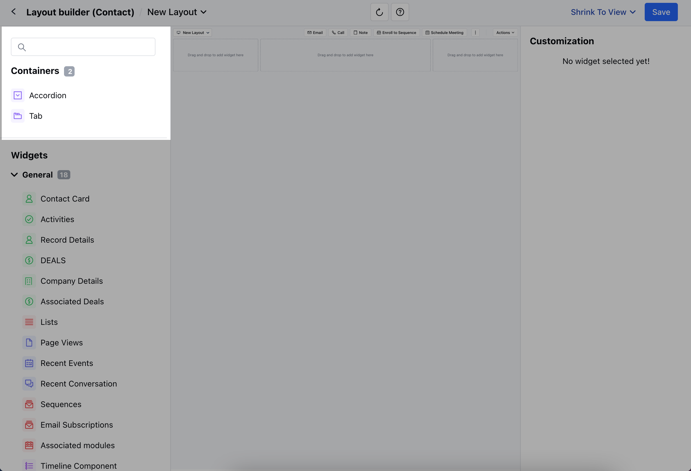

- You can also **Set the Visibility Rule** from the **\+ Add Rule** option
- Set the **Condition Criteria and Save**

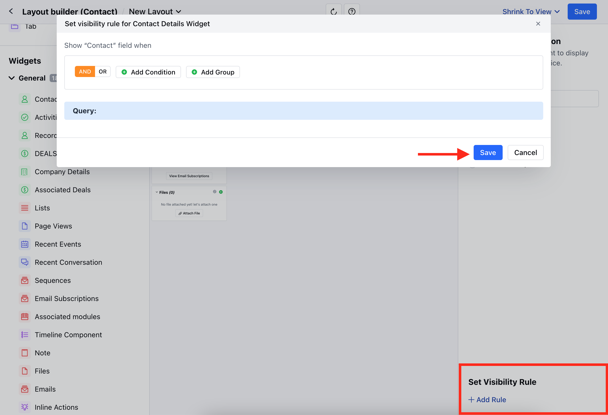

- Once you are done making the changes, you can hit on **Save**.

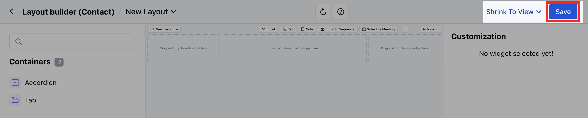

- A pop will open asking for the following information,
  - **Layout Name**: It will display the name that you provided earlier, but you can change it before saving.
  - **Description**: Add a description of the newly created layout.
- Choose if you want to Enable this layout for usage. If you enable the option it will open an option to allow access,
  - **Organization Level**: Everyone in the organization will have access to this layout.
  - **Role**: Only users with specific roles can access this layout.
  - **Teams**: Only users in the specific team can access this layout.
  - **User**: Only specific users can access this layout.
  - Then, **Save** the information

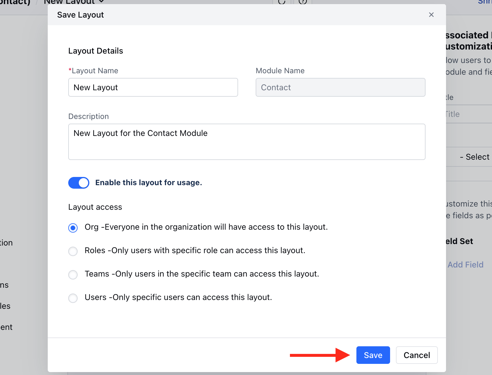

<Note>
  \*\*Note: \*\*If you have one layout set as organization level and then you save another then the previous one loses its org level setting and becomes inactive from usage at user level.
</Note>

### Customize the Default Layouts

To customize the Default Layout

- Hover on the **Default Layout** option,**Actions** button will appear
- Click on the **Actions** button and select the **Edit** option.

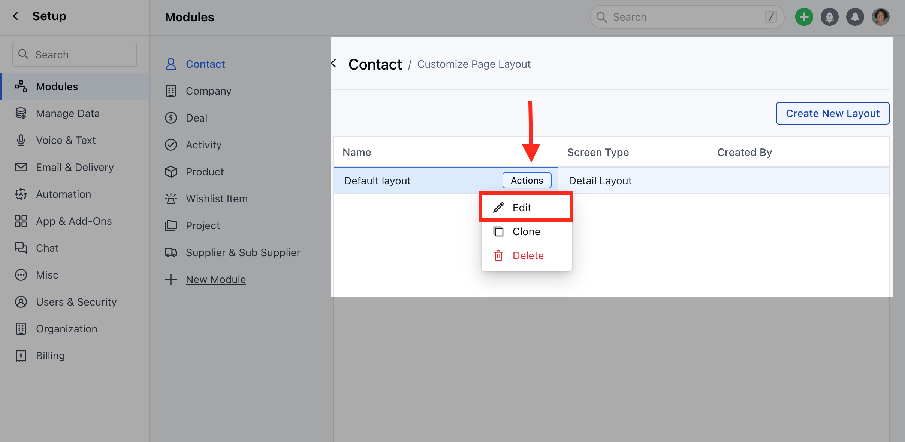

- You will be redirected to the **Layout Builder Page**.
- Here, you can drag and drop the Widgets to align with your specific business processes.
- You can choose to enable/disable the given Actions under the Quick Actions for Module Card

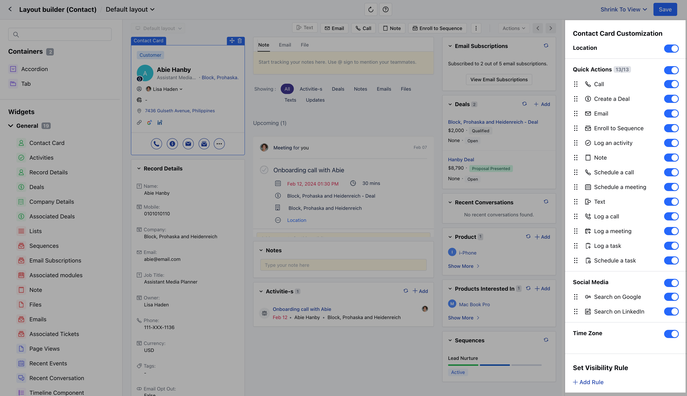

- With the Deal Module layout, you can enable or disable the Deal Card fields as per the requirement

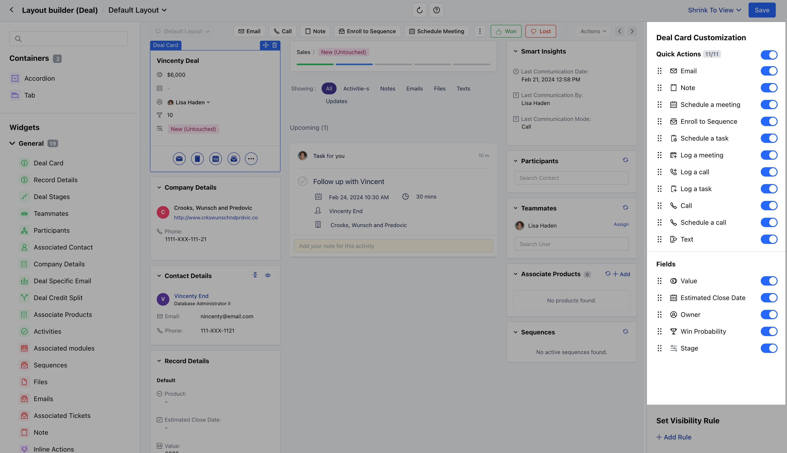

- Once done,**save** the changes.

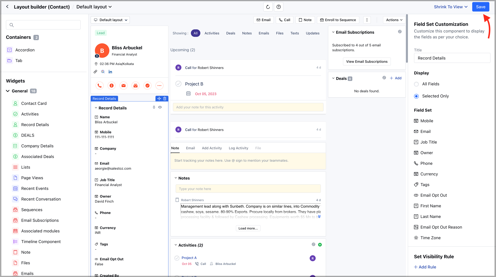

- Once you click on the Save option a pop will open asking for the following information
- Here, you can
  - **Change the Layout Name**
  - **Add the Description**
  - **Enable/Disable the Layout for Usage**
  - **Change the Layout Access**
  - Once done, **save** the information.

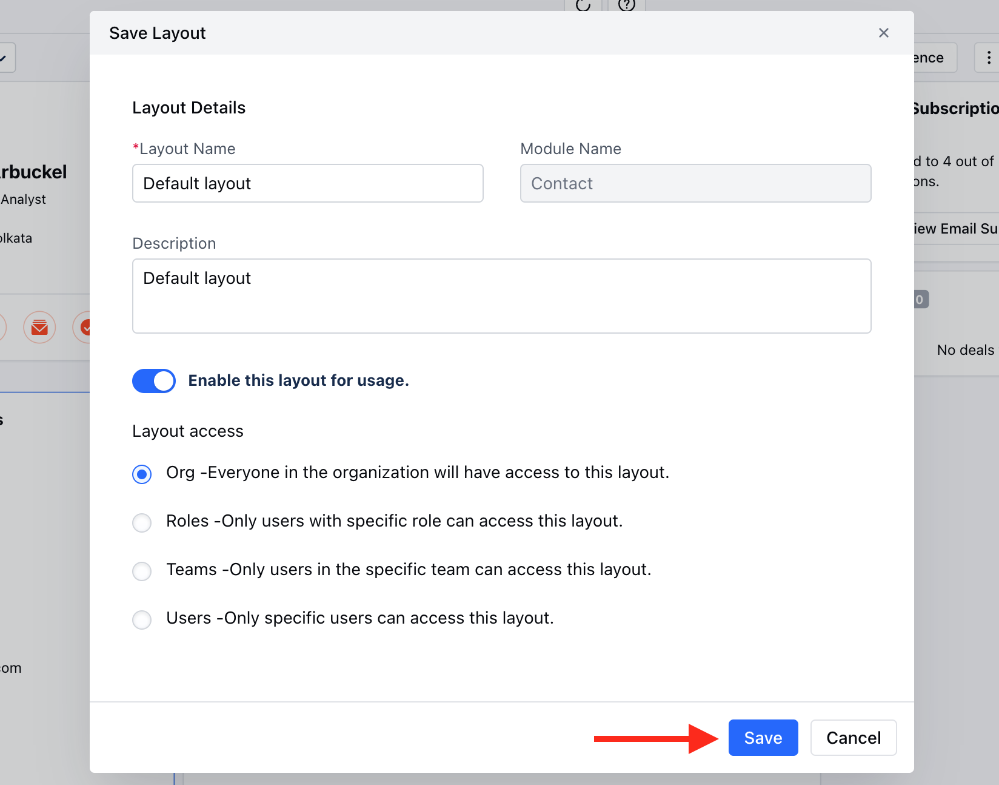

### How to Customize the Page Layout for Mobile App

Once you have moved the customize layout option, you will be able to customize the mobile layout by toggling on the **Enable Custom Mobile Layout** option from the top right bar.

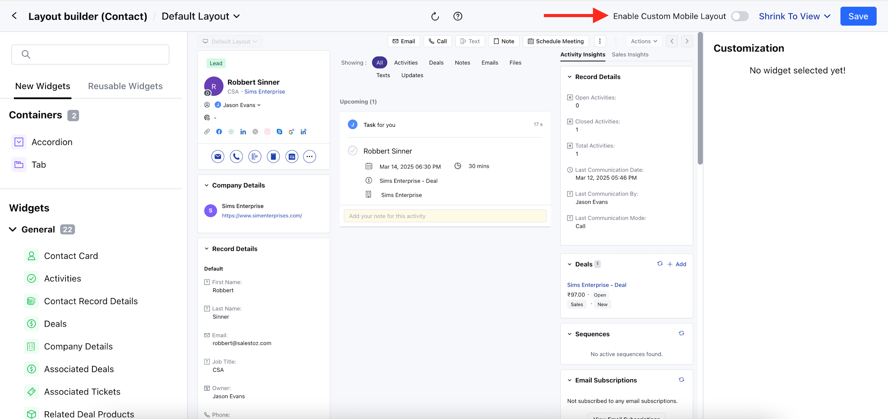

Here you will get an option like,

- **Copy Layout from Desktop:** This will copy all the widgets, sections and settings that has applied to the desktop layout.
- **Start Fresh:** This will create a blank layout without any widgets, that allows you to select the widgets based on your requirements.

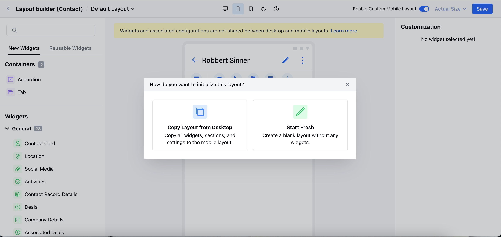

- You can also switch between the Web, Mobile, and Tab layout.

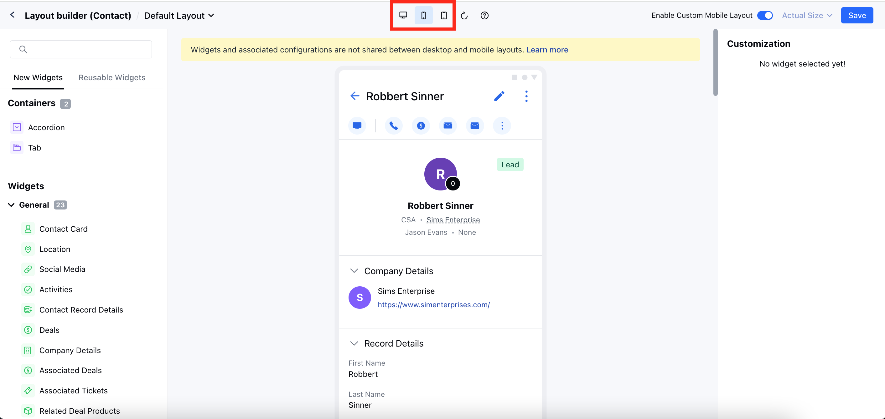

You can add widgets from the right panel. Here you will get options like,

- **New Widgets:** That helps to display the widgets that are available for the mobile layout.
- **Reusable Widgets:** This will allow you to quickly copy widgets from other layouts.
  - **Select Layout:** Select the specific layout from which you would like to copy the widget.
  - **Screen Type:** Select the Desktop or Mobile as the screen type.

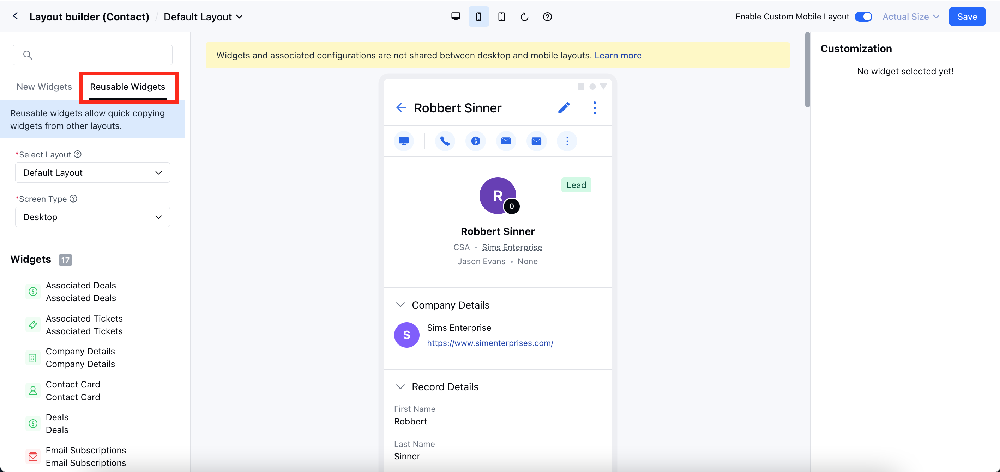

Once the layout has been created, you can hit save and enable the layout to use for the mobile app.

To disable the mobile layout:

- Move to the custom layout that has an active mobile layout.
- Toggle off the **Enable Custom Mobile Layout** from the top bar

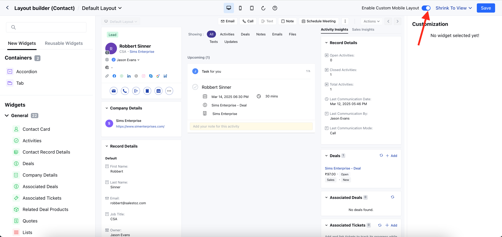

- It will give a pop-up message for the confirmation.

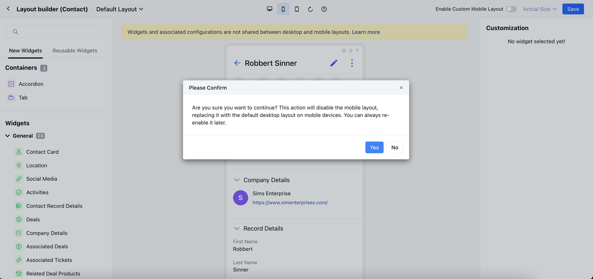

- Hit "**Yes**" to disable the mobile layout.