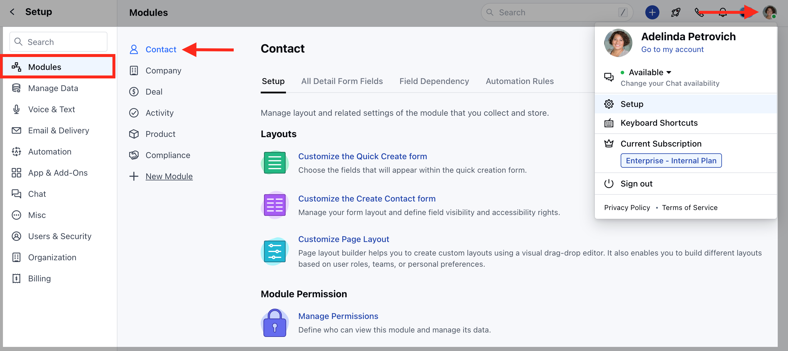
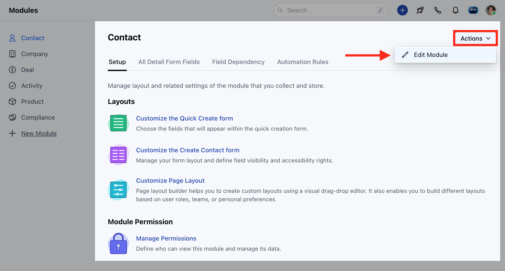
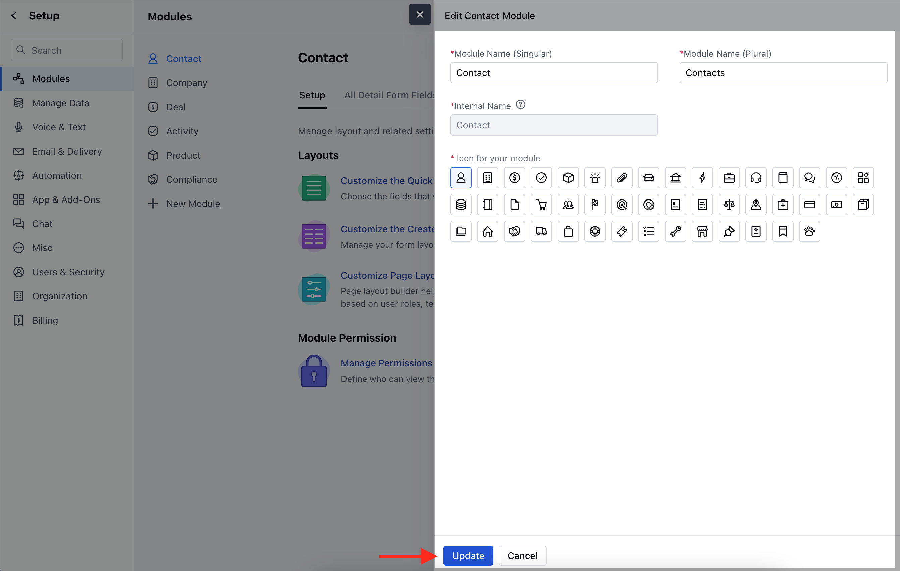

**Skara** allows you to update the names of the **System modules** according to the business needs.

Sometimes users know modules with different names and all CRMs have their **terminologies** to define the modules.

For example, **Organizations** may be defined as "**Accounts"** but in Salesmate by default, we define them as **"Companies"**.

Thus, you can replace the name of the Modules present in Salesmate and update them as per your choice.

- **More Examples:**
  - **Contact** to **People**
  - ****Company ****to****Organization**** 

Also, to pacify the grammar-hungry geeks we allow you to set the Singular and Plural names for the modules separately.

- [Steps to Customize the Modules](#steps-to-customize-the-modules)
- [Changing the Position of Modules](https://support.salesmate.io/hc/en-us/articles/10455763551513-Customize-The-System-Modules#h_01GJMQ9JJ9AK05DMV77Z7JXVSF)

### Steps to Customize the Modules:

- Navigate to the **Profile icon** in the top right corner.
- Click on **Setup.**
- Head over to the **Modules** category.
- Select any **Module.**

- Head to the **Actions** option and click on **Edit Module**

- You can change the Module Icon
- Enter the new **Singular** and **Plural** name of the module.
- **Internal Name** cannot be changed

- You can also change the [**Profile-Level Permissions**](https://support.salesmate.io/hc/en-us/articles/19326369490457-Managing-Profile-Permissions-in-Salesmate) from here.
- Click on **Update** to save the changes.
- You can rearrange the position of modules as per your requirement, it can help you with changing the position of the most used modules to the above so that you can quickly access them [. Learn More](https://support.salesmate.io/hc/en-us/articles/22662227241113-How-to-Customize-the-Sidebar)