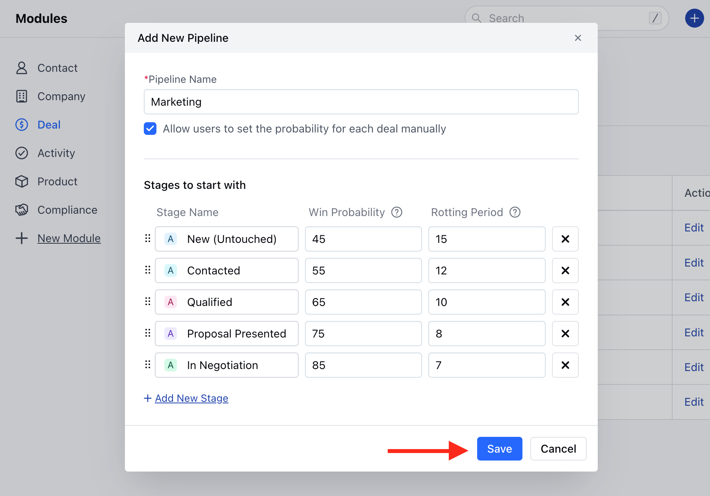

Salesmate offers you a default Sales Pipeline with Stages. The user can, however, rename Stages and Pipeline according to their need.Easy steps to configure your Sales Pipeline

<iframe width="560" height="315" src="https://www.youtube.com/embed/sm1XS6vZNYc?list=PLyYol_VsdQ5kq3RxvfA2NaXeI_5bAaF1x" title="YouTube video" frameborder="0" allow="accelerometer; autoplay; clipboard-write; encrypted-media; gyroscope; picture-in-picture; web-share" allowfullscreen/>
- **Topics covered:**

- [How to Create a New Pipeline](#how-to-create-a-new-pipeline)

- [Update the Default Pipeline](#update-the-default-pipeline)

- [How to Delete a Pipeline](#how-to-delete-a-pipeline)

### How to Create a New Pipeline,

To create a New Pipeline,

Navigate to the **Profile icon** in the top right corner Click on the **Setup** Head over to the **Modules** category Click on the **Pipeline** Section

Here, you need to enter the following details,**Pipeline Name**: Define the Pipeline Name **Allow users to set the probability for each deal manually**: Tick the checkbox if you wish to allow other Users to Set the Win ProbabilityYou can **Customize the Default Stage Colour, Rename them, Set the Win Probability and the Rotting period.

- **You can also **Add a New Stag** e if required or just Remove it if not needed.rearrange the Stages with simple drag-and-dropOnce done click on **Save**

### Update the Default Pipeline

To Update the Default Pipeline,

Click on the Edit option of the Default

Here, you can Customize the Pipeline as per your requirement

### How to Delete a Pipeline

Click on the **Delete** icon to delete the Pipeline

Confirm the action to continue deleting the Pipeline

