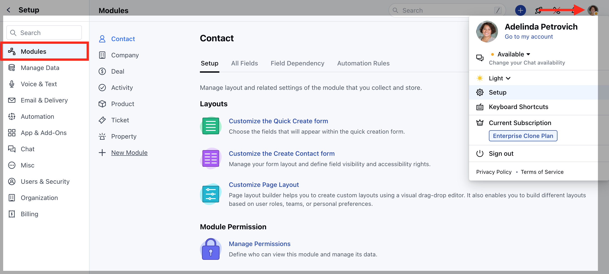
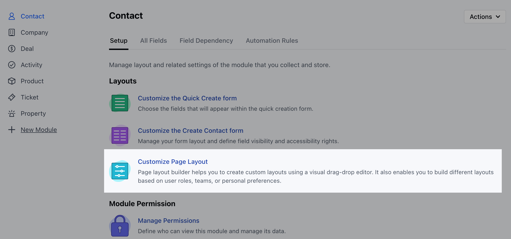
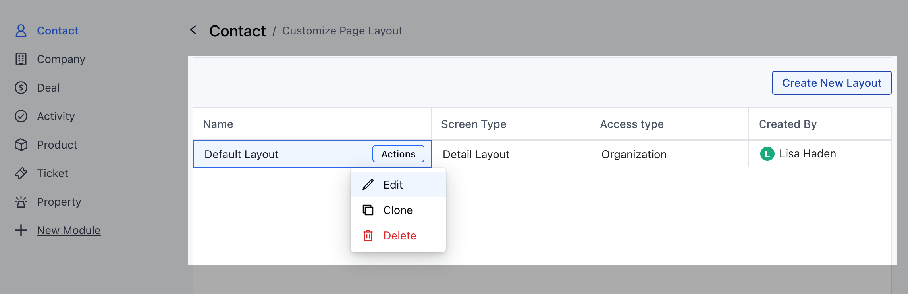
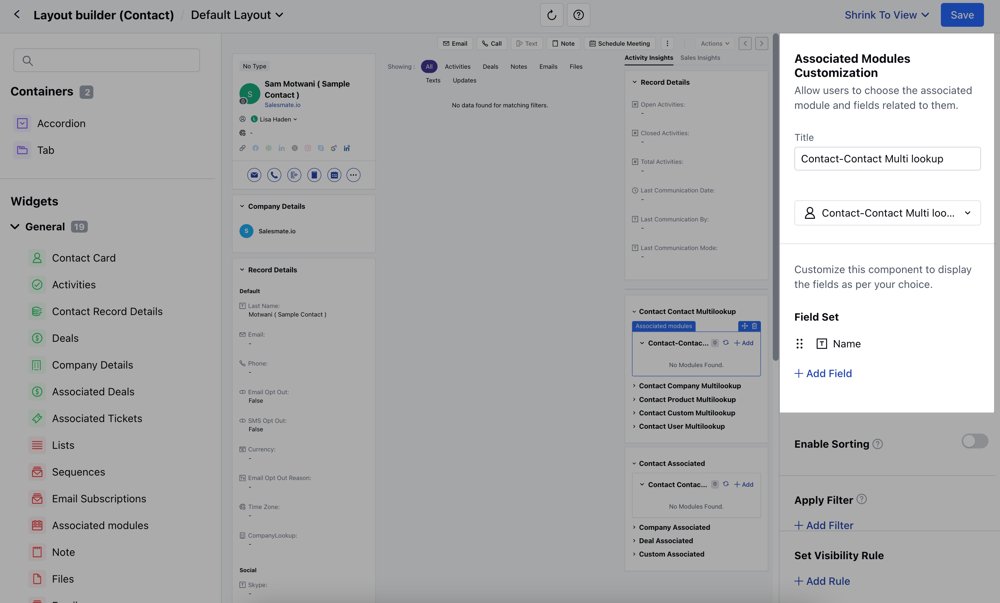
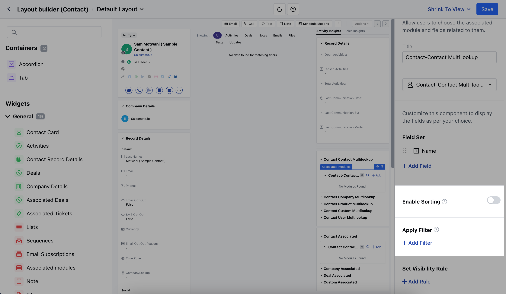
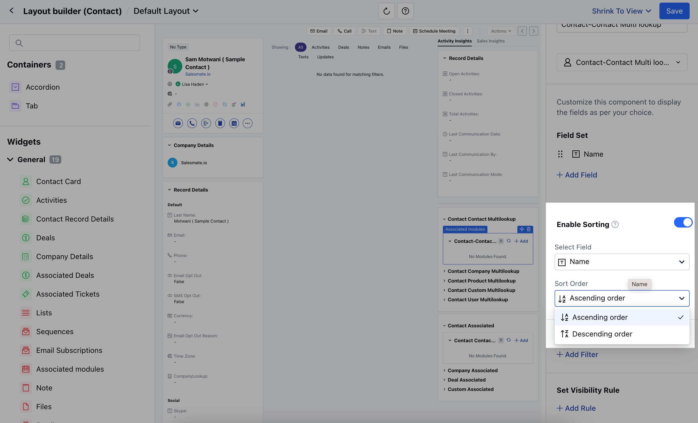
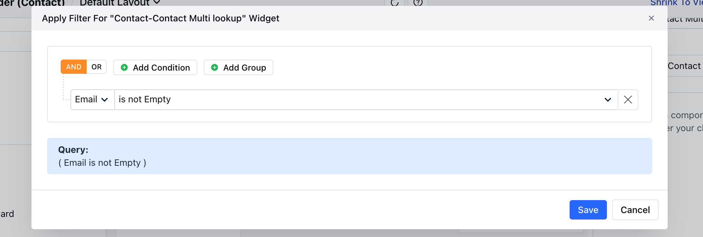
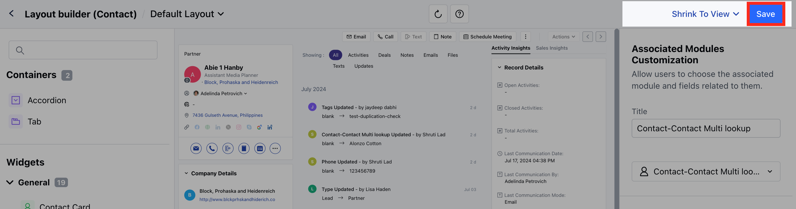

The Modules Page Layout Builder empowers you to personalize your Detail Layout experience by enabling sorting and filtering functionalities for the selected widgets.

**Note:** Enable Sorting & Filtering is available for Associated Modules (Multi Look Up Fields), Associated Products, Deals & Activities widgetsTo enable Sorting Filtering for Widgets,

Navigate to the **Profile Icon** in the top right corner.Click on **Set Up** Head over to the **Modules** categorySelect the required Module **(Contact, Company, Deal, Product or Custom Module)**

Click on the **Customize the Page Layout** option

Here, you can Edit the existing Layout or Create a New Layout

When you drag-drop the Associated Module widget on the layout page, a drop-down will ask you to choose the relation.Once you have selected the module, an option to add the fields will be enabled.

Now if you add any of the above mentioned Widgets, you would get an option to,
[Enable Sorting](#enable-sorting)
[Apply Filters](#apply-filters)

###  Enable Sorting

This option will be disabled by default, click on the Toggle button to enable the option.Choose the field on which you want to apply sorting and then select the order of sorting,- **Select Field:** Select the required field from the available list of fields.

- **Sort Order:** Choose to sort the order in ascending or descending order.

###  Apply Filters

Click on **+ Add Filter** to apply FiltersA pop up will open to add the set of ConditionsOnce done,**Save** the applied criteria.

Click on **Save** to save the applied changes.

