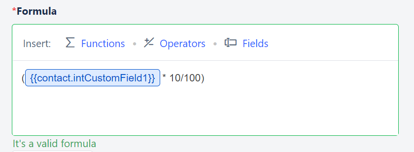
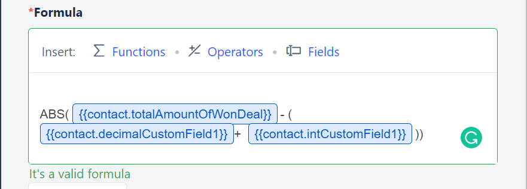
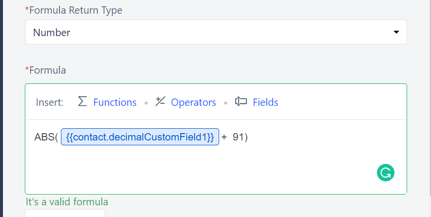
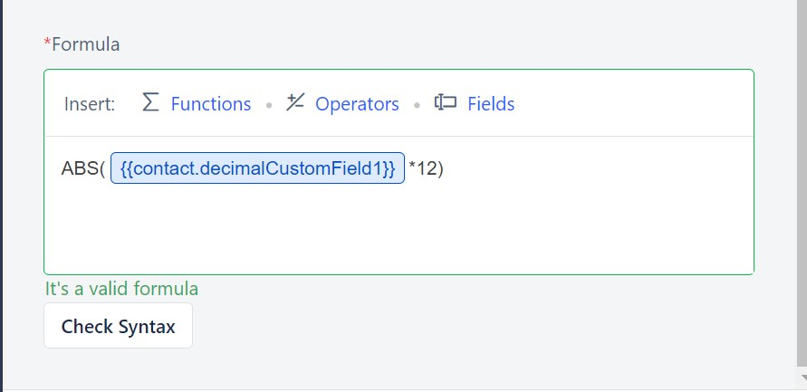
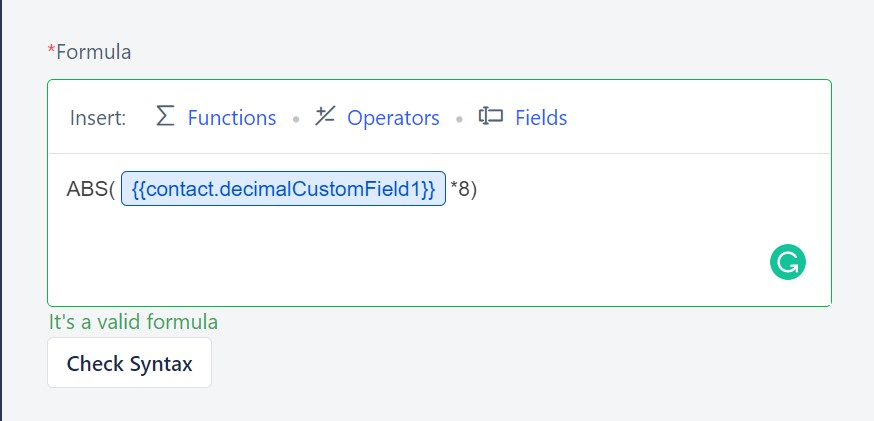

Formula fields let you perform mathematical operations on your module system/custom fields. You can use multiple operators, make calculations, and derive results from the data populated in the fields. Right from simple calculations to handling complex formula calculations; it allows you to achieve various use cases.Let's look at the various use cases that can be achieved using Salesmate's Formula Fields.

### **Topics covered:**

- [Calculating Sales Commission](#calculating-sales-commission)

- [Calculating Sale Profit](#calculating-sale-profit)

- [Calculating Subscription Renewal Dates](#calculating-subscription-renewal-dates)

- [Calculating Recurring Revenue](#calculating-recurring-revenue)

- [Calculating the Number of Working Hours](#calculating-the-number-of-working-hours)

### Calculating Sales Commission

Admins would appreciate the CRM that auto-calculates Sales Commission for their individuals grabbing multiple opportunities and then releasing the incentives accordingly.

Formula = Deal Value * (Commission percentage)Eg: A Salesman's commission on a $1000 sale would fetch him a $100 commission on a 10% commission rate

### Calculating Sale Profit

Salesmate directly calculates the Net Sale profit after subtracting the cost of goods sold (COGS), operating expenses, other expenses, interest (on debt), and taxes payable. These many fields could take your time to manually calculate the Net Profit.

Formula = Sale Value - (Operating expenses + Commissions + Taxes)Eg: HallsCorp's net profit for the quarter was $100,000 after paying commissions to their employees and deducting the taxes and total expenses.

### Calculating Subscription Renewal Dates

Saas businesses offer various subscription models where it becomes necessary to track the start dates and the expiration dates in the CRM where they can keep track of it. Salesmate lets you display the future dates showing the expiration or the renewal dates.

Formula = Start Date + number of days in the subscription planEg: a customer's 3-month subscription started on the 7th of May and ends on the 7th of August

### Calculating Recurring Revenue

Companies related to various industries have recurring revenue business models where keeping track of recurring sales revenue becomes a necessity to track quarterly Sales and predict sales forecasts.

Formula = Sales value * time periodEg: The income yield on the rental property per annum is $1200

### Calculating the Number of Working Hours

This can be useful in keeping track of the number of hours involved (total time) on the current project so that a company can plan the next project accordingly

Formula = Number of Days * Number of hours/ dayEg: 800 working hours were spent on Project A which was 200 hours less compared to what was planned

