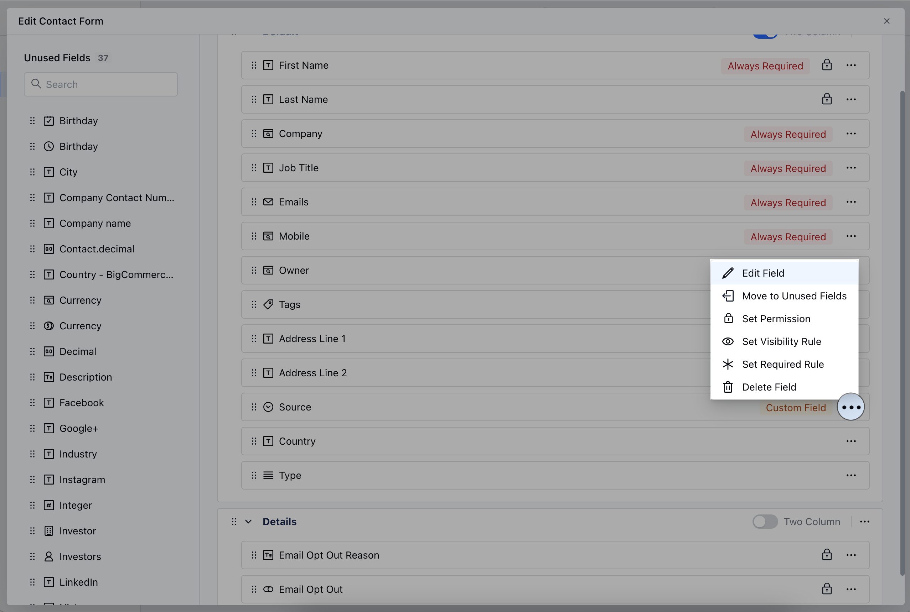
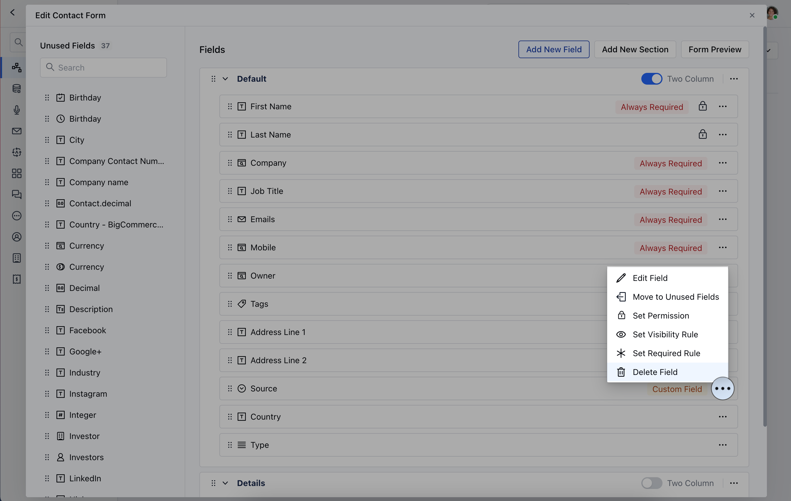
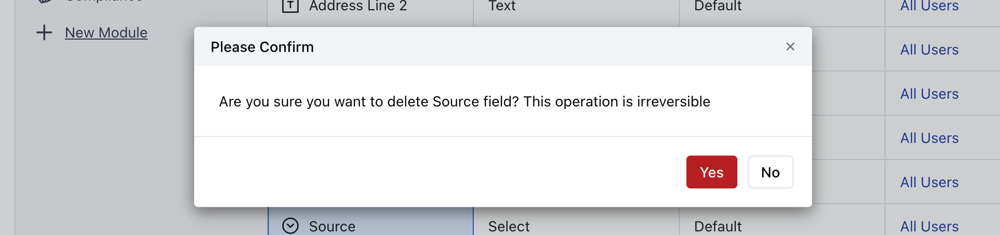

Once you create a Custom Field, you also get options to Edit, Delete, or move the Field to the Unused section

Topics Covered:

- [How to Edit Custom Fields](#how-to-edit-custom-fields)
- [How to Delete Custom Fields](#how-to-delete-custom-fields)

### How to Edit Custom Fields

To Edit Custom Fields

- Navigate to the **Profile Icon** on the top right corner
- Click on the **Set Up**
- Head Over to the **Modules** Category
- Select the Module(**Contact, Company and Ticket Modules)**

- Click on **Customize the Create Module Form** under Layout

- Select the Field that you wish to Edit, then click on the three dots located at the corner
- Click on the **Edit Field** option

OR

- Go to **All Detail Form Field** Section
- Select the Field to **Edit**, then hover over the field you wish to modify and click on the **Actions** button.

### How to Delete Custom Fields

Similarly to Delete the Fields, follow the above-mentioned steps and select the Delete option,

- To Delete from **Custom Create Forms**, select the field you wish to Delete and click on the **Delete Field** option

- To Delete From **All Detail Form Fields**, hover over the field you wish to modify and click on the **Actions** button.

- A pop-up will appear with an option to [Move the Fields to Unused Section](https://support.salesmate.io/hc/en-us/articles/29324541435289-How-to-Move-Custom-Fields-to-Unused-Section) or Delete the Field
- Click on the **Delete Field** option

- Confirm the action to continue deleting the field

<Note>
  **Note:** Please note that the System Fields cannot be deleted
</Note>