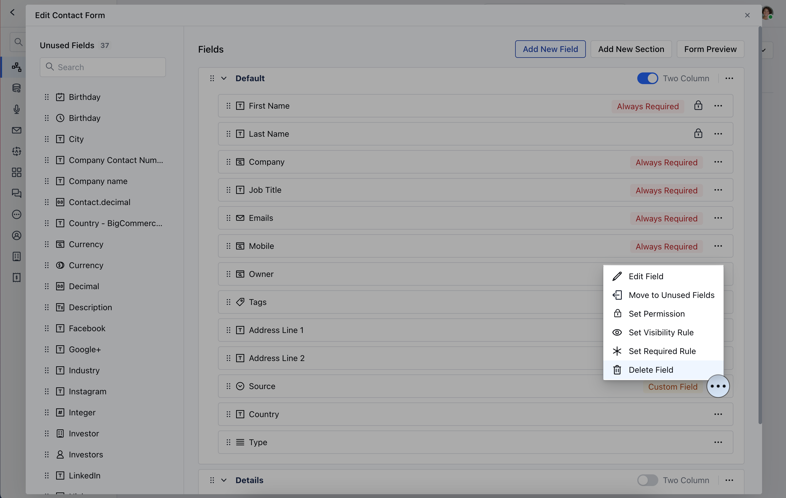

Once you create a Custom Field, you also get options to Edit, Delete, or move the Field to the Unused sectionTopics Covered:

- [How to Edit Custom Fields](#how-to-edit-custom-fields)
- [How to Delete Custom Fields](#how-to-delete-custom-fields)

### How to Edit Custom Fields

To Edit Custom Fields

Navigate to the **Profile Icon** on the top right cornerClick on the **Set Up** Head Over to the **Modules** CategorySelect the Module(**Contact, Company, Deal, Activities, Products, and Custom Modules)**

Click on **Customize the Create Module Form** under Layout

Select the Field that you wish to Edit, then click on the three dots located at the cornerClick on the **Edit Field** option

OR

Go to **All Detail Form Field** SectionSelect the Field to **Edit**, then hover over the field you wish to modify and click on the **Actions** button.

### How to Delete Custom Fields

Similarly to Delete the Fields, follow the above-mentioned steps and select the Delete option,

To Delete from **Custom Create Forms**, select the field you wish to Delete and click on the **Delete Field** option

To Delete From **All Detail Form Fields**, hover over the field you wish to modify and click on the **Actions** button.

A pop-up will appear with an option to [Move the Fields to Unused Section](https://support.salesmate.io/hc/en-us/articles/29324541435289-How-to-Move-Custom-Fields-to-Unused-Section) or Delete the FieldClick on the **Delete Field** option

Confirm the action to continue deleting the field

- **Note:**Please note that the System Fields cannot be deleted
