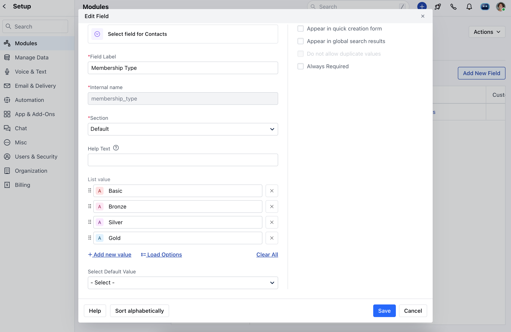
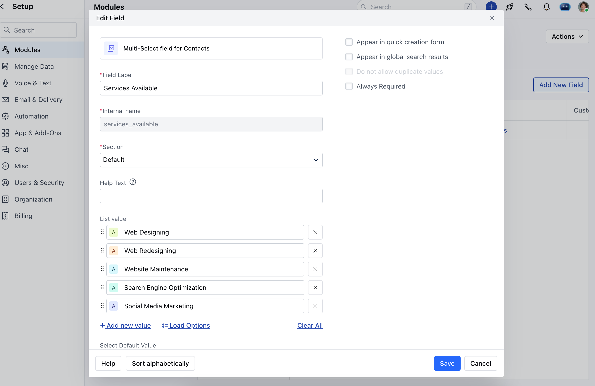
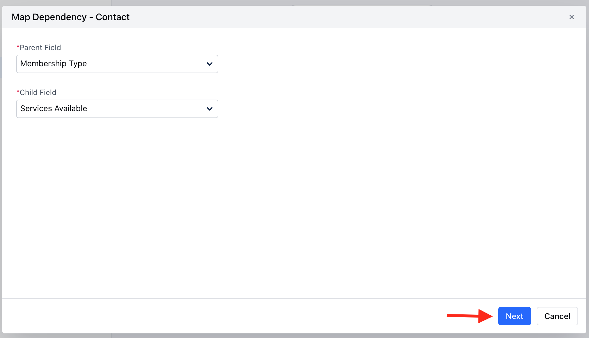
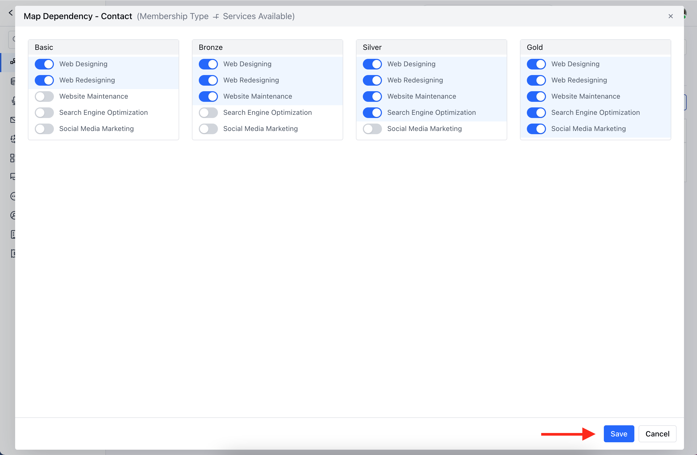

There are certain fields whose values depend on another field's value. For example, the values in the state field will depend on the country that you select from the country field.

<iframe width="560" height="315" src="https://www.youtube.com/embed/lUkzWT_lZB4?list=PLyYol_VsdQ5kq3RxvfA2NaXeI_5bAaF1x" title="YouTube video" frameborder="0" allow="accelerometer; autoplay; clipboard-write; encrypted-media; gyroscope; picture-in-picture; web-share" allowfullscreen />

<Note>
  **Note:** Map Dependency Fields can only be created for **Select** and **Multi-select** field types.
</Note>

**To create dependency fields:**

- Navigate to the **Profile icon** on the top right corner
- Click on **Setup**
- Head over to **Modules** Category
- Here, select the Preferred Module **( Contact, Company and Ticket Module)**

- Navigate to the Field Dependency tab
- It displays columns for **Parent Field**, **Child Field**, and **Actions**.
- Upon first visit, the grid will be empty, showing the message No mapped dependency fields found.

- Click the **"Add Dependency Field"** button to begin mapping the dependency between fields.
- To create a field dependency, you need at least two select or multi-select fields.
- A popup will appear with two options:

**Parent Field:** Select the parent field from the dropdown. Only one value can be selected **(Eg: Membership Type)**

- **Child Field:** Select the child field from the dropdown. The values in this field will change based on the selected value in the parent field **(Eg: Services Available)**

- Once you have selected the parent and child fields, click the **"Next"** button.

- Select values of the Child field dependent upon each Parent value. Hit **Save**.

<Note>
  **Note:** The options to Edit or Delete will not be available for default system dependency fields or in the deal or custom module.

  -  Map Dependency Fields can only be created for **Select** and **Multi-select** field types.
  - Only select and multi-select fields will be displayed as options.
</Note>