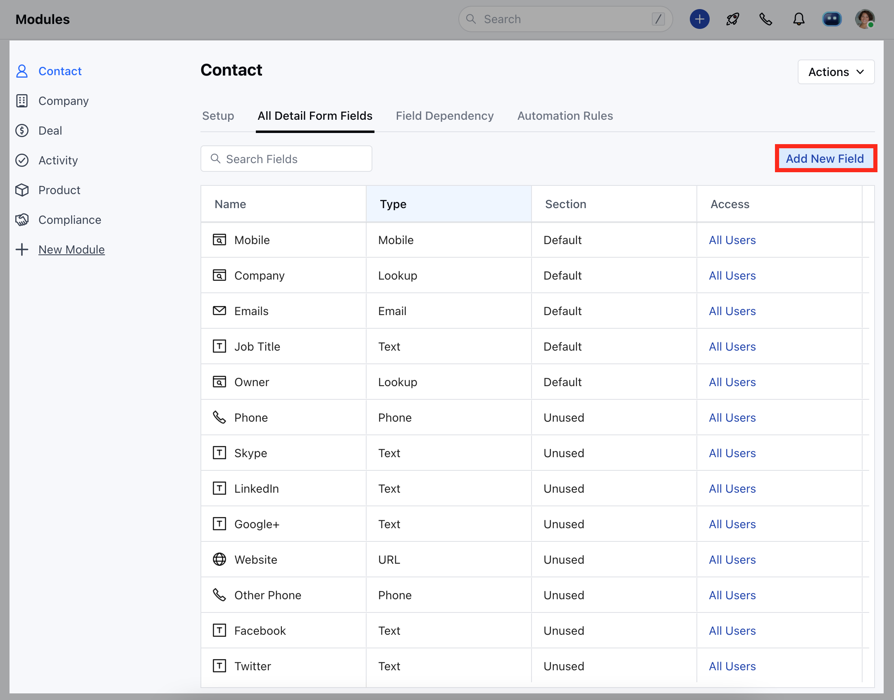
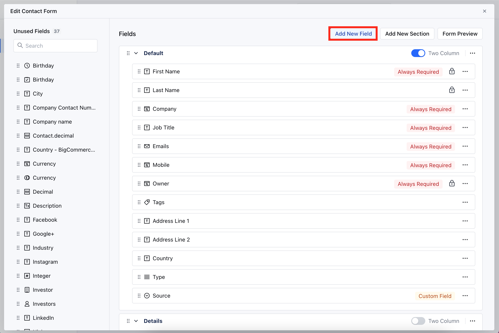
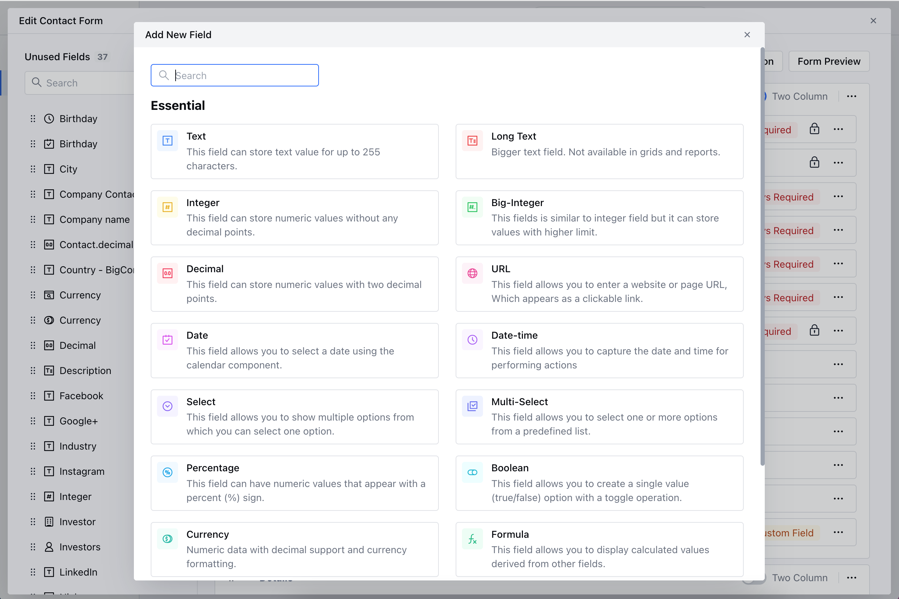
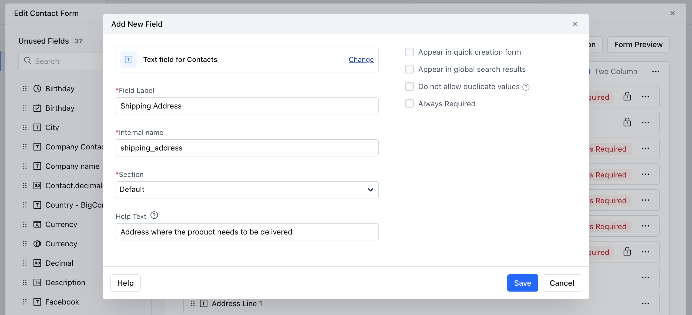
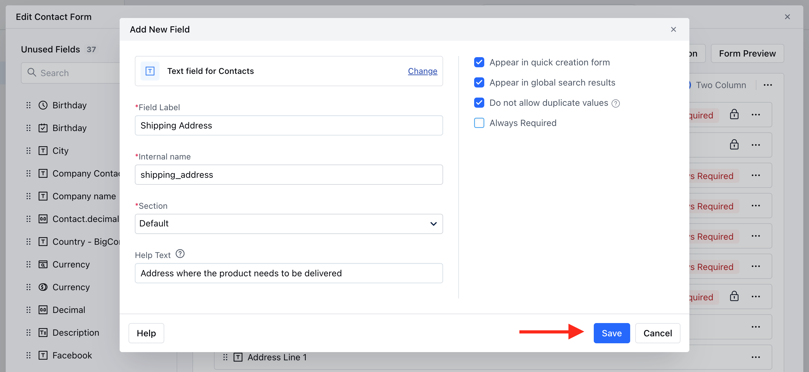

The Custom Fields can be placed under various sections which are editable and can be renamed as per your requirement. After you create new Custom Fields, you can change their position on the form from the Layout section.

<iframe width="560" height="315" src="https://www.youtube.com/embed/GQ7WC3_h-EE?list=PLyYol_VsdQ5kq3RxvfA2NaXeI_5bAaF1x" title="YouTube video" frameborder="0" allow="accelerometer; autoplay; clipboard-write; encrypted-media; gyroscope; picture-in-picture; web-share" allowfullscreen />

### How to Create Custom Fields

To Create New Custom Fields:

- Navigate to the **Profile Icon** on the top right corner
- Click on the **Set Up** 
- Head Over to the **Modules** Category
- Select the Module(**Contact, Company and Ticket Module)**

- Go to the **All Detail Form Fields** section
- Click on **Add New Field** to create a new custom field

OR

- Go to **Customize the Module Create Form**
- Click on the **Add New Field**

- Select the **Field Type** or search the Type with the Quick search option

- Provide the following details 
  - **Field** **Label:** Define the label to identify the field
  - **Internal Name:** Define the internal name for API integrations
  - **Section:** Select the Section you wish the Field to fall under.
  - **Help Text:** Define Help Text to provide additional information to help your teammates understand the purpose of the field

- After adding details to a custom field, you can select the following options:
  - **Appear in Quick Creation Form:** Display this field in the quick creation form for easy access.
  - **Appear in Global Search Results:** Allow searching on this field when a user performs a global search.
  - **Do not allow Duplicate Values:** Prevent the creation of duplicate records based on this field.
  - **Always Required:** Make this field mandatory if needed.
- Once done, Click **Save.**

<Note>
  **Note:** Please note that once added, the **Internal Name** of a field cannot be changed.
</Note>

With Skara we have overcome the limit of fields by increasing the custom field limit to 50 per module, along with the plan-based limits,

| CRM Feature           | Basic | Pro | Business | Enterprise  |
| --------------------- | ----- | --- | -------- | ----------- |
| Custom Fields/ Module | 50    | 100 | 500      | Unlimited\* |